# Sequence Bioinformatics4

## 목차

- [Sequence Bioinformatics4](#sequence-bioinformatics4)
  - [목차](#목차)
  - [Lecture 1: Intro](#lecture-1-intro)
    - [Early sequence bioinformaticists](#early-sequence-bioinformaticists)
      - [Assembling the target sequence](#assembling-the-target-sequence)
      - [Margaret Dayhoff](#margaret-dayhoff)
      - [Walter Goad](#walter-goad)
    - [Early RNA Sequencing](#early-rna-sequencing)
    - [Early DNA Sequencing](#early-dna-sequencing)
    - [Sequencing bioinformatics](#sequencing-bioinformatics)
  - [Lecture 2: Big Data](#lecture-2-big-data)
    - [Algorithm](#algorithm)
    - [Brute force (exhaustive) algorithms](#brute-force-exhaustive-algorithms)
    - [Heuristic algorithms](#heuristic-algorithms)
      - [seed-filter-extend](#seed-filter-extend)
      - [k-mer (길이 k의 부분 문자열)](#k-mer-길이-k의-부분-문자열)
    - [Process, access, store big data](#process-access-store-big-data)
      - [Parallel computing](#parallel-computing)
      - [Multi-core computers](#multi-core-computers)
      - [Cluster](#cluster)
      - [Heterogeneous Computing](#heterogeneous-computing)
      - [Cloud computing](#cloud-computing)
      - [SLURM(Simple Linux Utility for Resource Management)](#slurmsimple-linux-utility-for-resource-management)
    - [Graph](#graph)
      - [트리(Tree)](#트리tree)
      - [Suffix Tree](#suffix-tree)
      - [Suffix Array](#suffix-array)
  - [Lecture 3: Genomes, Evolutionary Forces](#lecture-3-genomes-evolutionary-forces)
    - [Prokaryotes vs Eukaryotes](#prokaryotes-vs-eukaryotes)
      - [Organisms vs. their genomes](#organisms-vs-their-genomes)
      - [Prokaryotic genomes](#prokaryotic-genomes)
      - [Eukaryotic nuclear genomes](#eukaryotic-nuclear-genomes)
      - [Eukaryotic organellar genomes](#eukaryotic-organellar-genomes)
    - [Evolutionarly Forces](#evolutionarly-forces)
      - [Meiotic recombination](#meiotic-recombination)
      - [Selection](#selection)
      - [(Random) genetic drift](#random-genetic-drift)
      - [Gene flow](#gene-flow)
      - [Pan-genome](#pan-genome)
      - [Evolutionary Forces](#evolutionary-forces)
      - [Taxonomic relationships](#taxonomic-relationships)
    - [Mutations](#mutations)
      - [Single nucleotide mutations](#single-nucleotide-mutations)
      - [Larger scale Mutation](#larger-scale-mutation)
      - [Segmental duplications in humans](#segmental-duplications-in-humans)
      - [Wohle Genome Duplication in plants](#wohle-genome-duplication-in-plants)
      - [Fate of duplicated genes](#fate-of-duplicated-genes)
      - [Gene \& genome duplications](#gene--genome-duplications)
      - [Transposable / Mobile elements](#transposable--mobile-elements)
      - [Orphan genes](#orphan-genes)
  - [Lecture 4: Genome Assembly](#lecture-4-genome-assembly)
    - [Online database](#online-database)
    - [Raw and pre-processed data](#raw-and-pre-processed-data)
    - [Assembly: Principle](#assembly-principle)
    - [Assembly: General Steps](#assembly-general-steps)
      - [Greedy](#greedy)
    - [Overlap-layout-consensus: OLC](#overlap-layout-consensus-olc)
      - [Algorithm](#algorithm-1)
    - [De Brujin Graph](#de-brujin-graph)
      - [Best k-mer size](#best-k-mer-size)
      - [Softwares](#softwares)
    - [Scaffolding](#scaffolding)
      - [with Mate pairs](#with-mate-pairs)
      - [with long reads](#with-long-reads)
      - [with long range linkage information](#with-long-range-linkage-information)
    - [Finishing genome assembly](#finishing-genome-assembly)
    - [Evaluation](#evaluation)
    - [Genome sequence](#genome-sequence)
    - [SLURM](#slurm)
  - [Lecture 5: Genome Annotation](#lecture-5-genome-annotation)
    - [Genome annotation](#genome-annotation)
    - [De novo: Intrinsic](#de-novo-intrinsic)
      - [Hidden Markov Models](#hidden-markov-models)
      - [Gene Prediction](#gene-prediction)
      - [Genscan](#genscan)
    - [Extrinsic](#extrinsic)
    - [Hybrid methods](#hybrid-methods)
    - [File formats](#file-formats)
  - [Lecture 6: Read Mapping](#lecture-6-read-mapping)
    - [Mapping](#mapping)
      - [Mapping bias](#mapping-bias)
      - [Variation graph](#variation-graph)
      - [NGS Read mapping](#ngs-read-mapping)
        - [Hash table based](#hash-table-based)
        - [Burrows-Wheeler Transform](#burrows-wheeler-transform)
        - [long read mapping](#long-read-mapping)
      - [SAM](#sam)
      - [SNP](#snp)
        - [bcftools](#bcftools)
        - [Structural variation](#structural-variation)
        - [VCF](#vcf)
    - [read mapping application](#read-mapping-application)
    - [Data Format](#data-format)
  - [Lecture 7: Pairwise sequence alignment](#lecture-7-pairwise-sequence-alignment)
    - [Homology \& similarity](#homology--similarity)
    - [Pairwise comparison](#pairwise-comparison)
      - [scoring an alignment](#scoring-an-alignment)
    - [Dotplot](#dotplot)
    - [Scoring matrix](#scoring-matrix)
      - [PAM](#pam)
      - [BLOSUM](#blosum)
      - [Gap panalty](#gap-panalty)
    - [Optimal alignment](#optimal-alignment)
    - [Dynamic programming](#dynamic-programming)
      - [Smith-Waterman algorithm](#smith-waterman-algorithm)
      - [MUMmer](#mummer)
  - [Lecture 8: BLAST](#lecture-8-blast)
  - [BLAST](#blast)
    - [Score Probabilities](#score-probabilities)
    - [BLAST Result](#blast-result)
    - [Masking low-complexity regions (LCR)](#masking-low-complexity-regions-lcr)
    - [How to improve BLAST searches\*](#how-to-improve-blast-searches)
  - [Lecture 9: Multiple Sequence Alignment](#lecture-9-multiple-sequence-alignment)
    - [Positional Homology](#positional-homology)
    - [Software](#software)
    - [Progresive alignment](#progresive-alignment)
      - [Sum-of-paris Score](#sum-of-paris-score)
      - [Challenge](#challenge)
      - [Iterative alignment(refinement)](#iterative-alignmentrefinement)
    - [T-Coffee](#t-coffee)
    - [Gap: MAS](#gap-mas)
      - [Gap: PRANK](#gap-prank)
    - [Large alignment](#large-alignment)
    - [Selecting Software](#selecting-software)
    - [Evaluating Alignment](#evaluating-alignment)
    - [Meta Alignment](#meta-alignment)
      - [M-Coffee](#m-coffee)
    - [MSA](#msa)
  - [Lecture 10: HMM](#lecture-10-hmm)
    - [Position-specific scoring matrix (PSSM)](#position-specific-scoring-matrix-pssm)
    - [Generative Model](#generative-model)
    - [HMM](#hmm)
      - [Profile Hidden Markov Model](#profile-hidden-markov-model)
      - [Emissions](#emissions)
      - [HMMer](#hmmer)
      - [Pros and Cons](#pros-and-cons)
  - [Lecture 12: Phylogenies I](#lecture-12-phylogenies-i)
    - [Phylogenetic Tree](#phylogenetic-tree)
      - [Rooting Tree](#rooting-tree)
      - [Resolved vs unresolved trees](#resolved-vs-unresolved-trees)
    - [Gene Tree](#gene-tree)
      - [Homologuous genes](#homologuous-genes)
      - [Duplication // loss](#duplication--loss)
      - [Terms](#terms)
      - [In general](#in-general)
    - [Substitution Model](#substitution-model)
      - [Rate variation](#rate-variation)
      - [Choosing Model](#choosing-model)
    - [Inferring phylogeny](#inferring-phylogeny)
      - [Neighbor Joining](#neighbor-joining)
  - [Lecture 13: Phylogenies II](#lecture-13-phylogenies-ii)
    - [Maximum parsimony](#maximum-parsimony)
    - [Maximum likelihood](#maximum-likelihood)
    - [Bayesian](#bayesian)
    - [Bootstrap](#bootstrap)
    - [Evaluation Data set](#evaluation-data-set)
      - [Comparing trees](#comparing-trees)
      - [Comparing tree topologies](#comparing-tree-topologies)
    - [Discribig gene tree](#discribig-gene-tree)
    - [workflow](#workflow)
  - [Lecture 14: Large scale analysis](#lecture-14-large-scale-analysis)
    - [Large-scale assignment of orthologs/homologs](#large-scale-assignment-of-orthologshomologs)
    - [Population genomic](#population-genomic)
    - [Phylogenetic incongruence](#phylogenetic-incongruence)
      - [Incomplete lineage sorting \& coalescence](#incomplete-lineage-sorting--coalescence)
    - [Gene flow \& Introgression](#gene-flow--introgression)
    - [D-statistic](#d-statistic)
  - [Summary](#summary)


## Lecture 1: Intro 

### Early sequence bioinformaticists

물리학자와 통계학자들이 생물학적 데이터에 관심을 가지게 되었고, 이에 따라 생물학에 도구, 문제 및 관행을 수입했습니다. Margaret Dayhoff와 Walter Goad과 같은 인물들은 생물학적 서열에 대한 연구를 이끌었으며, 이러한 서열은 생물학에서 근본적인 중요성을 가지게 되었습니다.

1950년대 이후 생물학적 서열 데이터가 점점 더 많이 확보되었습니다. 이러한 데이터는 일차원으로 표현되며, 기호 패턴의 형태로 나타납니다. 이러한 특성은 양적 및 계산 도구에 적합하며, 이들을 통해 생물학적 서열의 분석 및 이해에 기여할 수 있습니다. 따라서 물리학자와 통계학자들의 기술과 지식이 생물학 분야로 수입되어 새로운 연구 방법과 접근 방식이 발전하게 되었습니다.

1. **데이터 저장 및 관리**:

* **centralizing of data**: 초기에는 생물학적 서열 데이터가 분산되어 있었으나, 생물정보학의 발전으로 데이터가 중앙 집중화되었습니다.
* **sequence database**: 생물학적 서열을 저장하고 관리하기 위한 데이터베이스가 개발되었습니다.
  
2. **서열 분석 ➟ 수학적 문제**:

* **pattern matching and detecting**: 서열 분석은 수학적 문제로 볼 수 있습니다. 서열을 Assembly하고 보존된 서열 패턴을 분석하며, 동일성을 갖는 유전자를 식별하는 등의 작업이 수행됩니다. 
* **statistical problems**: 서열 분석에서는 통계학적 기법이 사용됩니다. 예를 들어, 코돈 바이어스(특정 코돈이 다른 코돈보다 더 자주 사용되는 경향)를 분석하는 데 통계적 기법이 적용됩니다.
* "**paleogenetics**"(고생물학): 서열을 사용하여 서열 및 생물체의 진화적 역사를 문서화합니다. 과거의 생물학적 이벤트를 이해하고 서열 데이터를 통해 이를 추적하는 것이 목적입니다.

#### Assembling the target sequence

단백질 서열 조각들을 가지고 목표 서열을 추론(Assembly)하는 접근 방법에 대해 알아봅시다. 주어진 데이터는 단백질 서열의 조각들이며, 접근 방법은 가능한 모든 조합을 시험하여 P와 Q 조각 간의 Overlap을 확인하는 것입니다.

이 과정은 다음과 같이 진행될 수 있습니다:

1. 주어진 단백질 서열 조각들을 P와 Q의 두 그룹으로 나눕니다.
2. 모든 가능한 P와 Q 조각의 조합을 만듭니다.
3. 각 조합에서 P와 Q 조각 간의 Overlap을 확인합니다.
4. Overlap이 발견되는 조합은 후보 서열로 유지됩니다.
5. 후보 서열을 검증하여 모든 조각이 순서에 맞게 Assembly되었는지 확인합니다.
6. 올바르게 Assembly된 서열이 발견되면 목표 서열로 인정됩니다.
7. 이 접근 방법은 비효율적이고 계산 비용이 높을 수 있지만, 초기에는 이러한 방법을 사용하여 서열을 결정하는 데 일부 화학적 분석 방법이 적용되었습니다.

#### Margaret Dayhoff

Margaret Dayhoff가 개발한 다양한 생물정보학적 기법

* MAXLAP: 임의의 순서 정보를 가진 두 펩타이드 간의 최대 가능한 중첩을 찾습니다.

* MERGE: 두 펩타이드의 모든 가능한 중첩 구성을 찾습니다.

* PEPT: 어떤 수의 펩타이드의 중첩과 일치하는 모든 가능한 단편을 찾습니다.

* SEARCH: 확률적 고려를 기반으로 특이한 아미노산 그룹을 포함하는 모든 펩타이드를 찾습니다.

* QLIST: 각 qi 단편이 맞을 수 있는 P 펩타이드의 가능한 관련 세트의 Q-리스트를 생성합니다.

* LOGRED: 데이터와 일치하는 모든 가능한 단백질 구조를 얻기 위해 Q-리스트의 논리적 축소를 수행합니다.

#### Walter Goad

핵 물리학자가 로스 알라모스에서 핵융합 및 핵분열과 같은 데이터 중심의 문제를 다루었으며, 수치 및 통계적 방법을 사용하여 이를 해결했습니다. 1960년대부터 **그는 이러한 방법을 DNA 서열에 적용했으며, 패턴 매칭 및 데이터 관리와 같은 작업을 수행했습니다. 1970년대 초기에는 GenBank의 초기 버전을 만들었으며,** 이는 현재의 유전 데이터베이스와 많은 생물정보학 알고리즘의 기초가 되었습니다.

### Early RNA Sequencing 

초기 RNA 서열 결정에 사용된 방법과 일부 중요한 RNA 분자의 서열 결정

* **similar degradation approaches**
  * RNA의 서열 결정은 화학적 분해 방법을 사용했습니다.
  * 효소적 분해: RNA 분자를 특정 효소를 사용하여 분해하였습니다.
  * 방사능으로 표시하고 조각들을 분리하였습니다. 이렇게 하면 서열 결정에 필요한 조각들을 얻을 수 있었습니다.
  * overlapping fragments들을 결정하여 서열을 Assembly할 수 있었습니다.
* **sequence determination of short RNA molecules**
  * 초기에는 짧은 RNA 분자의 서열 결정이 주로 이루어졌습니다.
  * 예시로는 세균의 페닐알라닌 전달 RNA(Phe tRNA) 및 세균의 5S 리보솜 RNA(rRNA)가 있습니다.
  * Phe tRNA는 76 염기 쌍(nt)으로, 5S rRNA는 120 nt로 구성되어 있습니다.

### Early DNA Sequencing

DNA 서열 결정에 사용된 두 가지 접근 방법

* **degradation approach은 작동하지 않음**
  * 초기에는 화학적 분해를 사용하여 DNA 서열을 결정하는 시도가 실패했습니다.
  * DNA 분자가 매우 크기 때문에 서열을 결정하기에 어려웠습니다.
  * 특정 부위에서 DNA를 분해할 수 있는 효소가 없었습니다.
* **duplication approach**
  * 이 실패를 극복하기 위해 **duplication approach**가 사용되었습니다.
  * 이 방법은 DNA를 복사하여 작은 조각을 생성하는 것입니다.
  * DNA를 합성하는 효소(폴리머라아제)를 사용하여 DNA를 복제합니다.
  * 특정 부위에서 폴리머라아제 활동을 멈추게 하는 방법을 사용하여 중복되는 조각을 생성합니다.
  * 결과적으로 서로다른 길이의 overlapping fragments가 생성되며, 마지막 염기(nucleotide)는 알려져 있습니다.
  * 이 방법은 1977년에 Sanger에 의해 발표되었습니다.
  * 초기에는 약 120bp 정도의 작은 조각의 서열만을 결정하였습니다.

최초의 DNA 서열 Assembly 소프트웨어는 Rodger Staden이 개발했으며, 다음과같은 주요 원리에 기반하여 작동합니다.

* 오버랩(Overlap) 확인:

    두 조각의 5' 끝이 다른 조각의 3' 끝과 동일한 경우, 이러한 데이터를 "오버랩"이라고 합니다.

* 조각의 연속성 확인:

    충분한 길이의 오버랩이 있는 경우, 두 서열은 연속적이라고 가정됩니다.
이러한 경우, 두 조각의 데이터를 결합하여 하나의 연속된 서열을 생성할 수 있습니다.

* 상호작용 프로그램:

    이러한 과정을 수행하기 위해 세 가지 상호작용 프로그램이 사용되었습니다:
  * OVRLAP: 오버랩을 탐색하는 프로그램
  * XMATCH: 오버랩을 검토하고 수정하여 결합하는 프로그램
  * FILINS: 최종적으로 정렬된 서열을 생성하는 프로그램

* 추가적인 분석 프로그램:

    이후에는 "스타든 패키지(Staden package)"라고 불리는 많은 추가 분석 프로그램이 개발되었습니다.

### Sequencing bioinformatics

연속적인 발전이 계속되면서 3세대 시퀀싱 기술과 링크드 리드(linked-reads) 기술이 등장했습니다.

* 3세대 시퀀싱:

  * 3세대 시퀀싱 기술은 오랜 기간에 걸쳐 연속적인 개발이 이뤄졌습니다.
  * 이 기술은 보다 긴 DNA 분자의 시퀀싱을 가능하게 합니다.
  * 일반적으로 싱글 분자 시퀀싱(single-molecule sequencing)이라고도 불립니다.
  * 이러한 기술은 더 긴 DNA 분자를 시퀀싱할 수 있어서, 복잡한 genome나 긴 유전자의 시퀀싱에 유용합니다.

* linked read 기술:

  * 링크드 리드 기술은 단일 세포 또는 인디비듀얼 DNA 분자로부터의 시퀀싱 데이터를 더 연결되고 정확하게 만드는 기술입니다.
  * 이 기술은 하나의 genome 또는 RNA 분자의 모든 구성 요소 사이의 상호 작용과 연결을 이해하는 데 도움이 됩니다.
  * 예를 들어, genome 변이 분석, 염색체 구조 및 복잡한 유전자 조절 네트워크 등에 활용됩니다

시퀀스 데이터는 다음과 같이 사용될 수 있습니다. 

* entire genomes:

* 단일 생물체:
  * 개별 생물체의 entire genomes를 분석합니다.
    * 풀링된 세포:
      * 여러 세포를 함께 풀링하여 genome를 분석합니다.
    * 단일 세포:
      * 단일 세포 수준에서의 genome를 분석합니다.
  * 풀링된 생물체:
    * 여러 생물체를 함께 풀링하여 genome를 조사합니다.
    * 이를 통해 메타게놈 데이터를 얻을 수 있습니다.

* selected genome regions:

  * RNA 및 전사체(transcriptome):
    * 유전자 발현을 분석하기 위해 mRNA의 서열을 조사합니다.
  * 엑솜(exome):
    * genome 중 단백질 코딩 부분인 엑솜의 서열을 분석합니다.
  * 기타 타겟:
    * 질병 관련 영역, 16S rRNA 등과 같은 특정 영역을 대상으로 합니다.
    * 유전변이 연구 및 세균 균주 분류에 활용됩니다.
  * 복잡도 감소:
    * RAD tags:
      * DNA 서열의 특정 지점에 위치한 단일 염기의 서열을 분석합니다.

* selected molecules / treatments:

  * 상호작용:
    * 단백질-단백질, 단백질-DNA, 단백질-RNA, RNA-DNA, DNA-DNA 등의 상호작용을 조사합니다.
  * 열린 염색질:
    * 염색질이 열린 지역을 조사하여 유전자 발현을 이해합니다.
  * 메틸화된 DNA 상태:
    * DNA 메틸화 상태를 조사하여 유전자 발현과 조절을 이해합니다.
  * nascent transcripts:
    * RNA 분자가 생성되고 있는 초생 트랜스크립트를 조사하여 발현 패턴을 이해합니다.

서열 데이터는 종 내/간, 인구 내/간, 개체 간 등 다양한 수준에서 얻어지고, 데이터는 서로 다른 위치, 시간, 조건에서 수집됩니다. 이러한 데이터는 세포 및 발달 생물학, 진화, 임상 진단, 농업, 법의학 등 다양한 분야에서 사용됩니다.

1. **DNA, RNA, 단백질의 기본 구조와 기능**:
   - DNA(디옥시리보핵산)는 염기로 구성된 두 개의 연결된 가닥으로 이루어진 분자로, 유전 정보를 저장하고 RNA 합성에 대한 template으로 작용합니다.
   - RNA(리보핵산)은 하나의 가닥으로 이루어진 분자로, mRNA(메신저 RNA), tRNA(전송 RNA), rRNA(리보솜 RNA) 등을 포함하여 유전자 발현에서 다양한 역할을 합니다.
   - 단백질은 아미노산으로 구성된 대형 분자로, 세포 내에서 구조적 지지부터 효소의 생화학적 반응 촉매, 신호 전달 및 운송 등 다양한 기능을 수행합니다.

2. **유전자 구조 (엑손, 인트론)**:
   - 유전자는 단백질이나 기능적 RNA 분자를 만드는 지침을 포함하는 DNA 세그먼트입니다.
   - 엑손은 유전자의 코딩 영역으로, mRNA로 전사되어 결국 단백질로 번역됩니다.
   - 인트론은 유전자 내의 비 코딩 영역으로, 전사되지만 mRNA 처리 중에 제거되어 단백질로 번역되지 않습니다.

3. **유전 코드, 리딩 프레임**:
   - 유전 코드는 mRNA의 염기 삼중체인 코돈과 단백질에서 아미노산 간의 대응 관계를 지정하는 규칙의 집합입니다.
   - 리딩 프레임은 염기 서열이 어떻게 코돈으로 분할되는지를 나타내는 특정한 방법입니다.

4. **전사, 번역**:
   - 전사는 DNA에 인코딩된 유전 정보가 RNA 분자(메신저 RNA, 전송 RNA, 리보솜 RNA 등)로 복사되는 과정입니다.
   - 번역은 mRNA의 염기 서열이 리보솜에 의해 해독되어 단백질로 번역되는 과정입니다.

5. **핵 genome vs. 기관 genome**:
   - 핵 genome는 유핵 세포의 핵 내에 포함된 DNA로, 대부분의 유전자 정보를 포함합니다.
   - 기관 genome는 미토콘드리아나 엽록체와 같은 기관에 포함된 DNA로, 독립적인 genome를 가지고 있습니다.

6. **원핵 생물 vs. 진핵 생물**:
   - 원핵 생물은 핵과 세포막으로 구성된 세포를 가지고 있지만, 내부에 핵막과 같은 구조가 없는 단세포 생물체입니다.
   - 진핵 생물은 핵과 기관을 가진 세포로, 핵 내에 다수의 선형 염기 서열을 포함하고 있습니다.

## Lecture 2: Big Data

큰 데이터 셋을 처리하는 것은 큰 도전입니다. 특히 한 유전자 또는 genome 프로젝트에 대한 수많은 비교와, 여러 유전자 또는 genome에 대한 더 많은 비교를 수행해야 합니다. 또한 데이터셋의 크기가 더욱 커지고 있습니다.

예를 들어, 다윈 나무 프로젝트(Darwin Tree of Life project)는 영국과 아일랜드의 모든 종을 시퀀싱하는 프로젝트입니다. 이 프로젝트는 엄청난 양의 genome 데이터를 다루어야 합니다. 또한, 개미, 곤충, 곰팡이, 인간 등 특정 분류 계통에 대한 대규모 프로젝트도 진행되고 있습니다.

이러한 대규모 데이터셋을 다루기 위해서는 효율적인 데이터 관리 및 분석 방법이 필요합니다. 

속도를 향상시키기 위해, 우리 개인 PC로는 불가능합니다. 따라서 더 빠른 컴퓨터는 큰 도움이 되지 못합니다. 그러나 다음 항목들은 효율적인 데이터 처리와 속도 향상에 도음이 될 수 있습니다. 

* algorithm:

    적절하고 효율적인 알고리즘을 선택해야 합니다. 대용량 데이터셋을 다룰 수 있는 효율적인 알고리즘을 사용하여 처리 시간을 최소화할 수 있습니다.

* data structure:

    효율적인 데이터 구조를 선택해야 합니다. 데이터에 효율적으로 접근하고 쿼리할 수 있는 구조를 선택하여 데이터 처리 및 검색 성능을 최적화할 수 있습니다. 또한, 저장 공간을 효율적으로 활용할 수 있는 구조를 선택하여 메모리 사용량을 최소화할 수 있습니다.

* parallelization:

    작업을 분할하고 병렬로 실행하여 처리 속도를 높일 수 있습니다. 데이터 처리 작업을 여러 개의 스레드나 프로세스로 분산하여 병렬 처리를 수행하면 전체 처리 시간을 단축할 수 있습니다. 그러나 병렬화를 위해서는 알고리즘과 데이터 구조가 적합하게 설계되어야 합니다.

### Algorithm

알고리즘은 잘 정의된 문제를 해결하기 위해 수행되어야 하는 순서가 지정된 명령의 시퀀스입니다. 알고리즘은 영어이나 의사코드로 작성할 수 있습니다. 또한, 다양한 프로그래밍 언어로 구현될 수 있습니다. 올바른 알고리즘은 문제의 모든 인스턴스를 해결할 것입니다. 즉, 주어진 문제에는 여러 가지 올바른 알고리즘이 존재할 수 있습니다.


알고리즘의 복잡성과 효율성은 space requirement과 time requirement 에 따라 결정됩니다.

* space requirement (→데이터 구조)
  - 알고리즘이 실행되는 동안 필요한 메모리 공간으로, 주로 사용되는 데이터 구조에 따라 결정됩니다.

* time requirement 
  - 알고리즘이 완료되는데 소요되는 절대적인 시간입니다.
  - 알고리즘이 수행하는 총 연산 횟수입니다.
  - 알고리즘이 완료되는 데 걸리는 시간:
    - 평균적으로.
    - 최선의 경우.
    - 최악의 경우.

* 입력 크기에 따른 알고리즘 실행 시간 변화
  - 일반적으로 입력 크기가 증가함에 따라 알고리즘의 실행 시간도 증가합니다. 이 증가율을 알고리즘의 시간 복잡도라고 합니다. 일부 알고리즘은 입력 크기에 비례하여 선형적으로 증가하고(O(n)), 다른 알고리즘은 제곱이나 지수 함수와 같이 더 빠르게 증가할 수 있습니다.
  
### Brute force (exhaustive) algorithms

- 최적해를 찾기 위해 모든 가능성을 시도합니다.
- 출력: 최적해
- 바이오인포매틱스에서는 작은 문제에만 사용할 수 있습니다.
- 종종 exponential  running time을 가집니다.

### Heuristic algorithms

- 모든 해결책을 평가하지 않기 때문에 최적해를 보장하지 않습니다.
- 속도와 정확도 사이의 좋은 절충안입니다.
- 많은 다양한 종류/디자인이 존재하며 사용됩니다.
- 예: 탐욕 알고리즘
  - 최적화 문제에 사용됩니다.
  - 각 단계에서 알고리즘이 최선의 즉각적인 해결책을 선택합니다.
  - 전체적으로 최상의 해결책을 찾지 못할 수 있습니다.
  - 서열 정렬 및 Assembly, 공통 조상 추론 등에 사용됩니다.
- 예: seed-and-extend 
  (seed-and-filter-and-extend)

#### seed-filter-extend

바이오인포매틱스에서 많이 사용되는 휴리스틱 알고리즘 중 하나입니다. 이 알고리즘은 유전자 서열 정렬 및 Similarity 검색과 같은 문제에서 효율적인 해법을 찾기 위해 사용됩니다.

알고리즘의 이름에서 알 수 있듯이, 씨드(seed), 필터(filter), 그리고 익스텐드(extend)의 단계로 구성됩니다.

**씨드(seed) 단계**:
- 씨드는 입력 서열에서 발견된 짧은 정확한 일치 부분입니다. 길이가 몇 개의 염기서열로 제한됩니다.

**필터(filter) 단계**:
- 씨드 단계에서 찾은 각 씨드에 대해, 알고리즘은 이를 기반으로 전체 서열을 다시 검사하여 정확한 일치 부분을 찾습니다.

**익스텐드(extend) 단계**:
- 필터링된 후보 부분에 대해, 알고리즘은 이들을 확장하여 더 긴 정확한 일치 부분을 찾습니다. 

씨드-필터-익스텐드 알고리즘은 짧은 씨드를 먼저 찾아내고, 이를 기반으로 전체 서열을 효율적으로 필터링하여 후보 부분을 선택하며, 이후 후보 부분을 확장하여 정확한 매치를 찾는 방식으로 작동합니다.

실제 매치는 짧은 (정확한) 매치를 포함합니다.
- 이러한 짧은 (정확한) 매치는 긴 (부정확한) 매치에 비해 찾기 쉽고 빠릅니다.
- 두 번째 단계에서는 이러한 짧은 (정확한) 매치를 확장하고, 단 이러한 매치만 확장합니다.


#### k-mer (길이 k의 부분 문자열)

k-mer는 길이가 k인 부분 문자열을 의미합니다. 여기서 k는 일정한 길이를 가리킵니다. 이 부분 문자열은 주어진 DNA 또는 RNA 서열에서 추출됩니다. k-mer를 사용하면 서열 내의 패턴, 반복, 유전자 등을 파악할 수 있습니다.

k-mer를 사용하는 일반적인 방법 중 하나는 sequence assembly입니다. 대규모 서열 데이터를 Assembly할 때, k-mer를 사용하여 서열을 작은 조각으로 나눈 다음 이를 이용하여 전체 서열을 Assembly하는 과정을 거칩니다.

서열 데이터에서 k-mer를 추출할 때는 이동 윈도우 기법을 사용하여 서열을 순회하면서 모든 가능한 k-mer를 추출할 수 있습니다. 윈도우를 한 번씩 이동하면서 k-mer를 추출하므로 모든 서열 내의 k-mer를 효과적으로 추출할 수 있습니다.

최근에는 k-mer를 서브샘플링하여 대규모 데이터를 처리하는 데 사용하는 방법도 있습니다. 이를 통해 메모리 사용량을 줄이고 계산 속도를 향상시킬 수 있습니다.

* **전처리**: 시퀀스 데이터를 k-mer로 분할합니다.
  - 리드(Reads), 리드 + 레퍼런스(Reads + Reference), 쿼리 + 데이터베이스(Query + Database) 등 여러 방식으로 사용됩니다.
  - k의 값은 데이터 및 목표에 따라 달라집니다.
  - 이러한 k-mer를 시드(앵커 등)를 식별하기 위해 사용합니다.

* 문자열의 모든 k-mer 저장
  - 모든 k-mer를 저장하면 중복된 정보가 저장되며 많은 메모리를 사용합니다.
    - Norway rat 게놈(Rattus norvegicus genome)의 크기는 2.75 Gbp입니다.
    - 예를 들어, 600 bp의 33 × 10^6개의 리드가 있고, 길이 20의 k-mer가 4 × 10^11개 있을 경우 → 200GB의 저장 공간이 필요합니다!
  - 서브샘플링(subsample)을 통해 해결할 수 있습니다.
    - 유사한 서열에서 동일한 k-mer가 선택될 수 있도록 샘플링합니다.

* k-mer의 서브샘플링
  - minimizers, syncmers, strobemers 등을 사용할 수 있습니다.
  - 윈도우 내에서 시작 또는 끝에 가장 작은 s-mer를 가진 k-mer(s)를 선택합니다.
    - 서로 다른 서열 간의 비교에 적합합니다.

--- 

### Process, access, store big data

- **데이터 구조**:
  - 정보를 효율적으로 사용할 수 있도록 구성된 것을 의미합니다.
  - 일반적인 데이터 구조로는 문자열, 리스트, 테이블, 트리, 그래프 등이 있습니다.

- **거대한 데이터 양 및 어려운 문제**:
  - 공간 효율적인 데이터 구조가 필요합니다.
  - 효율적으로 액세스할 수 있는 데이터 구조가 필요합니다.
  - 종종 초기 데이터 전처리가 필요합니다: 다른 데이터 구조에 저장, 보조 데이터 구조 생성 등.

예를 들어, k-mer를 저장하는 방법은 대용량 데이터를 효율적으로 처리하고 공간을 절약하기 위해 중요합니다. k-mer를 저장하는 주요 방법 중 하나는 해시 테이블을 사용하는 것입니다. 이를 통해 빠르게 k-mer를 검색할 수 있습니다.

해시 테이블은 k-mer를 키(key)로 사용하여 값을 저장하는 데이터 구조입니다. 각 키는 해시 함수를 사용하여 고유한 해시값으로 변환됩니다. 이 해시값은 일반적으로 배열의 인덱스로 사용되어 k-mer와 관련된 데이터를 저장합니다. 해시 테이블을 사용하면 매우 빠르게 k-mer를 저장하고 검색할 수 있습니다.

또한 일부 알고리즘에서는 특정 k-mer 패턴에 대한 정보를 압축하여 저장하기도 합니다. 예를 들어, minimizers와 같은 기술을 사용하여 서브샘플링된 k-mer만 저장할 수 있습니다. 이렇게 하면 메모리 사용량을 줄이고 처리 속도를 향상시킬 수 있습니다.

데이터베이스 시스템을 사용하여 k-mer를 저장할 수도 있습니다. 이를 통해 대규모 데이터를 관리하고 쿼리할 수 있습니다. 또한 병렬 처리 및 분산 처리를 위한 기능을 제공하여 대용량 데이터를 효율적으로 처리할 수 있습니다.

모든 k-mer를 메모리에 저장할 수 없는 경우에는 디스크에 저장할 수도 있습니다. 여러 파일로 나누어 저장하거나 데이터베이스 시스템을 사용하여 필요할 때마다 필요한 k-mer를 검색할 수 있습니다.

#### Parallel computing

- **Serial Computing 대 Parallel Computing**:
  - **Serial Computing**: 한 번에 하나의 작업을 처리하는 방식으로, 단일 프로세서에서 순차적으로 작업을 수행합니다.
  - **Parallel Computing**: 여러 작업을 동시에 처리하는 방식으로, 병렬 프로세서 또는 컴퓨팅 리소스를 사용하여 작업을 분할하여 처리합니다.

- **Task**:
  - 컴퓨팅 문제를 해결하기 위해 수행되어야 하는 단위 작업을 나타냅니다.

- **Subtask**:
  - 큰 작업을 여러 개의 작은 작업으로 분할한 것을 의미합니다.

- **Output/Result**:
  - 각 작업 또는 하위 작업의 실행 결과를 나타냅니다.

- **클록 속도가 최대화된 상태**:
  - 컴퓨터의 클록 속도가 한계에 도달하여 더 이상 성능 향상을 기대하기 어려운 상황을 의미합니다.

- **병렬화에 의한 성능 향상**:
  - 병렬화를 통해 성능 향상을 이뤄내는 것이 중요해졌습니다. 이는 Parallel Computing에 의해 가능합니다.

- **특수 하드웨어 및 프로그램 필요**:
  - Parallel Computing을 위해서는 특수한 하드웨어 및 프로그램이 필요합니다.

- **하위 작업 간의 자주 발생하는 통신 중요성**:
  - Parallel Computing에서 하위 작업 간의 자주 발생하는 통신은 중요합니다. 효율적인 통신은 전체적인 성능에 영향을 미칩니다.

- **Embarrassing, Coarse-grained 입자 크기, 잘 세분화된 병렬화**:
  - Parallel Computing의 성능 향상을 위한 다양한 전략으로, Embarrassing, Coarse-grained, Fine-grained 병렬화 방법이 사용됩니다.

#### Multi-core computers

- Example: 
  - **한 칩, 하나의 코어(One Chip, One Core)**:
    - 초기에는 각 칩에 하나의 코어만 포함되어 있었습니다.

  - **한 칩, 네 개의 코어(One Chip, Four Cores)**:
    - 현재 많은 컴퓨터는 한 칩에 여러 개의 코어를 포함하고 있습니다. 일반적으로 네 개의 코어가 흔합니다.

- **다중 코어 프로세서가 표준**:
  - 현재 대부분의 데스크탑, 랩톱, 모바일 전화기 등은 다중 코어 프로세서를 탑재하고 있습니다.

- **코어 간의 통신이 빠르고 쉽다**:
  - 다중 코어 컴퓨터에서는 코어 간의 통신이 빠르고 쉽습니다. 이를 통해 코어들이 효율적으로 작업을 분담하고 협력할 수 있습니다.

- **소프트웨어 재작성이 필요**:
  - 다중 코어 프로세서를 지원하기 위해서는 소프트웨어를 다시 작성해야 할 필요가 있습니다. 이는 코어 간의 통신 및 작업 분배를 최적화하기 위한 파라미터 등을 수정하는 작업을 의미합니다.

#### Cluster

- **다중 컴퓨터(멀티코어)로 구성된 노드들**:
  - 클러스터는 여러 대의 컴퓨터로 구성되며, 각 컴퓨터는 여러 개의 코어를 가질 수 있습니다.

- **로그인 / 헤드 / 마스터 노드**:
  - 클러스터에는 사용자가 접근할 수 있는 로그인 노드 및 전체 클러스터의 관리와 작업 분배를 담당하는 헤드 노드 또는 마스터 노드가 있습니다.

- **고속 로컬 영역 네트워크로 연결됨**:
  - 클러스터의 각 노드는 고속 로컬 영역 네트워크로 연결되어 있습니다. 이를 통해 노드 간의 통신이 빠르고 효율적으로 이루어집니다.

- **비용**: 클러스터는 비싸지만, 동일한 크기와 속도의 단일 컴퓨터보다는 저렴합니다.

- **응용 프로그램**: 클러스터에서 실행되는 응용 프로그램은 추가적인 프로그래밍이 필요할 수 있습니다. 이는 클러스터 환경에 맞게 작업을 분산하고 효율적으로 실행하기 위한 파라미터 등을 수정하는 작업을 의미합니다.

- **작업 분배 시스템 필요**: 클러스터에서는 작업을 효율적으로 분배하기 위한 시스템이 필요합니다. 이는 작업을 각 노드로 분산하고 실행하는 역할을 수행합니다.

#### Heterogeneous Computing

Heterogeneous Computing은 여러 종류의 컴퓨팅 자원을 함께 사용하여 작업을 수행하는 컴퓨팅 패러다임을 의미합니다. 주로 중앙 처리 장치(CPU)와 그래픽 처리 장치(GPU)를 함께 사용하는 경우가 많습니다. 이러한 접근 방식은 각각의 장치의 강점을 결합하여 성능을 극대화하고 효율성을 높이는 데 중점을 둡니다.


- **컴퓨팅 자원의 다양성**
  - **CPU**(Central Processing Unit):

    일반적으로 모든 컴퓨터 시스템에 포함되어 있는 일반 목적의 프로세서입니다. 보통 몇 개의 코어를 가지고 있습니다.
  - **GPU**(Graphics Processing Unit):

    그래픽 처리에 특화된 프로세서로, 수백 개의 작은 코어를 포함하고 있습니다. 주로 그래픽 렌더링에 사용되지만, 최근에는 일반 목적의 병렬 컴퓨팅을 위한 프로그래밍이 가능합니다.

CPU와 GPU를 함께 사용하여 병렬 처리를 활용함으로써 작업의 처리량과 속도를 높일 수 있습니다.
또한 GPU는 높은 병렬 처리 능력을 가지고 있으며, 특정 작업에 대해 CPU보다 에너지를 효율적으로 사용할 수 있습니다. 그러나 Heterogeneous Computing에는 CPU와 GPU를 함께 사용하기 위해 특수화된 프로그램 또는 프로그래밍 기술이 필요합니다.

#### Cloud computing

- **가상 머신(Virtual Machines)을 활용한 컴퓨팅**:
  - 여러 대의 네트워크에 연결된 컴퓨터에서 가상 머신을 실행하는 것입니다. 
  - 물리적인 컴퓨터를 모방하여 운영 체제, 설정, 소프트웨어 등을 에뮬레이션합니다.
  - 높은 유연성을 제공하며, 가상 머신을 저장하고 복제하는 것이 매우 쉽습니다.

- **computing power rented on demand**:
  - 클라우드 공급업체(예: 아마존, 구글, 마이크로소프트)에서 필요에 따라 컴퓨팅 파워를 대여할 수 있습니다.
  - 일부 생물학적 데이터 세트가 사용 가능하지만, 데이터 업로드가 제한적인 경우도 있습니다.

- **specialized programming required**:
  - 클라우드 컴퓨팅을 활용하기 위해서는 MapReduce / Hadoop과 같은 전문적인 프로그래밍 기술이 필요합니다.
  - Go 프로그래밍 언어와 같은 새로운 도구들도 사용됩니다.

#### SLURM(Simple Linux Utility for Resource Management)

- **헤드 노드에 로그인**:
  - 클러스터에 접속할 때는 헤드 노드에 로그인하여 기본 파일/폴더 작업(cp, rm, grep, awk 등)을 수행합니다.

- **SLURM을 사용한 계산**:
  - SLURM을 사용하여 계산 작업을 수행합니다.
  - 필요한 자원(시간, RAM 등)을 SLURM에 알려줍니다.
  - SLURM은 이러한 자원을 가진 계산 노드로 작업을 보내거나, 자원이 다시 사용 가능해질 때까지 대기열에 작업을 넣습니다.

### Graph

그래프(Graph)는 노드(Node)와 엣지(Edge)로 이루어진 수학적인 구조입니다. 그래프 이론은 다양한 학문과 상호 작용하며, 데이터를 저장, 검색 및 검색하는 데 우수한 구조입니다. 그래프의 특성은 잘 연구되어 있으며, 그래프 이론에서 효율적인 해결책이 많이 존재합니다. 이러한 이유로 그래프는 데이터를 표현하고 다루는 데 매우 유용한 도구로 사용됩니다.

#### 트리(Tree)

트리는 그래프의 하위 분류 입니다. 

- **Nodes**:
  - **Node**: 최소 하나의 자식을 가진 노드입니다.
  - **Leaf**: 자식이 없는 노드로, 트리의 끝을 나타냅니다.
  - **Root**: 트리의 최상위 노드입니다. 다른 모든 노드는 루트에서 시작하는 경로를 가집니다.

- **Branches / Edges**:
  - 노드를 연결하는 선으로, 트리의 구조를 형성합니다.

- **Parent / Child**:
  - 부모 노드는 그 자식 노드를 가리키며, 각 노드는 하나의 부모 노드를 가집니다.
  - 자식 노드는 해당 부모 노드에 의해 생성됩니다.

- **Non-Binary Trees**:
  - 이진 트리는 각 노드가 최대 두 개의 자식을 가지는 트리입니다. 
  - 비이진 트리는 각 노드가 두 개 이상의 자식을 가지는 트리입니다.

#### Suffix Tree

- **개요**: 문자열의 표현으로 사용됩니다. 이는 특정 문자열의 모든 접미사를 포함하는 트리로, 이 문자열에서 효율적인 검색을 가능하게 합니다.
- **용도**: 문자열 검색 및 패턴 매칭과 관련된 문제에서 유용하게 사용됩니다.

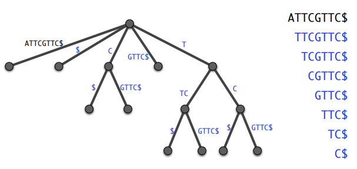

- **개요**: 주어진 문자열의 접미사를 트리로 표현합니다. 각 접미사는 루트에서 리프까지의 정확히 하나의 경로에 대응되도록 문자열로 레이블이 지정된 엣지가 있습니다.
- **구성**: 접미사 트리를 구성하는 것은 비효율적입니다. 또한 저장하는 데에도 비효율적입니다. 따라서 더 공간 효율적인 접미사 배열로 변환합니다.
- **검색 효율성**: 한번 구축하면, 검색은 패턴의 길이에 비례하여 매우 효율적입니다.
- **응용 분야**:
  - 텍스트에서의 키워드/패턴 검색
  - (최대) 반복
  - 고유한 부분 문자열
  - 최장 공통 부분 문자열
  - 비정확한 일치 등

#### Suffix Array


- **개요**: 문자열의 모든 접미사를 사전순으로 정렬한 배열입니다.
- **구성**: 각 접미사의 시작 위치를 인덱스로 표현하여 배열에 저장합니다.
- **저장 공간**: 접미사 트리보다 훨씬 공간 효율적입니다. 일반적으로 문자열 길이에 비례하는 공간을 차지합니다.
- **검색 효율성**: 문자열 내에서 패턴을 검색하는 데에 효율적입니다. 이진 탐색 등을 사용하여 빠르게 검색할 수 있습니다.
- **응용 분야**:
  - 텍스트 검색 및 검색 엔진
  - DNA 서열 분석
  - 문자열 압축
  - 비정확한 일치 및 Similarity 검색 등

## Lecture 3: Genomes, Evolutionary Forces

### Prokaryotes vs Eukaryotes

- **조직 구조 및 복잡성의 큰 차이**:
  - 진핵생물은 원핵생물에 비해 더 큰 게놈 크기와 더 많은 유전자를 가지고 있습니다.
  - 유전자 내에는 exons 사이에 존재하는 불필요한 부분인 introns이 포함되어 있습니다.
  - 진핵생물은 원핵생물에 비해 크고, nucleus, mitosis, 세포주기, meiosis, 성적 생식, 내부 구획 및 막으로 둘러싸인 세포기관을 가지고 있습니다.

#### Organisms vs. their genomes

- **prokaryotes**
  - 하나의 genome를 가지고 있으며, 이는 일반적으로 원형 염색체로 표현됩니다.

- **eukaryotes**
  - 두 개 또는 세 개의 서로 다른 genome를 가지고 있습니다.
  - 핵 genome(nuclear genomes)와 세포기관 genome(organellar genomes)로 구성됩니다.
    - 핵 genome: 생물체의 세포핵 내에 위치한 DNA로, 대부분의 유전자를 포함합니다.
    - 세포기관 genome:
      - 세포 기관인 미토콘드리아에 있는 DNA(all)와 플라스티드에 있는 DNA(autotrophs)로 구성됩니다.

- **genome의 진화적 역사**:
  - 생물체의 진화 및 관계와는 별개로, 그들의 genome 및 유전자의 진화적 역사가 있습니다.
  - 서로 다른 genome는 다양한 특성을 나타낼 수 있습니다

---

#### Prokaryotic genomes

- **genome 크기**:
  - 일반적으로 3-6 Mbp에 이르며, 약 3,000개의 유전자를 포함합니다. (예외도 있음)
  - 매우 콤팩트하고 높은 유전자 밀도를 갖습니다. 즉, intron 없이 실제로 쓰이는 유전자만 가지고 있습니다.

- **유전자 내용**:
  - 최소한의 유전자만을 가지고 있으며, 해로운 및 적응적이지 않은 유전자 손실이 신속하게 이루어집니다.
  - 유전자 내용은 동적으로 변화하며, 재배열, 돌연변이, 삭제 및 수직유전자이전(HGT)을 통해 유전자 소유를 얻을 수 있습니다.

- **유전적 특성**:
  - 매우 높은 유전자 효과적인 인구 크기(Ne; >10^9)를 갖고 있습니다.
    - ↑ 자연선택, ↓ 유전적 드리프트

- **원핵생물의 genome 특징**:
  - 원핵생물 중 일부 종은 원형 염색체를 가지고 있으며, 이들은 자유생활하는 종으로, 그 genome는 높은 밀도로 포장되어 있으며, 효율적이고 콤팩트한 형태를 띱니다.
  - 반면, 원핵생물의 일부 종은 별도의 특성을 갖고 있으며, 이는 보다 작은 크기와 다른 특성을 가지고 있습니다.
  
--- 

#### Eukaryotic nuclear genomes

- **nuclear autosomes**:
  - 이는 diploids에게 homologous한 염색체의 쌍으로 존재하며, 동일한 길이와 모양을 가진 염색체입니다.

- **nuclear sex chromosomes**:
  - 이는 동물과 식물에만 존재하며, 재조합이 중단된 후 autosomes에서 진화되었습니다.


-  핵 동물의 genome

   - **genome 구조의 보존**:
     - 포유동물의 핵 genome는 보다 보존된 구조를 갖고 있습니다.
     - 더 보존된 단일복사 유전자를 가지고 있습니다.

-  핵 꽃망울 식물의 genome

   - **genome의 이중화, 분율화 및 재배치**:
     - 꽃망울 식물의 핵 genome는 더 많은 복제, 분율화 및 재배치를 겪었습니다.
     - 더 많은 종에 특화된 유전자 군을 가지고 있습니다.

#### Eukaryotic organellar genomes

- **생물체의 진화적 역사와 별개**:
  - 세포기관의 genome는 호스트 생물체와는 별개로 진화했습니다.
  
- **감소된 유전자 내용**:
  - 세포기관의 genome는 일반적으로 호스트 genome보다 작고 유전자 수가 적습니다.
  
- **핵 genome의 조절**:
  - 세포기관의 활동은 핵 genome에 의해 조절되며, 그들의 작동과 유전자 이식에 필요한 조화가 이루어집니다.

- **미토콘드리아의 genome**:
  - 모든 진핵생물의 미토콘드리아는 하나의 공통 조상인 알파-프로테오박테리아에서 유래되었습니다.
  - 동물과 식물의 미토콘드리아는 크기와 유전자 수, 서열 및 구조 보존 수준에서 차이가 있습니다.
  
- **플라스티드의 genome**:
  - 광합성 진핵생물의 플라스티드는 공통 조상인 시아노박테리아에서 유래되었습니다.
  - 일부 계통에서는 구조적 재배치가 발생합니다.

---

### Evolutionarly Forces 

#### Meiotic recombination

- **역할**:
  - 염색체의 적절한 분리를 위해 필요합니다.
  - alleles들의 새로운 조합(haplotypes)을 생성합니다.
  - linkage disequilibrium 패턴에 영향을 줍니다.
  - 서로 다른 진화적 역사를 가진 genome 구역을 생성합니다.
  - 유전자 변환(gene conversion)을 통해 염기 구성에 영향을 줍니다.

- **장점**:
  - 생식성 재결합은 염색체의 효과적인 분리와 알렐의 새로운 조합을 가능하게 하므로 종 내에서 유전적 다양성을 유지하는 데 중요한 역할을 합니다.
  - 새로운 조합은 종 내에서 적응적 진화와 다양한 특성의 발현을 촉진할 수 있습니다.

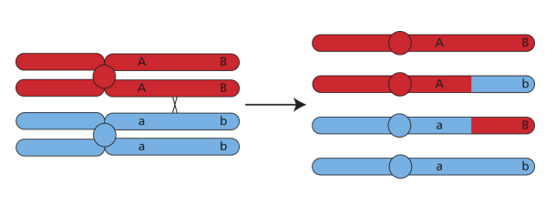

#### Selection

- **direct selection vs linked selection**:
  - **direct selection**은 개별 allele의 빈도에 영향을 미칩니다. 
    - 예를 들어, positive selection은 선호되는 allele의 빈도가 증가하는 것을 의미합니다.
  - **linked selection**은 유용한 allele 주변의 유전적 다양성 손실을 의미합니다.
  


- **예시**:
  - positive selection: 특정 환경 조건에서 특정 특성을 갖는 개체의 생존률이 더 높은 경우 해당 특성에 대한 유리한 allele의 빈도가 증가합니다.
  - linked selection: 특정 유용한 allele이 있는 부위 주변의 유전적 다양성이 감소하고, 이로 인해 해당 부위와 연결된 다른 유전적 변이들의 빈도도 변화합니다.
  
- **direct selection과 linked selection이 genome 다양성에 미치는 영향**:
  - 직접 선택과 linked selection은 genome의 다양성을 조절하는 데 중요한 역할을 합니다.


#### (Random) genetic drift

random genetic drift는 작은 규모의 모집단에서 주로 발생하는 현상으로, 각 세대에서의 우연한 변이의 누적으로 인해 알렐 빈도가 시간이 지남에 따라 확률적으로 변동하는 것을 의미합니다. 이는 모집단의 크기가 작을수록 더 두드러지게 나타납니다.

무작위 유전적 드리프트는 직접적으로 자연 선택과는 달리 특정 유전적 특성의 적응성에 대한 결과가 아니라, 단순히 우연한 상황에 의해 발생하는 변이의 누적으로 인한 현상입니다. 이는 대체로 작은 규모의 모집단에서 더 큰 영향을 미치며, 모집단의 크기가 커질수록 무작위 유전적 드리프트의 영향력이 줄어듭니다.

이러한 무작위 유전적 드리프트는 모집단의 유전적 다양성을 감소시키고, 모든 알렐의 빈도를 변화시키며, 종 내에서 유전적 구조의 변화를 유발합니다. 

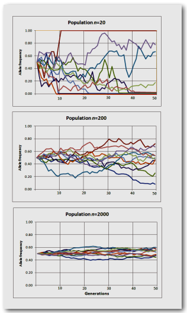


- **각 세대는 이전 세대의 샘플일 뿐**:
  - 무작위 유전적 드리프트는 각 세대가 이전 세대의 샘플일 뿐이라는 개념에 기반합니다. 
  - 즉, 각 세대의 개체는 이전 세대의 일부만을 대표합니다.

- **시간이 지남에 따른 알렐 빈도의 확률적 변동**:
  - 무작위 유전적 드리프트는 시간이 지남에 따라 알렐 빈도의 확률적 변동을 의미합니다.
  
- **작은 규모의 모집단에서 더 크게 발생**:
  - 무작위 유전적 드리프트는 작은 규모의 모집단에서 더 자주 발생합니다.


#### Gene flow

gene flow은 일반적으로 개체 또는 모집단 간에 유전적인 물질이 이동하는 과정을 나타냅니다. 이는 주로 migration, hybridization, introgression과 관련되며, 종 또는 하위 종 간의 개체들 간의 교배로 인해 발생합니다.

- **migration**: 서로 다른 지역 또는 모집단 간의 개체 이동으로 인해 유전자 유동이 발생합니다. 이는 개체들이 다른 지역으로 이동하거나 새로운 환경으로 이주할 때 발생할 수 있습니다.

- **hybridization**: 서로 다른 종 또는 하위 종의 개체들 간의 교배로 인해 유전자 유동이 발생합니다. 이는 서로 다른 유전자 풀을 가진 종들이 교차하여 새로운 유전적 조합을 형성하는 과정입니다.

- **introgression**: 유전자 유동의 한 형태로, 두 개 이상의 종이 서로간에 유전자를 교환할 때 발생합니다. 이는 종 간의 유전적 경계가 흐려지고, 한 종의 유전적 특성이 다른 종으로 전파되는 현상을 의미합니다.

유전자 유동은 많은 식물 및 동물 종의 진화에 큰 영향을 미쳤습니다. 이는 다양한 지역 또는 환경 조건에서의 개체 간의 유전적 교환으로 인해 새로운 특성이 도입되고 유전적 다양성이 유지되며, 종의 적응성과 진화에 영향을 미칩니다.

horizontal (lateral) gene flow는 서로 다른 종 간에 유전적 물질이 이동하는 과정을 나타냅니다. 이는 일반적으로 유전자 전달이 종 내에서 발생하는 것과는 달리, 서로 다른 종 간의 유전적 교환으로 인해 발생합니다. 특히 원생핵생물에서 이러한 현상이 빈번하게 나타납니다.

#### Pan-genome

pan-genome는 특정 종 내에서 발견되는 모든 개체의 DNA 서열의 비중복 컬렉션을 의미합니다. 이는 특정 종에 속하는 모든 개체의 genome의 전체적인 특성을 포괄하는 개념입니다. 이때문에 게놈 시퀀싱을 계속해도, 새 유전자가 발견되는 빈도가 줄어듭니다. 겹치는 부분이 많기 때문입니다.

pan-genome는 주로 core genome와 shell genome로 구성됩니다.


- core genome: 모든 해당 종 개체에게서 발견되는 유전자로 이루어진 부분입니다. 이는 모든 종에서 공통적으로 발견되는 핵심적인 유전자 집합으로, 종 내의 모든 개체에서 중요한 생존 및 기능적 역할을 담당합니다.

- shell genome: 특정 개체 또는 일부 그룹의 개체에서만 발견되는 부가적인(accessory) 유전자로 이루어진 부분입니다. 이는 특정 조건이나 환경에서 유용한 유전자이거나, 특정 하위 모집단에서 발현되는 변이를 포함합니다.


Eukaryoten의 pan-genome은 특정 Eukaryoten 종 내의 여러 개체나 모집단에서 발생하는 유전자와 non-coding genome region의 전체적인 집합을 의미합니다. 코리지놈과 부속 게놈을 포함하며, 대부분은 박테리아나 고균의 pan-gemone과는 달리 다양한 진화적, 생태적 요인에 영향을 받습니다.

Eukaryoten의 pan-gemone의 다양성에 영향을 주는 주요 요인은 다음과 같습니다:
- tandem and segmental duplications 
- loss, 
- mobile elements
- introgression
- selection (domesticated vs. wild relatives)
- genetic drift
- technical reasons

pan-genome게놈이 동적이라는 점을 감안하여 종 내의 모든 개체의 유전자 또는 게놈 콘텐츠를 나타냅니다. 종 내에서 발생하는 다양한 Evolutionary Forces에 의해 게놈은 계속해서 변화합니다. Pan-genome은 interspecific variation와 intraspecific variation를 포함합니다. 이 중 intraspecific variation은 bacteria에선 HGT, eukaryotes에선 보통 intergenic regions의 mutation으로 나타납니다. 

pan-genome은 한 종의 게놈 콘텐츠를 나타내는 일반적인 개체의 게놈 콘텐츠와는 다르게, 모든 개체의 유전자 또는 게놈 콘텐츠를 포함합니다. 따라서, 한개의 genome은 species 전체를 대표하지 않습니다. 


#### Evolutionary Forces

Evolutionary Forces은 모든 생물체 및 게놈에 영향을 미치며 서로 다른 규모의 다양한 수준에서 종 내 및 종 간의 유전적 변이를 유발합니다. 이러한 변이는 다음과 같은 다양한 규모로 나타날 수 있습니다.

* 단일 염기 변화
* Mbp 규모의 변이
* 염색체 재배열

**Evolutionary Forces은 종, 게놈 및 Genome 영역에 따라 강도가 다를 수 있습니다.** 시간이 흐를수록 유전적 변화가 발생할 기회가 더 많아지므로 종 간의 유전적 관계가 중요합니다. **주어진 시간이 더 길수록 더 많은 유전적 차이가 생길 기회가 많아지므로, 두 유전자가 갈라져 나온 시기가 중요합니다.** 종 간의 진화적 차이는 종의 유전적 다양성 및 게놈의 특성을 형성하는 데 중요한 역할을 합니다.

생물의 진화는 여러 가지 인자에 의해 형성되며, 이러한 Evolutionary Forces은 모든 생물체와 게놈에 영향을 줍니다. 이러한 Evolutionary Forces은 서로 다른 종 내에서 및 종 간에서 다양한 수준의 유전적 변이를 초래합니다. 유전적 다양성은 종 내부와 종 간의 다양한 수준에서 나타날 수 있으며, 이러한 다양성은 여러 가지 Evolutionary Forces에 의해 조절됩니다. 

Evolutionary Forces은 모든 생물체와 게놈에 영향을 미치며, 종 내에서 및 종 간에서 다양한 수준의 유전적 변이를 초래합니다. 이러한 Evolutionary Forces은 단일 염기 변화부터 Mbp 규모의 변이 및 염색체 재배열까지 다양한 형태로 나타날 수 있습니다. 종 간의 진화적 차이는 종의 생물학적 특성과 게놈 구조에 영향을 미치며, 유전적 다양성의 형성에 중요한 역할을 합니다. 

#### Taxonomic relationships

중요합니다. Taxonomic relationships은 생물종 간의 분류 및 진화적 관련성을 나타냅니다. 이것은 종 간의 공통 조상에 따라 결정됩니다. 생물종은 동일한 진화적 유래를 갖는 동일한 조상을 공유하는 모든 개체들의 집합입니다. 따라서 서로 밀접하게 관련된 종은 공통의 조상으로부터 유래했을 가능성이 높습니다.

Taxonomic relationships은 다양한 수준에서 확인될 수 있습니다. 종 내에서는 개체들 간의 Similarity 및 다양성을 기반으로 서브종, 변종 및 군집 등의 하위 분류가 정의될 수 있습니다. 종 간의 관계는 종들 간의 공통 특징 및 진화적 상호작용을 고려하여 결정됩니다.

Taxonomic relationships은 종의 형태학적, 생리학적, 분자생물학적 특징 등을 통해 판단됩니다. 형태학적 특징은 종 간의 외부적인 형태, 내장 구조, 해부학적 특성 등을 비교하여 종 간의 관련성을 파악하는 데 사용됩니다. 분자생물학적 기술 및 유전자 서열 분석은 DNA, RNA, 단백질 등의 생물학적 분자를 비교하여 종 간의 진화적 관계를 정의하는 데 사용됩니다.

### Mutations

Mutation은 크게 다음과 같은 여러 유형과 규모로 나뉠 수 있습니다.


1. Single nucleotide changes
 
    하나의 염기가 다른 염기로 변경되는 것을 의미합니다. 이는 주로 하나의 염기가 다른 염기로 대체되거나, 삽입 또는 삭제되는 경우에 발생합니다. 이러한 변화는 종종 point mutation이라고도 불리며, 주로 돌연변이 유발 요인 중 하나입니다.

2. Duplication, inversion, insertion, deletion, translocation

    이러한 종류의 돌연변이는 일부 DNA 세그먼트의 복제, 역전, 삽입, 삭제, 또는 이동으로 인해 발생합니다. 이러한 돌연변이는 일반적으로 몇 백 또는 몇 천 개의 염기를 포함하며, 큰 염기 단위에서 전체 염색체까지 다양할 수 있습니다.

#### Single nucleotide mutations

다양한 원인으로 발생할 수 있습니다.

- Base misincorporation during DNA replication

    DNA 복제 과정에서 DNA 폴리머아제가 잘못된 염기를 삽입하여 발생할 수 있습니다. 이는 DNA 복제 중의 실수로 인한 결과로, 주로 DNA 복제 과정에서 발생하는 돌연변이 중 하나입니다.

- Spontaneous mutations

    일부 돌연변이는 자발적으로 발생합니다. 이는 DNA 구조의 자연적인 불안정성 또는 생물체 내부 환경적 요인으로 인한 결과일 수 있습니다.

- Chemical & physical mutagens

    화학 또는 물리적 뮤테이젠은 DNA에 변화를 일으키는 환경적 요인입니다. 이러한 뮤테이젠에는 화학적 물질 (예: 방사선, 화학 물질), 환경 오염물질 등이 포함됩니다.

nuclear genome의 경우, 인간을 포함한 생물들에서는 보통 1 염기 사이트 당 약 10^-8 정도의 돌연변이가 발생합니다.

이러한 돌연변이 발생율은 여러 가지 요인에 따라 다르며, CpG 사이트, transition-transversion 돌연변이,  coding-noncoding 영역, synonymous-mis/nonsense 돌연변이, 염색체 등과 같은 요소들에 따라 발생율이 다르게 나타날 수 있습니다.

#### Larger scale Mutation

- Deletion:

    특정 DNA 세그먼트가 제거되는 돌연변이입니다. 이는 일반적으로 큰 크기의 돌연변이로서, 삭제된 세그먼트의 크기는 수 천 개의 염기쌍에 이를 수 있습니다.

* Inversion:

    특정 DNA 세그먼트가 Inversion되어 원래의 방향과 반대로 재배열되는 돌연변이입니다. Inversion은 일반적으로 큰 크기의 세그먼트를 포함하며, Inversion된 세그먼트의 길이는 수천 개의 염기쌍에 이를 수 있습니다.

* Insertion:

    특정 DNA 세그먼트가 다른 위치에 삽입되는 돌연변이입니다. 이는 대개 소량의 염기쌍에서부터 수천 개의 염기쌍까지 다양할 수 있습니다.

* Translocation:

    한 염색체에서 다른 염색체로 세그먼트가 이동하는 돌연변이입니다. 이러한 세그먼트 이동은 대개 두 염색체 간의 큰 세그먼트를 포함합니다.

* Duplication:

    특정 DNA 세그먼트가 두 번 이상 복제되는 돌연변이입니다. 중복은 일반적으로 세그먼트, 단편, 전체 염색체 또는 전체 genome 수준에서 발생할 수 있습니다. 이는 큰 크기의 변이로서, 중복된 세그먼트의 크기는 수천 개에서 수백만 개의 염기쌍까지 이를 수 있습니다.


#### Segmental duplications in humans

인간의 세그멘탈 중복은 인간 genome에서 특정 DNA 세그먼트가 복제되어 두 번 이상 나타나는 현상을 가리킵니다. 이는 일반적으로 수천 개에서 수백만 개의 염기쌍에 이르는 큰 크기의 세그먼트에 대해 발생합니다. 세그멘탈 중복은 인간 genome의 중요한 특징 중 하나입니다. 

생각보다 자주 일어나며, 한 염색체에서 다른 염색체의 조각이 매우 자주 발견됩니다. 같은 염색체 내에서도 매우 자주 일어나는 현상입니다. 

인간의 세그멘탈 중복은 다음과 같은 특징을 가집니다:

* **크기**: 대부분의 경우, 세그멘탈 중복은 수천 개 이상의 염기쌍을 가지며, 때로는 수백만 개의 염기쌍까지 늘어날 수 있습니다.

* **위치**: 세그멘탈 중복은 인간의 genome 여러 영역에 고르게 분포되어 있습니다.

* **기능적 역할**: 세그멘탈 중복은 유전자의 다양한 기능적 변화에 기여할 수 있습니다. 이 중복된 세그먼트는 유전자 복제 및 조절에서 다양한 기능을 수행할 수 있으며, 종종 질병의 원인이 될 수도 있습니다.

* **genome 구조 및 진화에의 영향**: 세그멘탈 중복은 genome 구조의 다양성을 증가시키고, 진화적 변화 및 종 내 다양성에 중요한 영향을 미칠 수 있습니다.

* 질병과의 관련성: 세그멘탈 중복은 많은 유전적 질병과 관련이 있습니다. 중복된 세그먼트의 잘못된 조절 또는 기능적 이상은 질병의 발생과 관련이 있을 수 있습니다.

#### Wohle Genome Duplication in plants

Whole Genome Duplication, WGD은 식물의 진화에서 중요한 역할을 하고 매우 흔한 현상입니다. 이는 한 종의 생물이 전체 genome를 두 번 복제하여 발생하는 것으로, 이로 인해 genome의 크기가 2배로 증가합니다. 식물의 WGD는 여러 가지 중요한 특징을 가지고 있습니다:

* **진화적 현상**: WGD는 식물 진화에서 일반적으로 발생하는 현상 중 하나입니다. 과거 수백만 년 동안 많은 식물 종에서 WGD 사건이 발생했으며, 이는 식물의 다양성 및 적응성을 촉진하는 데 중요한 역할을 합니다.

* **genome 구조의 다양성**: WGD로 인해 발생하는 genome 복사본은 genome 내에서 다양한 구조적 및 기능적 변화를 초래합니다. 이로 인해 genome의 다양성이 증가하고 새로운 유전자 기능이 발생할 수 있습니다.

* **유전자 기능의 변화**: WGD로 인해 발생하는 genome 중복은 새로운 유전자 기능의 발생과 기존 유전자 기능의 변화에 영향을 줄 수 있습니다. 이는 종 내에서 적응성 및 진화적 적응성을 촉진할 수 있습니다.

* **질병 연구**: WGD는 식물 질병 연구에도 중요한 영향을 미칩니다. 중복된 genome 영역은 종종 질병 내성 및 저항성과 관련이 있으며, 이를 통해 식물의 생존 및 생산성을 향상시키는 데 기여할 수 있습니다.

* **유전자 발현 및 조절**: WGD는 유전자 발현과 조절에도 영향을 미칩니다. 중복된 genome 영역은 유전자 발현 및 조절 네트워크의 복잡성을 증가시키고, 이로 인해 식물의 발달 및 적응성에 중요한 영향을 줄 수 있습니다.

#### Fate of duplicated genes

중복된 유전자는 주로 세 가지 주요 운명을 갖게 됩니다: 손실(loss), 유지(retention), 그리고 새로운 기능 획득(neofunctionalization) 또는 기능의 분할(subfunctionalization)을 통한 기능적 변화입니다.

- **Loss**:
  
  - 물리적 손실: 중복된 영역이 genome에서 완전히 사라지는 경우입니다.
  - 기능적 손실: 중복된 유전자가 기능을 잃어버리고 pseudogene가 되는 경우입니다. 이는 주로 변이에 의한 변화나 기능상 불필요한 상황에서 발생합니다.

- **Retention**:

  - Neofunctionalization: 

      중복된 유전자가 새로운 기능을 획득하여 새로운 생물학적 기능을 수행하는 경우입니다. 이는 새로운 환경 조건이나 유전자 발현 패턴의 변화에 의해 유도될 수 있습니다.
  - Subfunctionalization: 
  
      중복된 유전자가 과거의 기능을 분할하여 하위적인 기능을 수행하는 경우입니다. 각 중복된 유전자는 원래의 유전자가 가졌던 부분적 기능을 유지하며, 이에 의해 새로운 생물학적 기능이 확장될 수 있습니다.

  - gene balance model:

      중복된 유전자가 수량적 불균형을 피하기 위해 특정 유전자나 유전자 그룹이 보존되는 현상입니다. 이 모델은 유전자의 배율이나 발현 수준을 조절하여 중복된 유전자의 기능을 조화시키는 역할을 합니다.

  - absolute dosage model:

      중복된 유전자가 새로운 기능을 획득하는 대신 증가된 유전자의 배율을 선호하는 현상입니다. 이 모델은 중복된 유전자의 수량이 유전자 발현이나 기능에 미치는 영향을 강조합니다.


#### Gene & genome duplications


유전자 및 genome 중복은 진화적 프로세스에서 중요한 역할을 합니다. 여기에는 다음과 같은 주요 측면이 포함됩니다:

- **small scale duplication and loss**

    작은 규모의 중복과 손실은 지속적으로 발생하는 과정입니다. 이러한 작은 규모의 중복 및 손실은 개별 유전자 또는 작은 DNA 세그먼트의 복사 및 손실로 이루어집니다. 이것은 생물의 다양성과 적응성에 기여할 수 있습니다.

- **large-scale duplications**

    - 식물, 곰팡이, 곤충, 척추동물 등에서 예상보다 더 자주 발생하는 대규모 중복이 있습니다. 이러한 대규모 중복은 종종 오랜 시간 동안 발생했거나 매우 오래된 경우에는 감지하기가 어려울 수 있습니다.
    - 대규모 중복은 종의 생물학적 다양성과 진화에 중요한 영향을 미칠 수 있으며, 종의 새로운 특성이나 기능의 형성에 기여할 수 있습니다.

- **multi-locus**

    대부분의 genome에서 multi-locus gene family가 존재합니다. 이는 공통 조상 유전자의 복사로부터 파생된 다양한 유전자들로 구성됩니다. 이러한 다중군 유전자는 기능적으로 관련된 유전자들로 구성되어 있으며, 서로 다른 기능을 수행하거나 다양한 조건에서 발현될 수 있습니다. 이러한 다중군 유전자는 종의 적응적 다양성과 진화적 적응에 중요한 역할을 합니다.


#### Transposable / Mobile elements

아주 씹새기죠!

Transposable or Mobile elements는 genome 내에서 이동할 수 있는 유전자입니다. 이러한 요소는 Barbara McClintock에 의해 "jumping genes"라고도 불립니다. 시퀀싱을 방해하는 요소중 하나입니다.

- **Retrotransposons (class I)**

    RNA intermediate를 통해 이동합니다. 이들은 reverse transcriptase를 사용하여 RNA를 DNA로 역전사합니다. 주요 서브 클래스에는 LTR(Long Terminal Repeat)가 있는 LTR Retrotransposons과 LTR이 없는 non-LTR Retrotransposons(SINEs, LINEs)이 있습니다.

    LTR은 Long Terminal Repeats의 약어로, LTR retrotransposons이나 일부 바이러스 등의 유전자 요소에서 발견되는 특정 유전자 지역을 가리킵니다. 이는 retrotransposons이나 바이러스 RNA의 양쪽 끝에 있는 반복적인 DNA 시퀀스를 나타냅니다.

    LTR은 retrotransposons의 삽입 및 활성화에 관련된 여러 가지 생물학적 기능을 수행합니다. 이들은 리트로트랜스포좀이 DNA에 삽입될 때 리트로트랜스포좀 유전자의 트랜스크립트를 시작하고 종료하는 데 관여하며, retrotransposons의 활성화 및 유전자 삽입에 필수적입니다.

    - **LTR retrotransposons**
      - LTR으로 둘러싸여 있습니다. 이러한 LTR은 retrotransposons의 삽입 사이트를 식별하고 트랜스크립트에 참여합니다. LTR retrotransposons은 종종 자율적인 요소로서 다른 유전자를 삽입하는 데 필요한 모든 단백질을 가지고 있습니다.
    - **non-LTR retrotransposons**
      - LTR이 없는 retrotransposons은 retrotransposons의 또 다른 유형입니다. 대표적인 예로는 LINEs와 SINEs가 있습니다.
      - **LINEs**: 
            
        L1(Long Interspersed Nuclear Elements)이라고도 불리는 LINEs는 비-LTR retrotransposons 중 하나로, 자율적인 유전자 요소입니다. 인간 게놈에서 약 17%를 차지하며, 500,000개 이상의 복사본이 있습니다.
      - **SINEs**:

           Alu가 대표적인 SINEs로, 비-LTR retrotransposons 중 하나입니다. Alu 요소는 인간 게놈에서 1,000,000개 이상의 복사본이 존재하며, 자율적이지 않은 요소입니다.

- **DNA transposons (class II)**

    RNA 중간체 없이 DNA로 직접 이동합니다. 이들은 DNA 재배열 및 삽입을 통해 이동합니다.

#### Orphan genes

Orphan genes는 다른 종이나 계통에서 (감지 가능한) homologs 유전자를 갖지 않는 유전자를 나타냅니다. 새로이 서열이 결정된 생물체의 유전자 중 약 1-25%가 Orphan 유전자로 식별될 수 있습니다.

이러한 유전자가 다른 종이나 계통에서 homologs 유전자를 갖지 않는 이유에는 두 가지 가능성이 있습니다.

- **true absence / lineage specificity**: 일부 Orphan 유전자는 새롭게 발생하거나 진화적으로 변형된 것일 수 있습니다. 이는 특정 종이나 계통에만 존재하는 생물학적인 혁신을 나타냅니다.

- **homology-detection failure**: 다른 종이나 계통에 homologs 유전자가 존재할 수 있지만, 현재의 비교 방법으로는 감지되지 않을 수 있습니다. 이는 homology 검출 기술의 한계로 인해 발생할 수 있습니다. 따라서 일부 유전자는 다른 종이나 계통에서 유사한 역할을 수행하더라도 현재의 비교 방법으로는 감지되지 않을 수 있습니다.

## Lecture 4: Genome Assembly

**Genome Assembly**

Genome Assembly은 생물의 전체 유전 정보를 구성하는 DNA 서열을 결합하여 일련의 연속적인 서열로 구성하는 프로세스입니다. 이는 대규모 프로젝트에서 발생한 DNA 시퀀싱 데이터를 분석하여 생물학적 정보를 추출하는 중요한 단계 중 하나입니다. 다음은 Genome Assembly 과정에 대한 간략한 설명입니다.

1. **Sequencing**:
   - Genome Assembly 프로세스는 먼저 대상 종의 DNA를 시퀀싱하여 수천 또는 수백만 개의 짧은 DNA 조각을 생성합니다. 이 시퀀싱은 다양한 기술을 사용하여 수행될 수 있으며, 최근에는 높은 품질의 긴 reads를 생성할 수 있는 장기 시퀀싱 기술이 발전되었습니다.

2. **Assembly**:
   - 시퀀싱 데이터를 기반으로 컴퓨터 알고리즘을 사용하여 이러한 짧은 DNA 조각을 조합하여 원래 Genome의 전체 서열을 재구성합니다. 이 과정은 종에 따라 복잡도가 다를 수 있으며, 시퀀싱 데이터의 품질과 양, 그리고 종의 크기와 복잡도에 영향을 받습니다.

3. **Scaffolding**:
   - 종종 Assembly된 DNA 조각은 큰 덩어리로 결합될 수 있으며, 이는 개별 염색체 수준의 Genome 정보를 추출하는 데 어려움을 초래할 수 있습니다. Genome 분할은 이러한 덩어리를 분리하고, Assembly된 조각을 개별 염색체로 그룹화하는 과정입니다.

4. **Validation**:
   - Genome Assembly의 마지막 단계는 Assembly된 Genome의 품질을 검증하는 것입니다. 이는 Genome Assembly의 정확성과 완전성을 평가하고, 잘못된 구조나 인위적인 수정을 식별하는 데 도움이 됩니다.


### Online database

온라인 데이터베이스는 웹 기반으로 접근 가능한 데이터 저장소입니다. 여러 종류의 정보를 저장하고 관리하며, 연구자들이 그 정보를 검색하고 활용할 수 있습니다. 여기에는 UniProt, GenBank, 그리고 genome resource와 같은 데이터베이스들이 포함됩니다.

**UniProt**:
- 목적: 기능적으로 주석이 달린 단백질 서열.
- 하위 분류:
  - 'sprot': 수동으로 주석이 달린 단백질 서열.
  - 'trembl': 컴퓨터에 의해 주석이 달린 단백질 서열.

**GenBank**:
- 목적: 과학자들이 생성하고 제출한 서열 데이터.

**Genome Resource**:
- 목적: 하나의 Genome에 대한 모든 단백질 코딩 유전자의 완전한 집합 (nt, aa).
- 다양성: 종에 특화된 데이터베이스 및 NCBI, ENSEMBL, UniProt, JGI 등에서 제공되는 데이터베이스.

### Raw and pre-processed data

**Raw data**는 실험 또는 조사를 통해 얻어진 초기 데이터를 의미합니다. 이 데이터는 보통 처리되지 않은 형태로 존재하며, 분석이나 해석 전에 전처리 과정을 거쳐야 합니다.

**pre-processed data**는 Raw data를 분석에 적합한 형태로 가공하는 과정입니다. 여러 단계로 이루어질 수 있으며, 일반적으로 다음과 같은 작업들이 포함됩니다:

1. **어댑터 제거(Adapter Removal)**:
   - 다양한 Genome 시퀀싱 기술에서는 DNA 샘플이 시퀀싱 전에 어댑터(특정 서열)와 결합될 수 있습니다. 이 어댑터는 읽기 과정에서 불필요한 잡음을 생성할 수 있으므로, 어댑터를 제거하는 것이 중요합니다.

2. **품질 필터링/트리밍(Quality Filtering/Trimming)**:
   - 시퀀싱 과정에서는 어떤 부위의 데이터가 부정확하거나 낮은 품질을 가질 수 있습니다. 이런 경우에는 데이터의 품질을 높이기 위해 필터링 또는 트리밍 작업을 수행합니다. 이는 품질이 낮은 부분을 제거하거나 수정함으로써 데이터의 정확성을 향상시킵니다.

3. **기타 작업(기타)**:
   - **오류 수정(Error Correction)**: 시퀀싱 과정에서 발생한 오류를 수정하여 데이터의 정확성을 개선하는 작업입니다.
   - **오염 제거(Removal of Contamination)**: 외부로부터 유입된 다른 종의 DNA 또는 오염물질을 제거하는 과정입니다.

**파일 형식**:
이러한 전처리 작업은 다양한 파일 형식을 통해 수행될 수 있습니다. 일반적으로 DNA 시퀀싱 데이터는 FASTQ 또는 FASTA 형식으로 저장됩니다. 전처리된 데이터 역시 동일한 형식으로 저장될 수 있으며, 특정 전처리 도구나 소프트웨어에 따라 다를 수 있습니다.

+ **FASTA**

  FASTA 형식은 DNA, RNA, 또는 단백질 서열을 포함하는 텍스트 파일 형식입니다.
  FASTA 파일은 특정 분자의 서열을 나타내는 데에 사용됩니다.
  각 서열은 헤더(Header)와 서열 데이터로 구성됩니다. 헤더에는 서열의 식별 정보가 포함되어 있습니다.

  FASTA 파일은 두 형태가 반복되는 형식입니다.
  첫 부분은 항상 ">"로 시작합니다.
  ```
  >Header1
  AGCTGACTGACTGACTGACTGACTGACTGACTGAC
  >Header2
  TGACTGACTGACTGACTGACTGACTGACTGACTGA
  ```
+ **FASTQ**

  FASTQ 형식은 DNA 또는 RNA 시퀀싱 데이터를 저장하는 데 사용되는 텍스트 파일 형식입니다.
  
  각 라인은 다음과 같은 정보를 포함합니다: 시퀀싱 리드(서열), 품질 값, 리드 식별자 등.

  + **sequence ID**: @ 로 시작하며, 해당 서열의 이름을 나타냅니다.
  + **sequence**: 실제로 읽은 염기서열 정보입니다.
  + **description**: ‘+’ 글자로 시작하는데, + 하나만 있기도 하고 sequence ID를 넣거나 설명을 넣는 부분입니다.
  + **quality**: 각 염기서열이 얼마나 정확히 읽혔는지를 나타냅니다. Phred quality score 라는 표현법을 사용합니다.

  fastq 파일은 NGS (Next generation sequencing data) 의 결과를 저장하는 데 주로 쓰입니다.
  NGS 실험을 진행하면, 그 결과로 cDNA library 서열을 읽어서 데이터로 얻을 수 있습니다.

  FASTQ 파일은 FASTA에 비해 품질 정보(Quality Scores)를 제공하여 각 서열의 품질을 평가할 수 있습니다. 이는 전처리 및 분석 과정에서 유용합니다.

  ```
  @Header1
  AGCTGACTGACTGACTGACTGACTGACTGACTGAC
  +Header1
  !""""""""""""""""""""""""""""""""""""""""""""
  @Header2
  TGACTGACTGACTGACTGACTGACTGACTGACTGA
  +Header2
  !""""""""""""""""""""""""""""""""""""""""""""
  ```
  fastq 파일은 네 줄이 한 단위입니다.
  서열 하나를 "read"라 표현합니다.

  보통 이 파일을 직접 사용하기보다, reference genome 에 align 한 뒤에 활용됩니다.
  fastq 파일은 대부분의 연구에서 raw data, 즉 가공되지 않은 원본 파일로 여겨집니다.

여기서 사용되는 read는 몇가지 특징을 가집니다.

1. **Length of Reads**:
   - 시퀀싱 기술에 따라 다르지만, 일반적으로 생성된 리드(Reads)는 genome, chromosome 또는 gene 크기보다 훨씬 짧습니다.

2. **Errors**:
   - 서열 읽기 과정에서 발생하는 여러 가지 요인으로 인해 리드에는 일부 오류가 포함될 수 있습니다. 이러한 오류는 후속 분석에 영향을 미칠 수 있으며, 오류 수정 및 품질 제어 과정이 필요할 수 있습니다.

3. **Not uniformly distributed**:
   - 서열 데이터는 종종 특정 영역에 높은 커버리지(coverage)를 가지고 있거나, 그렇지 않은 경우가 있습니다. 이는 서열을 읽는 과정에서 발생하는 다양한 기술적 한계로 인해 발생할 수 있습니다.

4. **Redundancy**:
   - 일반적으로, 한 위치의 Genome는 여러 번 시퀀싱되어 다수의 리드가 생성됩니다. 이를 통해 커버리지를 계산할 수 있습니다.

- **커버리지(Coverage)**:
   - 각 서열 데이터의 위치가 얼마나 많은 리드로 커버되었는지를 나타내는 측정 항목입니다. 이는 시퀀싱 데이터의 품질을 평가하고, 후속 분석의 정확성을 보장하는 데 중요합니다.
   - 최적의 커버리지는 연구 목적, 시료, 시퀀싱 기술 등에 따라 다를 수 있습니다. 예를 들어, Sanger 시퀀싱에서는 8배 커버리지가 충분할 수 있지만, Illumina 시퀀싱에서는 일반적으로 50-100배의 커버리지가 사용됩니다.
   - 가령 어떤 DNA 조각을 sequencing할때, 보통 잘게 random subcloning을 해서 sequencing을 합니다. 그러면 한 DNA 조각의 여러 부분이 sequecing되는데 이때 어느 한 부분이 몇번 읽혔는지를 **depth**라고 합니다. 각 sequencing 길이를 다 합친 길이가 그 DNA 길이의 몇배인가를 **coverage**라고 부릅니다.

### Assembly: Principle

Genome Assembly은 DNA 서열 데이터를 사용하여 원래의 Genome 또는 염색체의 전체 서열을 재구성하는 프로세스입니다. 여기에는 다음과 같은 원리들이 포함됩니다:

 - 서로 겹치는 리드 또는 서열 조각들은 동일한 Genome 위치에서 유래되었다는 가정하에 Assembly됩니다. 이를 통해 서로 겹치는 서열 조각들을 연결하여 전체 Genome의 서열을 재구성할 수 있습니다.

 - 서로 겹치는 서열 영역이 동일한 Genome 위치에서 유래되었다고 가정하지만, 이 가정은 종종 현실에서 충족되지 않습니다.
   - **동일한 서열, 다른 위치**: 동일한 서열이 다른 Genome 위치에서 유래된 경우가 있을 수 있습니다. 예를 들어, 반복적인 DNA 구간이 여러 번 복사되어 다수의 위치에서 발견될 수 있습니다.
   - **다른 서열, 동일한 위치**: 서로 다른 서열이 동일한 Genome 위치에서 유래된 경우도 있을 수 있습니다. 이는 돌연변이, 염기 치환 등으로 인해 발생할 수 있습니다.

이러한 비일치는 Assembly 과정에서 오류를 일으킬 수 있으며, 이를 극복하기 위해 다양한 알고리즘과 기술이 사용됩니다. 

이외에도 여러 어려운 점이 존재합니다:

Genome Assembly 과정에서는 다양한 도전 과제가 있습니다. 이러한 도전 과제들은 Assembly의 정확성과 완성도에 영향을 미칠 수 있습니다. 아래는 주요한 도전 과제들과 간단한 설명입니다:

1. **Untrimmed Poor-Quality Reads**:
   - 품질이 낮은 리드는 잘못된 Assembly 결과를 초래할 수 있습니다. 이를 해결하기 위해 리드를 품질 필터링하거나 트리밍해야 할 수 있습니다.

2. **Errors**:
   - 시퀀싱 과정에서 발생하는 다양한 종류의 오류가 있을 수 있습니다.
     - **Base Calling Errors**: 시퀀싱 기기에서 발생하는 베이스 콜링 오류는 잘못된 염기가 서열에 삽입되거나 대체될 수 있습니다.
     - **삭제(Deletion)**: 리드에서 염기가 누락될 수 있습니다.
     - **삽입(Insertion)**: 리드에 잘못된 염기가 삽입될 수 있습니다.

3. **Low Coverage, Bad Linkage**:
   - 일부 영역은 리드로 충분히 커버되지 않거나, 서로 잘 연결되지 않을 수 있습니다. 이는 Assembly의 정확성과 완성도에 영향을 줄 수 있습니다.

4. **Unknown Orientation**:
   - 시퀀싱 데이터에서 리드의 방향이 명확하지 않은 경우가 있습니다. 이는 서로 다른 리드의 방향을 결정하기 어렵게 만들 수 있습니다.

5. **Contamination**:
   - 시퀀싱 샘플에는 다른 종의 DNA가 포함될 수 있으며, 이는 Assembly 과정에서 잘못된 결과를 초래할 수 있습니다.

6. **High Heterozygosity**:
   - 한 Genome 내에서의 다양한 다형성은 Assembly을 어렵게 만들 수 있습니다.

7. **Polyploidy**:
   - 몇몇 종은 다중 염색체를 가지고 있을 수 있으며, 이는 Assembly을 더 복잡하게 만듭니다.

8. **Repeats**:
   - Genome 내 반복적인 구조는 올바른 Assembly을 어렵게 만들 수 있습니다.

이중 repeats는 Assembly에서 주요하게 다뤄지는 challenge입니다.

Repeat은 Genome 내에서 동일한 또는 유사한 서열이 여러 번 Repeat되는 현상을 의미합니다. 이는 Genome Assembly 및 분석 과정에서 중요한 도전 과제 중 하나입니다. 주요한 종류의 Repeat은 다음과 같습니다:

1. **Simple Repeats**:
   - 단순 Repeat은 짧은 길이의 서열이 여러 번 Repeat되는 형태를 나타냅니다. 예를 들어, "ATATATATAT"와 같이 Repeat되는 서열이 있습니다.

2. **Tandem or Dispersed Gene Families**:
   - 직렬 또는 분산된 유전자 패밀리는 특정한 기능을 가진 여러 개의 유사한 유전자가 Genome 내에 직렬로 또는 분산되어 있는 형태를 의미합니다.

3. **Segmental Duplications**:
   - 세그멘탈 중복은 큰 단위의 DNA 서열이 Genome 내에서 중복되어 있는 현상을 나타냅니다. 이러한 중복은 일부 부분이 서로 유사하거나 동일한 경우가 있습니다.

4. **Interspersed Repeats**:
   - 삽입 반복은 다양한 유형의 전사 가능한 요소(Transposable Elements)로 구성됩니다. 이는 DNA 서열이 Genome 내에서 이동하거나 복사되는 현상을 나타냅니다.
     - **DNA 트랜스포좀(DNA Transposons)**: 예를 들어, 옥수수의 Ac 요소와 같은 DNA 트랜스포좀이 있습니다. 80bp - 3kb
     - **바이러스성 레트로트랜스포좀(Viral Retrotransposons)**: 예를 들어, 효모의 Ty 및 과일파리의 Copia 요소 등이 있습니다. 250bp - 10kb
     - **비바이러스성 레트로트랜스포좀(Non-viral Retrotransposons)**: 예를 들어, SINEs(Short Interspersed Nuclear Elements) 및 LINEs(Long Interspersed Nuclear Elements) 등이 있습니다. 100-400bp // 6-8kb

5. **Polyploids**:
   - 다중체는 여러 개의 완전한 게놈 세트를 가진 유기체를 의미합니다. 이는 Assembly 및 분석을 더 복잡하게 만들 수 있습니다.

### Assembly: General Steps

Genome Assembly는 주어진 시퀀싱 데이터로부터 원래의 Genome 또는 염색체의 전체 서열을 재구성하는 프로세스입니다. 일반적으로 다음과 같은 단계로 진행됩니다:

1. **Identify Read Overlaps, Assemble into Contigs**:
   - 먼저 시퀀싱된 리드들 간의 overlapping을 식별하고, 이를 기반으로 Contig를 Assembly합니다. 겹치는 부분을 공유하는 리드들은 서로 연결되어 Assembly되어야 합니다. 따라서 Contig는 겹치는 영역을 나열해놓은 Assembly품, 즉 중첩 DNA 세그먼트 입니다.

2. **Determine Order and Orientation of Contigs: Scaffolds**:
   - 다음으로, Assembly된 Contig들 간의 상대적인 위치와 방향을 결정하여 Scaffold를 생성합니다. 이 과정에서 Contig들 간의 연결 정보 및 Genome 맵핑 데이터를 활용합니다. Scaffold는 Contig들 간의 공간적 관계를 나타내며, Genome Assembly의 완성도를 높이는 데 중요한 역할을 합니다.

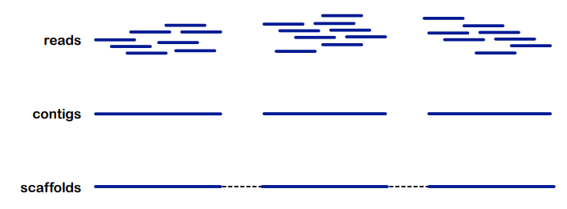


#### Greedy 

Greedy approach는 Genome Assembly을 위한 한 가지 전략으로, 간단하고 직관적인 방식으로 리드 간의 Overlap을 통해 Assembly을 시도하는 방법입니다. 일반적으로 다음과 같은 단계로 진행됩니다:

1. 먼저, 모든 서열 리드의 prefix와 suffix를 포함하는 룩업 테이블을 생성합니다.

2. 시작 리드를 선택하고, 이를 기반으로 다른 리드를 확장합니다. 각 확장 단계에서는 가장 큰 Overlap을 기반으로 다음 리드를 선택합니다.

3. 다음 리드를 선택할 때는 현재의 리드와 가장 큰 Overlap을 가진 리드를 선택합니다. 이를 통해 contig를 점진적으로 확장할 수 있습니다.

4. 그러나 이러한 접근 방법은 종종 잘못된 Assembly을 초래할 수 있습니다. 예를 들어, 두 개 이상의 리드가 확장될 수 있지만 실제로 서로 겹치지 않는 경우가 있습니다. 이를 발견해야 합니다.

5. 이러한 과정을 반복하여 최종적으로 하나 이상의 contig를 생성합니다. 그러나 이 방법은 종종 오류와 불완전한 Assembly을 초래할 수 있습니다.


이런 Greedy approach는 아직도 short-shotgun data를 읽는데 사용되며, 주로 다음과 같은 특징을 가지는 데이터에 사용될 수 있습니다:

- nuclear genome보다 작은 사이즈
- single(circular) genome
- 세포 당 수백개의 copy가 있는 경우
- Greedy는 일반적으로 나름 괜찮은 결과를 줍니다. 

그러나 Repeat과 같은 문제점이 여전히 존재합니다.

**NOVOPlasty**는 이 작업에 사용될 수 있습니다.

NOVOPlasty는 Genome Assembly을 위한 간단하고 효율적인 도구로, 단일 organellar genomes를 단편 시퀀싱 데이터로부터 Assembly하는 데 사용됩니다. 주로 organellar genomes를 Assembly하는 데 사용되며, 일반적으로 nuclear genome 보다 작고 단일한(circular) Genome로서 존재하는 organellar genomes에 적합합니다.

NOVOPlasty는 다음과 같은 주요 특징을 가지고 있습니다:

+ 간단하고 사용자 친화적인 인터페이스: NOVOPlasty는 사용하기 쉽고 사용자 친화적인 인터페이스를 제공하여 비전문가도 쉽게 사용할 수 있습니다.

+ 단일 명령어로 작동: 사용자는 단일 명령어를 사용하여 NOVOPlasty를 실행할 수 있으며, 설치와 설정이 간단합니다.

+ 내장된 비선형 시퀀싱: NOVOPlasty는 시퀀싱 데이터에 포함된 내부 순환 구조를 검색하여 organellar genomes를 Assembly하는 데 사용됩니다.

+ Genome Assembly 및 완성: NOVOPlasty는 단편 시퀀싱 데이터로부터 organellar genomes를 Assembly하고 완성된 Genome 서열을 생성합니다.

+ Genome Assembly 결과 시각화: Assembly된 Genome의 결과는 사용자에게 제공되며, Genome Assembly 결과를 시각화할 수 있는 다양한 도구를 제공합니다.

NOVOPlasty는 organellar genomes의 빠르고 효율적인 Assembly을 위한 간단한 도구로 널리 사용되며, 비교적 작은 데이터셋에 적합합니다. 그러나 대량의 시퀀싱 데이터 및 복잡한 구조를 가진 Genome의 경우에는 다른 전문 도구를 고려해야 할 수 있습니다.


### Overlap-layout-consensus: OLC

#### Algorithm

OLC(Overlap-Layout-Consensus) 알고리즘은 단편 시퀀싱 데이터에서 Genome를 Assembly하기 위한 일련의 알고리즘입니다. 이 중에서 overlap graph는 OLC 알고리즘의 첫 번째 단계로, 시퀀싱된 리드들 간의 Overlap 관계를 그래프로 나타냅니다.

+ Node는 시퀀스 리드를 나타냅니다.
+ Edge의 가중치는 Preffix와 suffix의 Overlap을 나타냅니다.
+ 목표는 그래프를 통해 Genome 또는 Contig를 찾는 것입니다.
+ 이를 위해 다음과 같은 접근 방식을 사용합니다:
  + 그래프 탐색(Traversing the Graph): Overlap 그래프를 탐색하여 Genome 또는 Contig를 찾습니다.

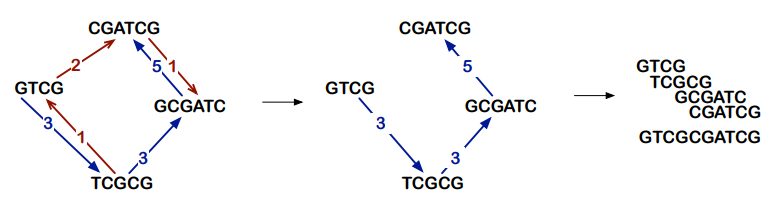


**Overlap:**
- Overlap 그래프를 계산합니다. 이 그래프는 각 노드가 시퀀스 리드를 나타내고, 에지의 가중치는 각 리드 간의 Overlap을 나타냅니다.
- Overlap을 찾기 위해 suffix trees 및/또는 dynamic programming을 사용할 수 있습니다. 이 과정은 보통 크고 복잡한 데이터셋에서 수행됩니다.

**Layout:**
- 그래프에서 가능한 경우에 중복을 제거합니다. 이는 그래프를 간결하게 만들고, Assembly 과정에서의 불필요한 복잡성을 줄입니다.
- Overlap 그래프의 일부를 사용하여 contigs를 계산합니다.

**Consensus:**
- 각 Contig 위치에 대해 하나의 염기(nucleotide)를 선택하여 Genome를 Assembly합니다.
- 이 단계에서는 Overlap 그래프로부터 계산된 Contig를 기반으로 최종 Genome를 구성합니다.

그러나, 문제가 있습니다. 많은 overlap으로 인해, 여러 경로가 생길 수 있고, 이는 결국 여러 genome이 가능하단 뜻 입니다. 

따라서 contig는 명확하게 식별할 수 있는 가장 긴 연속적인 세그먼트의 집합을 출력합니다. 그러나, 이렇게 OLC로 만들어진 contigs의 수가 수천개 이상일 수 있습니다.

NGS의 등장으로, OLC는 초기 Sanger 시퀀싱 데이터에 대해 개발되었지만, 현재 NGS데이터에는 사용할 수 없습니다. NGS 단편 시퀀싱 데이터에 대해서는 너무 많은 계산량과 고유한 겹침의 부족으로 인해 계산적으로 실현 가능하지 않습니다. 이러한 한계는 NGS 시퀀싱 데이터의 특성과 관련이 있으며, 이러한 데이터는 Sanger 데이터와는 달리 더 짧은 리드와 더 높은 오류율을 가지고 있습니다. 

### De Brujin Graph

드브루인 그래프(De Bruijn graph)는 생물정보학에서 시퀀싱 데이터를 Assembly하는 데 널리 사용되는 그래프입니다. 이 그래프는 DNA 또는 RNA 서열 데이터에서 시퀀싱된 단편 리드를 효과적으로 Assembly하기 위해 개발되었습니다.

드브루인 그래프의 기본 아이디어는 시퀀싱된 단편 리드의 겹침을 기반으로 그래프를 구성하는 것입니다. 이 그래프는 각 노드가 길이 k인 서열 조각을 나타내며, 이 서열 조각은 k-1 길이의 겹침을 가지고 있습니다. 이러한 그래프는 시퀀싱 데이터의 겹침 정보를 효율적으로 저장하고 분석할 수 있도록 해줍니다.


드브루인 그래프는 다음과 같은 특징을 가지고 있습니다:

- k-mer 노드: 그래프의 각 노드는 길이 k인 k-mer 서열을 나타냅니다. 이 k-mer는 시퀀싱 데이터의 단편 리드에서 추출됩니다.
- Edge: 두 개의 k-mer 노드가 겹칠 때마다 에지가 형성됩니다. 에지의 가중치는 두 k-mer 사이의 겹침 정보를 나타냅니다.
- Assembly: 드브루인 그래프를 통해 서열을 Assembly할 수 있습니다. 이는 그래프의 에지를 따라 이동하여 연결된 k-mer를 조합함으로써 이루어집니다.

드브루인 그래프는 특히 NGS(short-read) 데이터의 Assembly에 널리 사용됩니다.

#### Best k-mer size

가장 적합한 k-mer size를 선택하기 위해선 여러가지를 고려해야 합니다:

- k-mer의 출현 빈도를 분석:

  먼저 시퀀싱 데이터를 k-mer로 분할하고, 각 k-mer의 출현 빈도를 조사합니다.
다양한 k 값에 대해 k-mer들의 빈도를 플롯하고, 신호(signal)와 잡음(noise)을 분리하는 최적의 k 값을 선택합니다.

- 노드의 수를 줄이기 위한 k 선택:

  k 값을 충분히 크게 선택하여 노드의 수를 줄입니다. 큰 k 값은 노이즈를 줄이고 시그널을 강화하는 데 도움이 됩니다.

- subgraph(gap)의 수를 줄이기 위한 k 선택:

  k 값을 충분히 작게 선택하여 subgraph의 수를 줄입니다. 작은 k 값은 subgraph의 수를 줄이고 시퀀싱 데이터를 더 잘 연결하는 데 도움이 됩니다.


#### Softwares

드 브루인 방법을 사용하는 소프트웨어들은 Genome Assembly에 널리 사용되며, 다양한 구현과 매개변수 설정을 가지고 있습니다. 이러한 소프트웨어들은 다음과 같은 특징을 가지고 있습니다:

- **Auxiliary data structures**: 시퀀싱된 리드, k-mer, 인덱스, 위치, 페어드 리드 등에 대한 정보를 저장하는 auxiliary data structures가 있습니다.

- 시퀀싱 오류 및 반복 구조물 처리: 시퀀싱 오류 및 반복 구조물과 같은 문제를 처리할 수 있는 기능을 제공합니다.

- 품질 정보의 통합: 품질 정보를 통합하여 Genome Assembly에 활용할 수 있습니다.

- 다양한 구현: 다양한 구현이 존재하며, 각각 다른 데이터 구조를 사용합니다.

  - Velvet, ABySS, AllPaths, Meraculous, SOAPdenovo 등이 있습니다.
  - 해시 테이블, 블룸 필터, FM 인덱스 등과 같은 다양한 데이터 구조를 사용합니다.

  - 단일 최적의 구현과 매개변수 설정이 없음: 각 소프트웨어 및 매개변수 설정에 따라 결과가 달라지므로 여러 소프트웨어 및 매개변수를 시도해 보는 것이 좋습니다.

### Scaffolding


**Scaffolding**은 Genome Assembly의 단계 중 하나로, contigs를 Assembly한 후에 Contig 간의 상대적인 위치와 방향을 결정하여 Assembly된 Contig를 연결하는 과정을 말합니다. 이를 통해 보다 긴 연속적인 서열을 얻을 수 있으며, Genome의 구조 및 조직을 더 정확하게 파악할 수 있습니다.

 주요 단계:

- **Contig Assembly**: 먼저 시퀀싱 데이터에서 Contig를 Assembly합니다. Contig는 Genome Assembly 과정에서 시퀀싱 데이터를 통해 얻은 부분 서열로, 일반적으로 수십에서 수백 개의 염기서열로 구성됩니다.

- **Link Data Collection**: 다양한 유형의 실험 데이터를 사용하여 Contig 간의 연결을 파악하는 링크 데이터를 수집합니다. 이러한 데이터는 예를 들어, 서로 근접하는 리드들 간의 연결 정보, 인접한 Contig 간의 링크 정보 등을 포함할 수 있습니다.

- **Scaffolding Algorithm**: 수집된 링크 데이터를 기반으로 스카폴딩 알고리즘을 적용하여 Contig 간의 상대적인 위치와 방향을 결정합니다. 이 과정에서는 보통 그래프 이론을 활용하여 Contig 간의 연결 정보를 그래프로 나타내고, 이를 분석하여 최적의 스카폴딩 결과를 도출합니다.

- **Scaffold Generation**: 결정된 Contig 간의 상대적인 위치와 방향에 따라 스카폴드를 생성합니다. 스카폴드는 Contig 간의 연결 정보를 포함하는 서열 조각으로, 보다 긴 연속적인 서열을 나타냅니다.

다음과 같은 특징을 가집니다:

- 컨티그의 순서, 방향, 거리 추론: 스카폴딩 과정에서는 컨티그 간의 상대적인 순서와 방향, 그리고 간격 등을 추론합니다. 이를 통해 보다 정확한 Genome 구조를 파악할 수 있습니다.

- 컨티그를 연결하는 과정에서는 **일시적으로 N(unknown base)으로 채워진 공백을 사용**하여 컨티그를 연결합니다. 이를 통해 보다 긴 스카폴드를 생성할 수 있습니다.

- 스카폴딩은 genome assembly 과정의 일부로서, 컨티그 Assembly 후에 수행됩니다. 이 단계에서는 컨티그의 상대적인 위치 및 방향을 파악하여 보다 긴 연속적인 서열을 생성하는 것이 목표입니다.

#### with Mate pairs


**Mate pair(메이트 페어)**란 Genome 시퀀싱 과정에서 생성되는 한 쌍의 서열이 다른 서열에 붙어있는 특별한 형태의 DNA 프래그먼트를 가리킵니다. 메이트 페어는 서열의 특정 위치에 배치된 특별한 서열 태그를 사용하여 식별됩니다. 이들은 일정한 거리로 서로 반대 방향으로 정렬되어 있습니다. Genome Assembly 과정에서 메이트 페어의 거리 정보를 사용하여 컨티그를 연결하고, 맵핑 과정에서는 메이트 페어를 사용하여 Genome 서열의 상대적인 위치를 파악할 수 있습니다.

이 mate pairs를 가지고 scaffolding을 할 수 있습니다:

- **Mate pairs 간의 거리 파악**: Mate pairs 사이의 거리는 이미 알려져 있습니다.
- **Mate pairs가 컨티그에 정렬됨; 그래프 구조의 생성 및 해결**: Mate pairs는 컨티그에 정렬되며, 이를 기반으로 그래프 구조가 생성되고 해결됩니다.
- 그러나 긴 반복 구조물을 해결할 수 없으며, 장거리를 통해 컨티그를 연결할 수 없습니다.


#### with long reads

long reads를 이용해 scaffolding을 진행할 수도 있습니다. 

- **long reads는 ≥2개의 컨티그를 연결할 수 있음**: long reads는 보다 긴 연속적인 서열을 가지고 있기 때문에 두 개 이상의 컨티그를 연결할 수 있습니다.
- **컨티그와 long reads의 정렬 또는 혼합 어셈블러 사용**: 스카폴딩을 위해 컨티그와 long reads를 정렬하거나, 짧은 리드와 long reads를 모두 입력으로 사용하는 하이브리드 어셈블러를 사용할 수 있습니다.
- **문제점: long reads는 일반적으로 훨씬 더 높은 오류율을 가짐**: long reads는 일반적으로 높은 오류율을 가지고 있기 때문에, 이러한 오류를 처리하는 것이 도전적일 수 있습니다.

#### with long range linkage information

예: HiC, Chromosome Conformation Capture

- HiC 및 염색체 구조 캡처는 3차원 게놈 구조를 연구하기 위해 설계되었습니다.
- 물리적으로 인접한 게놈 영역을 식별합니다. 즉, 3차원 공간에서 물리적으로 인접한 영역은 1차원에서도 더 가까이 위치해 있을 것으로 예상됩니다.
-  HiC 및 염색체 구조 캡처는 스카폴딩을 위해 드래프트 Genome assembly에 사용될 수 있습니다.
- 그러나 스카폴딩을 위해 사용되는 장거리 연결 정보를 통해 컨티그의 정확한 거리와 방향은 알려져 있지 않습니다.


### Finishing genome assembly

- **대부분의 short read 어셈블리는 스카폴드로 유지됨**: 주로 짧은 read를 사용한 어셈블리는 스카폴드 형태로 유지됩니다. 이는 각 스카폴드가 특정한 염색체로 할당되지 않고, 여전히 큰 갭이 존재하기 때문입니다. 이로 인해 게놈의 완전한 모습을 파악하는 데에는 제약이 있을 수 있습니다.
- **갭 채우기 및 염색체 수준 어셈블리는 비용이 많이 들고 시간이 많이 소요됨**: 스카폴드 내의 갭을 채우고, 각각의 스카폴드를 특정 염색체에 할당하여 염색체 수준의 완전한 어셈블리를 완성하는 것은 많은 비용과 시간이 소요되는 작업입니다. 이는 더 정확하고 완벽한 게놈 모델을 얻기 위해서는 필수적인 단계입니다.
- **long read: 현재는 더 많은 염색체 수준의 어셈블리가 가능**: 최근에는 long read를 사용하여 더 많은 염색체 수준의 어셈블리가 가능해졌습니다. long read를 활용하면 더 긴 서열을 얻을 수 있으므로, 보다 정확하고 완벽한 게놈 어셈블리를 가능하게 합니다. 이는 single read 어셈블리보다 염색체 수준의 어셈블리를 완성하는 데에 더욱 효과적인 방법입니다.

### Evaluation


어셈블리 결과의 평가는 다음과 같습니다.

- paired reads의 배치 (방향, 거리): 어셈블리 결과의 품질을 평가하기 위해 paired reads의 배치를 확인합니다. 이는 reads가 어셈블리된 컨티그나 스카폴드에 대해 올바른 방향과 거리에 배치되었는지를 확인하는 것을 의미합니다.

- quality metrics의 계산: 어셈블리의 품질을 평가하기 위해 다양한 메트릭을 계산합니다.

  - 컨티그와 스카폴드의 개수 및 길이
  - N50 값: 전체 어셈블리의 50%가 이 길이 이상의 컨티그/스카폴드에 포함되어 있는 값

- 주어진 계통에 대한 예상 유전자 콘텐츠의 양적 평가: 특정 계통에서 예상되는 유전자 콘텐츠를 양적으로 평가합니다.

- 계통별로 표준 유전자 검사 (BUSCO)를 사용한 검사: 특정 계통에서 예상되는 표준 유전자의 유무를 평가합니다.

  - 얼마나 많은 표준 유전자가 완전한 상태로 존재하는지
  - 얼마나 많은 표준 유전자가 부분적으로 존재하는지 
  - 얼마나 많은 표준 유전자가 없는지
  - 얼마나 많은 표준 유전자가 중복되어 있는지
  ```
  12 contigs, total length: 580
  contig lengths = 10,30,30,40,40,40,50,50,60,70,70,90
  N50 = 60
  ```

### Genome sequence

Genome sequence는 한 종의 생물에서 발견되는 모든 DNA 서열의 집합을 의미합니다. 게놈 서열은 주로 다음과 같은 특징을 가집니다.

Nuclear Genome:

- Diploid: 대부분의 생물은 쌍핵을 가지며, 각 염색체는 두 개의 유전자를 가지고 있습니다.
- Homozygous & Heterozygous Positions: 
  
  Homozygous Positions는 두 개의 동일한 염색체에서 같은 염색체에서 동일한 염색체에서 동일한 서열을 나타내는 위치를 의미하며, Heterozygous Positions는 두 개의 다른 염색체에서 다른 서열을 나타내는 위치를 의미합니다.
- Haplotypes: 각 염색체의 유전자들의 서열 패턴을 의미합니다.
- Multiple Linear Chromosomes: Nuclear Genome은 여러 개의 선형 염색체로 구성되어 있습니다.

**current available data**

- **Contigs & Scaffolds**: 현재 대부분의 게놈 서열 데이터는 컨티그와 스카폴드 형태로 제공됩니다. 컨티그는 시퀀싱 데이터를 조립하여 얻은 일련의 연속적인 염기서열을 나타내며, 스카폴드는 이러한 컨티그를 더 긴 연속적인 서열로 연결하여 얻은 결과물입니다.
- **unordered, incomplete, (potentially) missassembled**: 현재의 Genome assembly은 여전히 비정렬되어 있고, 완전하지 않으며, 때로는 잘못 조립된 상태일 수 있습니다.
- **scaffold length & quality depends on repeat content**: 스카폴드의 길이와 품질은 해당 게놈 내의 반복적인 영역의 내용에 따라 달라집니다. 반복이 많은 지역은 스카폴드의 길이와 품질을 저하시킬 수 있습니다.
- **useful but contain missing/fragmented data**: 스카폴드는 유용하지만 종종 부족하거나 파편화된 데이터를 포함할 수 있습니다.
- **chromosome-level assembly**: 초기에는 매우 적은 수의 진핵생물에 대해서만 염색체 수준의 어셈블리가 가능했습니다. 그러나 최근에는 장기 리드 기술을 기반으로 한 어셈블리를 통해 점점 더 많은 종의 염색체 수준 어셈블리가 가능해지고 있습니다. 단, 이러한 어셈블리에는 여전히 N으로 구성된 긴 영역이 포함될 수 있습니다.

### SLURM

**Slurm (Simple Linux Utility for Resource Management)**은 리눅스 시스템에서 작업 스케줄링 및 자원 관리를 위한 오픈 소스 클러스터 관리 소프트웨어입니다.

주요 특징:

- 자원 관리: Slurm은 클러스터의 자원을 효율적으로 관리하고 할당합니다. 이는 CPU, 메모리, GPU, 네트워크 등을 포함합니다.
- 작업 스케줄링: 사용자가 제출한 작업을 적절한 노드에 할당하여 실행합니다. 이때 시스템 자원의 이용률을 최적화하고 작업의 대기 시간을 최소화합니다.
- 유연성: Slurm은 다양한 유형의 작업을 지원하며, 사용자가 필요에 따라 작업을 조정하고 제어할 수 있는 다양한 옵션을 제공합니다.
- 확장성: 대규모 클러스터에 대한 확장성을 갖추고 있어 수천 대의 노드와 수만 개의 작업을 지원할 수 있습니다.
- 사용자 관리: 사용자 및 그룹의 계정 및 권한을 관리할 수 있습니다.
- 모듈화: 다양한 플러그인 및 모듈을 지원하여 클러스터 환경을 사용자의 요구에 맞게 확장할 수 있습니다.


## Lecture 5: Genome Annotation

Repeats 또는 mobile elements는 그들을 masking하기 위해 식별되어야 합니다. 

그 중 Library를 사용하여 접근하는 방법은, 실제로 library에서 이미 알려진 repeat들을 검색하여 비교하는 것입니다. 이것 말고도, mobile elements의 특징적인 signiture을 검색할 수 있습니다. 이에는 LTR이나 핵심구조 단백질 또는 효소 등이 포함될 수 있습니다. 

### Genome annotation

genome annotation은 생물학적으로 중요한 기능을 가진 유전자 및 다른 기능적인 요소를 식별하고 설명하는 프로세스입니다. 단백질을 코딩하는 유전자가 게놈의 어디에 위치하는지 식별하는 것은 중요합니다. 이에는 여러가지 접근법이 사용될 수 있습니다:

- intrinsic, ab initio, **de novo**:

  이것은 게놈 내에서 단백질을 코딩하는 유전자를 직접적으로 식별하는 방법입니다. 이 방법은 주로 게놈의 DNA 서열의 특성을 기반으로 유전자를 찾아냅니다. 이를 통해 코딩 영역과 비 코딩 영역을 식별하고 유전자의 구조적 특징을 분석합니다. 수학적 계산을 통해 어떤 유전자가 어느 자리에 위치할 확률을 계산합니다. 아래에서 조금 더 자세히 알아보도록 하겠습니다.

- **extrinsic**, homology/evidence-based:

  이 방법은 다른 종의 또는 이미 잘 알려진 게놈의 Similarity을 기반으로 유전자를 식별합니다. 이는 이미 알려진 단백질 서열이나 유전자의 Similarity을 이용하여 새로운 게놈에서 유전자를 찾는 것을 포함합니다. 이는 단백질 서열, DNA 서열 또는 기타 Similarity 증거를 사용하여 유전자를 식별할 수 있습니다. 즉, 이미 식별된 서열과 비교합니다.

- hybrid / combined / pipelines:

  예. 하이브리드입니다. 가장 많이 쓰이는 방법입니다. 이러한 방법은 종종 자동화된 파이프라인 형태로 구현되어 있어 genome assembly의 고도화된 작업에 효과적입니다.


### De novo: Intrinsic

De novo 방법은 주로 해당 종에 대한 유전자를 포함하는 적절한 traning 데이터를 수집하여 시작합니다. 이는 게놈 주석 대상 종의 유전자를 포함하는 데이터를 수집하는 것을 의미합니다. 일반적으로 이는 게놈를 이미 알려진 종의 게놈와 비교하여 식별되는 기존의 유전자 서열을 활용하여 수행됩니다. 이러한 과정은 "첫 번째 세대"의 (유핵 생물의) 게놈에 대해서는 비교적 쉽게 수행될 수 있지만, "두 번째 세대"의 게놈에 대해서는 훨씬 어려울 수 있습니다.

두 번째로, 이러한 training 데이터를 기반으로 통계 모델을 구축합니다. 이러한 모델은 주로 히든 마르코프 모델(Hidden Markov Models), 베이지안 접근 방식, 또는 기계 학습 알고리즘을 활용하여 구축됩니다. 이러한 모델은 유전자의 위치와 그들이 가지는 다양한 특성에 대한 확률적인 정보를 학습하게 됩니다.

마지막으로, 이러한 **모델을 새롭게 조립된 게놈에 적용**하여 단백질을 코딩하는 유전자의 위치를 **예측**합니다. 모델은 게놈의 각 부분을 순회하면서 유전자가 발견될 확률을 추정하고, 그 결과를 통해 유전자의 위치를 예측합니다.

De novo는 training 데이터의 수집과 모델링 과정에서 많은 계산적 리소스와 전문 지식이 필요하지만, 한편으로는 게놈에 종속적이지 않으며, 새로운 종의 게놈에 대한 주석을 비교적 빠르게 수행할 수 있는 장점을 가지고 있습니다.

#### Hidden Markov Models

Hidden Markov Models, (HMMs)은 생물정보학에서 유전자 찾기 및 서열 정렬 등 다양한 응용 분야에 널리 사용됩니다. 유전자 찾기와 관련된 문제에서 HMM은 DNA 서열에서 유전자를 나타내는 영역을 식별하는 데 사용될 수 있습니다.

"CCTTCAA ATGCGCTGA GTAAGCAG"라는 시퀀스를 고려해 봅시다. 여기서 각 문자는 DNA 서열의 염기를 나타냅니다. 이 시퀀스는 관찰 가능한 상태의 시퀀스로 생각할 수 있습니다. 또한 이 시퀀스에는 "hidden" 상태가 있습니다. 이 경우 각 위치가 유전자의 일부인지 아닌지를 나타냅니다.

"hidden" 상태는 시퀀스의 각 위치가 유전자인지 아닌지를 나타냅니다. 예를 들어, hidden 상태는 특정 지역이 엑손(exon), 인트론(intron) 또는 유전자 사이의 영역인지를 나타낼 수 있습니다.

HMM은 hidden 상태 간의 전이 및 hidden 상태로부터 관찰 가능한 상태로의 생성을 모델링합니다. 유전자 찾기와 같은 문제에서는 관찰 가능한 상태에서 hidden 상태(예: 유전자인지 아닌지)가 주어졌을 때 **특정 염기 서열을 관찰할 확률을 나타내는 발생 확률과 hidden 상태 간의 전이 확률을 모델링**합니다.

**이미 알려진 유전자와 유전자가 아닌 영역에 대한 데이터를 사용하여 HMM을 훈련시키면, 모델은 유전자의 특성적인 패턴을 학습하고 이를 사용하여 새로운 서열에서 유전자의 위치를 예측할 수 있습니다.** 이 과정은 Baum-Welch 알고리즘과 같은 알고리즘을 사용하여 HMM의 매개변수(전이 확률 및 발생 확률)을 추정한 다음, 훈련된 모델을 사용하여 새로운 서열에서 예측을 수행하는 것을 포함합니다.

실제로 유전자를 발견하기 위해서는 훈련된 HMM을 사용하여 해당 DNA 서열에 대해 숨겨진 상태의 확률을 계산하고, 이를 기반으로 유전자가 존재할 가능성이 가장 높은 지역을 식별할 수 있습니다. 결과에는 해당 지역이 유전자일 가능성과 그 확률이 포함될 것입니다.

HMMs는 여러개의 답변을 도출할 수 있습니다. 그러나, **받은 답이 맞는지 확인할 방법이 없습니다.**. 따라서 이가 진짜인지 확인하기 위해선, 실제로 실험을 통해 expression 하고 만들어진 단백질이 예측한 단백질이 맞는지 확인해야 합니다.

#### Gene Prediction

- prokarytes로 예를 들어 봅시다. 이들 같은 경우 다음의 특징을 가집니다.

  - 인트론 없이 주로 연속적인 엑손으로 이루어져있음.
  - 유전자 당 평균 1000 bp의 크기를 가짐.
  - 각 유전자의 번역이 시작되는 위치와 종결되는 위치에는 특정한 시작코돈과 종결코돈이 있음.
  - 코딩 및 논코딩 영역에서의 일부 염기의 특정한 편향(경향)이 있을 수 있음.

  그러나 이러한 특성들을 기반으로 유전자 예측을 시도하는 것에는 몇 가지 제한 사항이 있습니다. 즉, 이들의 경우에는 위의 특징을 이용한 예측이 어려울 수 있습니다:

  - **small genes**: 특히 매우 작은 유전자의 경우에는 이러한 특성들이 잘 드러나지 않을 수 있습니다.

  - **partial sequences, incomplete genes**: 유전자의 일부분만 서열화된 경우나 유전자가 완전하지 않은 경우에는 이러한 특성들을 사용하여 유전자를 예측하기 어렵습니다.

  - **sequencing errors**: 서열 분석 중 발생한 오류, 특히 인과관계를 분석하는 데 있어 중요한 부분에서 발생한 서열 오류는 유전자 예측에 부정적인 영향을 미칠 수 있습니다.

  HMMs를 이용한 유전자 예측에는 HMMs with duration, 즉 **generalized HMMs**를 이용할 수 있습니다.

  generalized HMMs에서는, 각 hidden state가 하나 이상의 nucleotide를 emit할 수 있습니다.  

  이 모델은 각 상태에서 방출되는 문자열의 길이에 대한 정보를 포함하여 더 유연한 모델링을 제공합니다.

  이 모델은 유전자가 일반적인 길이를 가지지 않는 경우에 유용하며, 특히 다음과 같은 상황에 적합합니다:
  - DNA 서열에서 한 피크가 긴 유전자 또는 반복적인 영역을 나타내는 경우
  - 엑손이나 인트론과 같은 기능적으로 다양한 유전자 영역을 다루는 경우

  이러한 모델은 유전자 예측을 위해 단일 DNA 서열의 한쪽 strand만 고려할 수도 있고, 두 strand를 모두 고려할 수도 있습니다. 또한 일반적인 유전자 뿐만 아니라 특이한 유전자나 다양한 유전자 유형을 예측하는 데에도 사용될 수 있습니다.

  이를 이용하여, prokaryotes의 gene prediction은 이미 대부분 완료되었습니다. 

그러나 문제는, 인간은 prokaryotes보다 훨씬 gene number도 많고, 게놈 사이즈도 큽니다. 또한 인간은 인트론을 가지고, 인간 유전자의 거의 대부분의 multi-exon 유전자가 alternatively spliced된다는 점입니다. 

- eukaryotic gene의 prediction을 힘들게 하는 몇가지 signal이 있습니다:

  - **인트론-엑손 구조 (Intron-Exon Structure)**:

    - 유핵생물의 유전자는 인트론(intron)과 엑손(exon)으로 구성된 구조를 가지고 있습니다. 인트론은 종종 엑손보다 크며, 엑손은 주로 작은 크기를 갖습니다.
    - 모든 엑손에는 시작/종결 코돈이 있는 것은 아니며, 이는 실제로 일부 유전자에서는 발견되지 않을 수 있습니다.
  - **스플라이스 사이트 (Splice Sites):**

    인트론과 엑손 사이의 경계는 스플라이스 사이트로 알려져 있습니다. 스플라이스 사이트에는 "donor site"와 "acceptor site"가 있습니다. 도너 사이트는 GT로 시작하고, 어셉터 사이트는 AG로 끝납니다. 이러한 스플라이스 사이트는 전사 후 RNA 스플라이싱을 위해 인식됩니다.
  - **전사 신호 (Transcription Signals)**:

    전사 신호는 전사의 시작, 조절, 및 종결에 관여합니다. 이에는 CAP (Catabolite Activator Protein) 결합 부위, TATA box, 및 종결 신호가 포함됩니다.
  - **번역 신호 (Translational Signals)**:

    번역 신호는 번역의 시작과 종결을 제어합니다. Kozak 신호는 번역의 시작을 조절하고, 종결 신호는 번역의 종결을 나타냅니다.
  - **신호의 부재**:

    모든 유전자에는 설명된 신호가 포함되어 있는 것은 아니며, 특히 작은 유전자나 특수한 유전자에서는 이러한 신호를 찾기 어려울 수 있습니다.
  - **신호의 유전자 외 발생**:

    이러한 신호들은 종종 단순히 유전자 내에서 발견되지 않고, 종종 유전자 외적 위치에서도 발견됩니다. 이는 인접한 유전자들 간의 조절과 상호작용에 관여할 수 있습니다.

  따라서, Gene prediction이 원활하게 진행되기 위해서는 다음 조건이 갖춰져야 합니다:

  - 엑손 중첩 금지 (Exons Cannot Overlap):

    예측된 유전자의 엑손은 서로 중첩될 수 없습니다. 이는 서로 다른 유전자의 엑손이 겹치지 않아야 함을 의미합니다. 중첩된 엑손은 올바른 번역을 방해하거나 유전자의 기능을 손상시킬 수 있습니다.

  - 인접한 엑손의 ORF 유지 (Adjacent Exons Must Maintain an Open Reading Frame):

    - 인접한 엑손 사이에는 ORF가 유지되어야 합니다. 즉, 인접한 엑손의 연속적인 염기서열이 코돈 단위로 번역되었을 때, 그 번역 결과로 생성되는 아미노산 서열이 이어져야 합니다. 이를 통해 올바른 단백질이 생성될 수 있습니다.
    - ORF의 유지는 번역 후 아미노산 서열이 비정상적이거나 비기능적인 단백질을 생성하는 것을 방지하며, 단백질 기능을 유지하고 유지하는 데 중요합니다.

  Eukaryotic nucleotide는 다양한 compositional 특징을 가지고 있습니다:

  - Nucleotide Composition
    - GC 함량, 염기 구성, 이중 염기, 헥사머 등과 같은 염기 조성은 게놈의 특성을 나타냅니다.
    - 이러한 바이어스는 다양한 계통 및 종에 따라 다르며, 종 내에서도 엑손, 인트론, 유전자 사이 영역 등에서 차이가 있을 수 있습니다.
    - 또한 고발현 유전자와 저발현 유전자 사이에서도 염기 조성에 차이가 있을 수 있습니다.


Intrinsic gene finding approaches는 주로 유전자의 내부 구조 및 유전자와 관련된 다양한 신호를 분석하여 유전자를 예측합니다. 주요 요소는 다음과 같습니다:

- Structure of Eukaryotic Genes:

  유전자의 내부 구조, 특히 인트론-엑손 구조를 분석하여 유전자를 예측합니다. 이는 유전자가 엑손과 인트론의 반복적인 패턴으로 구성되어 있음을 고려합니다.

- Signals in the Sequences:

  유전자와 관련된 다양한 신호를 분석합니다. 이에는 스플라이스 사이트, 전사 및 번역 신호 등이 포함됩니다. 예를 들어, GT와 AG로 시작하는 스플라이스 사이트를 식별하여 인트론과 엑손을 구분합니다.

- Content Statistics and Sensors:

  서열의 통계적 특성과 다양한 센서를 활용하여 유전자를 예측합니다. 이에는 염기 구성, 헥사머, 코돈 사용 등이 포함됩니다. 이러한 내용 통계 및 센서는 서열의 특정한 패턴이 유전자인지 아닌지를 판별하는 데 사용됩니다.

#### Genscan

Genscan은 1997년에 개발된 유전자 예측 프로그램으로, Hidden Markov Model (HMM) 접근 방식을 기반으로 합니다.

- HMM 접근 방식:

  Genscan은 유전자 예측을 위해 HMM을 사용합니다. HMM은 유전자의 다양한 구성 요소를 모델로 삼아 각각을 상태로 모델링합니다. 이러한 상태는 각각 유전자의 특정 부분을 나타냅니다.
- 유전자 구조의 모델링:

  Genscan은 유전자의 구조를 모델링하는데, 이는 각 상태가 일련의 길이 및 속성을 가질 수 있음을 의미합니다. 즉, 각 상태는 특정한 길이의 서열을 방출할 수 있습니다.
* 유전자 구조의 모델링 방법:

  모델링된 유전자 구조는 상태의 리스트로 표현되며, 각 상태는 해당 상태의 길이 및 속성과 연결됩니다. 이를 통해 Genscan은 유전자의 구조를 상태 및 해당 길이와 속성의 시퀀스로 정확하게 표현할 수 있습니다.
- 가장 높은 확률의 유전자 구조 예측:

  Genscan은 유전자 예측을 위해 모델링된 유전자 구조 중에서 가장 높은 확률을 가지는 구조를 예측합니다. 이를 통해 가장 가능성이 높은 유전자 구조를 예측하게 됩니다.


Model을 training시키기 위해서는 각 상태의 특성을 알려주는 훈련 데이터가 필요합니다. Genscan의 경우, 모델을 훈련시키기 위한 훈련 세트로는 널리 쓰이는 다양한 모델들이 있습니다. 

이러한 훈련 데이터를 사용하여 각 상태의 모수(파라미터)를 추정하고, 모델을 훈련시킵니다. 훈련된 모델을 사용하여 인간 DNA 샘플에 대해 유전자 예측을 수행합니다. 이렇게 예측된 유전자는 해당 모델에 따라 가장 높은 확률을 가진 예측된 구조를 갖습니다.


정확도의 측정은 예측된 결과와 실제 결과 간의 일치 정도를 평가합니다. 그 중 두 가지 주요 지표는 Sensitivity와 Specificity입니다.

- Sensitivity:

Sensitivity는 실제 양성 케이스 중에서 제대로 예측된 비율을 나타냅니다. 다시 말해, Sensitivity는 모델이 실제로 양성인 케이스를 얼마나 잘 찾아내는지를 측정합니다. 수식으로는 다음과 같이 표현됩니다:
**Sensitivity** = (True Positives) / (True Positives + False Negatives)

- Specificity:

Specificity는 실제 음성 케이스 중에서 제대로 예측된 비율을 나타냅니다. 다시 말해, Specificity는 모델이 실제로 음성인 케이스를 얼마나 잘 걸러내는지를 측정합니다. 수식으로는 다음과 같이 표현됩니다:
**Specificity** = (True Negatives) / (True Negatives + False Positives)

Sensitivity와 Specificity는 모델의 예측 능력을 평가하는 데 중요한 지표입니다. Sensitivity가 높을수록 모델은 실제 양성 사례를 더 잘 감지할 것이며, Specificity가 높을수록 모델은 실제 음성 사례를 더 잘 필터링할 것입니다. 

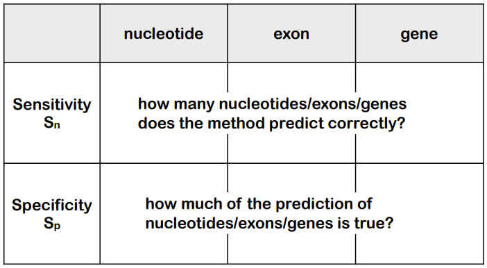


### Extrinsic

일단 Eukaryotes에 집중해봅시다. 주로 RNA-seq데이터나 single nucleotide sequence에 대한 long read RNA-seq 데이터를 활용합니다. 이는 다음과 같은 특징을 가집니다:

- similarity with transcripts(RNA-seq, long reads RNA-seq)을 통한 예측:
  - 엑손과 스플라이싱 패턴을 식별하는 데 사용될 수 있음.
  - 문제점으로는 paralogs, short reads의 배치, snapshot이 있음.
  - 선호되는 매우 흔한 방법입니다.

- 단백질 Similarity을 통한 예측:
  - 밀접한 친척의 proteome(예: UniProtKB)을 사용함.
  - 기능에 대한 정보를 제공할 수 있음.
  - 도메인, UTR, 계통 특이적인 유전자 등의 문제가 있음.
  - **새로운 유전자를 식별할 수 없음.**


Eukaryotes Gene prediction을 위한 Extrinsic 접근 방식에서는 일반적인 sequence similarity tools를 사용할 수 없습니다. 왜냐하면 이러한 도구들은 주로 서열 간의 Similarity을 비교하는 데에 사용되며, 이는 단순히 서열의 Similarity만을 고려합니다. 그러나 이러한 도구들은 유전자의 특징에 대한 정보를 고려하지 않습니다.

예를 들어, 스플라이스 사이트, 시작 및 종료 부위, reads 프레임 등의 유전자 특징은 서열 내에서 특정한 위치에 있어야 합니다. 일반적인 sequence similarity tools는 이러한 유전자의 특징을 파악하지 못하고, 그저 서열 간의 단순한 Similarity만을 비교합니다.

따라서 Gene prediction을 위해서는 이러한 유전자 특징을 고려할 수 있는 특정 소프트웨어가 필요합니다. 이러한 소프트웨어는 서열 Similarity 뿐만 아니라 유전자의 구조적 특징을 고려하여 유전자를 예측할 수 있습니다.

### Hybrid methods

위에서, extrinsic approach를 통해, 실제 얻어진 데이터로 얻어진 모델을 Evidenced Gene Model(EGM)이라 합니다. 이는 일반적으로 Predicted Gene Model(PGM)보다 높은 가중치를 가집니다. 이 둘을 합쳐 Consensus Gene Model(CGM)을 만듭니다. 

전체적인 파이프라인은 다음과 같습니다.

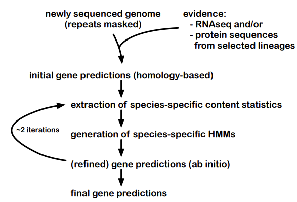


### File formats

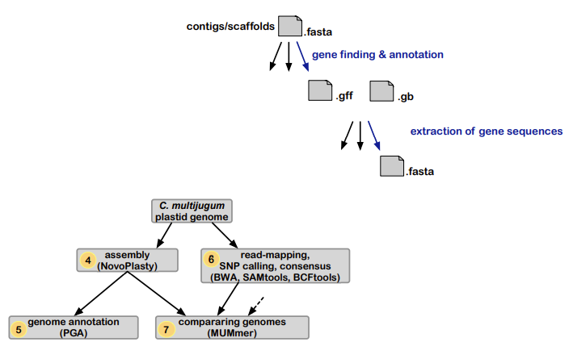

어셈블리 이후 얻어진 fasta file을 annotation을 하면 gff, gb파일이 얻어지게 된다. 여기서 또 유전자 시퀀스를 뽑아내면 fasta file이 된다. 

## Lecture 6: Read Mapping

Read mapping은 Assembly와 함께 genome analysis에서 사용되는 기술입니다.

둘은 기본적으로 같은 일을 하지만, 목적이 다릅니다.

+ Assembly:

  + 처음으로 종의 게놈를 분석할 때 사용됩니다.
  + Assembly은 일련의 단일 염기서열을 조합하여 원본 게놈의 구조를 만드는 과정입니다.
  + 고품질의 Assembly을 얻기 위해서는 많은 양의 시간, 자원, 그리고 비용이 소요됩니다.
  + 이 방법을 사용하면 게놈의 구조, 유전자 목록 등을 알 수 있습니다.

+ Read Mapping:

  + 해당 종이나 유사 종에 대한 추가적인 게놈 분석을 위해 사용됩니다.
  + 처음 게놈 Assembly에서 생성된 고품질 Assembly은 reference로 사용됩니다.
  + 이후에는 낮은 비용으로 수행할 수 있는 read mapping, 재시퀀싱, 정렬 등의 기술을 사용하여 추가 게놈를 분석합니다.
  + 이 방법은 낮은 커버리지로도 게놈를 분석할 수 있기 때문에 비용이 저렴합니다.
  + 주로 다른 게놈간의 차이를 확인하는 데 사용됩니다.
  
Mapping 기술은 기본적으로 extrinsic methode입니다. 처음으로 얻어진 genome assembly 데이터에 대해 현재 얻은 짧은 read들의 위치를 대칭시키는 방식으로 이루어집니다. 

주로 NGS가 사용되는데, 이러한 NGS로 얻어진 데이터들은 짧은 길이의 reads로 이루어져있습니다. 이는 .fastq 포맷에 저장됩니다. 이러한 시퀀싱 리드들은 분석 대상 DNA 조각의 염기서열 정보를 나타내지만 어떤 염색체 어느 위치에 있는 DNA 인지에 대한 정보는 담고 있지 않습니다. 따라서, 표준 게놈(reference genome)에서 위치를 찾아주는 작업이 필요하며 이를 매핑(mapping) 혹은 정렬(alignment)라고 부릅니다.

장비에서 생성된 원데이터(raw data)인 FASTQ 파일에 매핑이 완료되면 각 시퀀싱 리드 별로 표준게놈에서의 염색체 번호 및 위치가 기록됩니다. 이를 SAM(sequence alignment map) 파일이라 부르며 이것은 용량이 크기 때문에 압축된 파일을 보통 사용하며 이것을 BAM(binary alignment map) 파일이라 부릅니다. SAM 혹은 BAM 파일에는 게놈 위치뿐 아니라 매핑의 정확도를 나타내는 점수(mapping quality, MAPQ), 시퀀싱 리드에서 표준게놈 서열과 다른 염기를 표시해주는 정보(CIGAR string), paired-end 시퀀싱에서 같은 가닥의 반대편 시퀀싱 리드(mate)의 정보 등이 기록됩니다.

### Mapping

일단, Mapping은 이미 assembly가 진행된 genome에서 우리가 가진 reads의 위치를 찾는 것이므로, reference로 사용될 (이미 시퀀싱 및 어셈블리된) genome이 필요합니다. mapping과정은 일단 seed와 seed의 index를 찾은 뒤, 이후 그 seed부터 확장해 나가는 식으로 진행됩니다. 

그러나 우리가 사용하는 reference는 일반적으로 단일 개체(diploid)의 haploid로 표현되며, scaffold 수준의 de novo assemblies입니다. 따라서 이러한 reference는 전체 Genome의 대부분을 포괄하지만 완벽하지 않을 수 있습니다. 

#### Mapping bias

Mapping 과정에선 특정 bias가 나타날 수 있습니다. 주로 reference에 비해 다른 모든 유전적 다양성을 포함하는 reads가 포함될 때 발생합니다.

만약 우리의 reads가 non-reference allele를 포함하고 있다면, 매핑되지 않거나 올바르지 못하게 매핑될 수 있습니다. 이는 낮은 mapping score로 나타날 수 있습니다. 

또한 우리가 사용한 reads가 reference로 사용된 genome과 유전적 거리가 멀어질수록 bias의 효과가 커질 수 있습니다. 이러한 bias는 이후 진행될 분석에 큰 문제를 일으킬 수 있습니다. 

따라서 NGS등의 분석을 진행할 때에는 mapping step 이후 나타난 bias를 확인하는 등 mapping quality를 체크하는 과정이 필요하고, 퀄리티가 맘에 들지 않으면 이를 처리하는 post-alignment processing과정이 필요합니다. 

**single reference genome 대신 여러 reference에 reads를 매핑하여 bias를 줄일 수 있습니다.**

#### Variation graph

Variation Graph는 관측된 variation을 포함하고 가능한 시퀀스를 나타내는 paths를 포함하는 그래프 입니다. 이 위에 매핑을 진행할 수 있습니다. 

이러한 variation graph는 De novo assembly나 variation data들로 구성되어있습니다. 이를 통해 Genome 내의 다양한 변이를 포함하는 그래프를 생성할 수 있습니다. reads를 이러한 그래프에 매핑하는것은 그냥 linear sequence에 대한 매핑과 유사하게 진행됩니다. seed를 찾고, 확장하여 그래프상의 경로를 따라 정렬을 수행합니다.

#### NGS Read mapping

자 이제, 매핑을 진행하기 위해서는 preprocessing과 short matches를 식별하는것이 필요합니다. 이는 seed를 찾는 과정입니다. 이 방법은 hash table을 이용하는 방법과, BWT를 이용하는 방법이 있습니다.

이 두 방법중에 선택을 하기위한 고려사항은 다음과 같습니다.

• short vs. long reads
• speed vs. sensitivity!
• mismatches: technology error rate, mutation rate
• general challenges: repetitive regions
• ~~specialized challenges for specialized applications~~

##### Hash table based


해시 테이블 기반의 매핑 방법은 주로 single nucleotides sequence를 다루는데 사용되며, 이는 대부분의 게놈 시퀀싱 기술과 호환됩니다. 따라서 Sanger 시퀀싱 및 NGS(다음 세대 시퀀싱) 데이터에 모두 적용할 수 있습니다.

Sanger 시퀀싱은 전통적인 시퀀싱 방법 중 하나이며, 주로 긴 reads를 생성합니다. NGS는 여러 가지 기술을 포함하는 범주이며, 이 중 일부는 상대적으로 짧은 reads를 생성합니다. 해시 테이블 기반의 매핑 방법은 reads의 길이에 따라 조정될 수 있으며, 따라서 짧은 NGS reads뿐만 아니라 긴 Sanger reads와도 호환됩니다.

1. 해시 테이블 구축:

  - 먼저, reference를 일정한 크기의 연속적인 조각 또는 k-mer로 나눕니다. k-mer는 길이가 k인 연속된 염기 서열을 나타냅니다.
  - 각 k-mer를 해시 함수에 적용하여 해시 테이블에 저장합니다. 이 때, 같은 해시 값이 나올 경우 충돌을 처리하기 위한 방법을 선택해야 합니다.
  - 이때 key는 k-mer이고, value는 k-mer가 발견된 위치의 리스트입니다. 

2. 샘플 reads의 k-mer 추출:

   - 샘플 reads에서도 같은 방식으로 k-mer를 추출합니다.

3. 일치하는 k-mer 찾기:

   - 샘플에서 추출한 각 k-mer를 해시 테이블에서 검색하여 reference의 어느 위치에 해당하는지를 확인합니다. 이 과정은 짧은 시퀀스를 레퍼런스의 모든 위치에서 탐색하는 알고리즘으로 병렬처리하여 빠르게 매핑할 수 있습니다. 
   - 이 과정에서 일치하는 k-mer를 찾으면 해당 위치를 seed로 삼아서 이후에 정렬을 확장합니다. 이때 contiguous exact mathes가 seed로 선택됩니다. 
   - 이때 hash table에서 사용되는 k-mer를 template라 합니다. 
     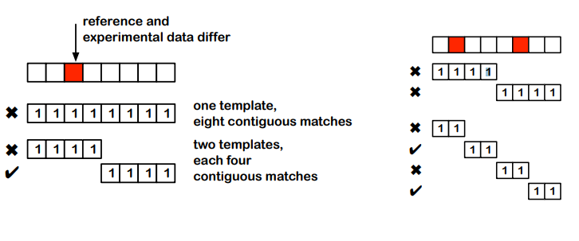
4. 시드 확장:

   - 찾은 시드를 중심으로 주변 영역을 확장하여 더 긴 정렬을 생성합니다. 이 과정은 일반적으로 다이나믹 프로그래밍(Dynamic Programming) 알고리즘을 사용하여 가장 최적의 정렬을 찾습니다.

5. 정렬 평가:

   - 확장된 정렬은 품질 점수에 따라 평가됩니다. 이는 일치하는 염기 수, 불일치 염기 수, 정렬의 위치 등을 고려하여 계산됩니다.
6. 최종 매핑 결과 생성:

   - 최종적으로 샘플 reads의 매핑 결과가 생성되고, 이를 통해 샘플이 reference 게놈 상의 어느 위치에 맵핑되었는지를 확인할 수 있습니다.


작은 template(substring, k-mer)은 더 많은 오류나 다양성이 존재하는 상황에서도 매핑할 수 있게 해줍니다. 이는 작은 template이 해당 오류나 다양성을 더 쉽게 처리할 수 있기 때문입니다. 그러나 작은 template은 효과적인 시드로는 그리 효과적이지 않습니다. 왜냐하면 작은 template은 너무 많은 영역에 일치하기 때문입니다. 따라서 작은 template을 사용할 때는 이러한 딜레마가 발생합니다.

**Spaced seeds**는 매핑과정에서 사용되는 template으로, 일반적으로 sensitivity를 증가시킵니다. 즉, 더 많은 매핑을 찾을 수 있도록 도와줍니다. 이를 사용하면 정해진 수의 불일치를 허용할 수 있으므로, 게놈 내의 다양한 변이나 오류를 고려할 수있도록 해줍니다. 

또한 spaced seeds는 일치하는 염기에 대해 가중치를 두어 더 중요하게 처리할 수 있으며, 시드의 길이를 조절하여 다양한 매핑 조건을 만족할 수 있습니다. 

template은 특정 read 길이와 예상되는 오류 또는 불일치 비율에 최적화되어야 합니다. 이는 매핑 성능을 극대화하기 위해 매우 중요합니다.

간격이 있는 시드를 사용하여 매핑을 수행할 때, 진정한 일치를 찾을 수 있는 보장이 있는지 여부에 대한 선택이 필요합니다. 하나의 적절하게 설계된 간격이 있는 시드를 사용할 수 있지만, 보다 신뢰할 만한 결과를 얻기 위해 여러 개의 간격이 있는 시드를 조합하는 것도 가능합니다. 이는 다양한 매퍼 및 특정 상황에 따라 다를 수 있습니다.

작은 template과 반복 요소는 많은 시드를 확인하고 확장해야 하므로 매핑 과정에 문제를 발생시킬 수 있습니다. 따라서 이러한 경우에는 미리 체인(chain)을 형성하여 이러한 문제를 완화할 수 있습니다. 그러나 이러한 접근 방식은 실행 시간 및 메모리 소비가 많이 필요할 수 있습니다.

##### Burrows-Wheeler Transform

Burrows-Wheeler Transform은 게놈 시퀀싱 및 문자열 압축 알고리즘에서 사용되는 중요한 기술 중 하나입니다. BWT는 full-text indexing approach중의 하나로, 문자열을 변환하여 압축하고 검색을 용이하게 하는데 사용됩니다. 변환 결과에 Index 정보가 포함되어있어, 다른 정보가 없더라도 변환된 문자열의 경우 유사한 문자열들끼리 뭉쳐진 형태로 나타나는 경우가 많아 압축을 위한 전처리 알고리즘으로 사용됩니다. 

BWT의 주요 특징은 다음과 같습니다:

**압축:**

   - BWT는 입력 문자열을 변환하여 중복된 부분 문자열을 인접한 위치로 모으는 방식으로 압축을 수행합니다.
   - 이 변환된 문자열은 일반적으로 원래 문자열보다 훨씬 작은 크기를 가질 수 있습니다.
   - 그러나 transform 전과 후의 문자열 길이는 사실 변함이 없습니다. 자체적으로 직접적으로 압축을 수행하는 알고리즘은 아닙니다. 그러나 input 안에서 중복되는 문자열이 많을수록 single character가 반복되는 경우가 생기긱 때문에 압축하기 매우 용이해집니다.
   - 따라서 DNA, RNA시퀀스를 bwt transform할경우, 반복되는 문자가 굉장히 많아집니다. 

**편리한 검색:**

  - BWT는 검색을 위한 인덱싱 구조를 생성합니다. 이 구조는 원래 문자열의 서브 문자열을 검색하는 데 효율적으로 사용됩니다.
  - 이러한 구조를 활용하여 게놈 시퀀싱과 같은 많은 문자열 처리 작업을 수행할 때 검색 성능을 향상시킬 수 있습니다.

**변환 과정:**

  - BWT는 입력 문자열의 모든 rotation을 생성합니다. 회전은 문자열의 시작점을 이동시켜 새로운 문자열을 형성하는 것을 의미합니다.
  - 각 회전에 대해 맨 끝에 있는 문자를 추출하고, 모든 회전을 해당 문자로 정렬합니다.
  이렇게 정렬된 문자들을 순서대로 연결하여 BWT된 문자열을 형성합니다.

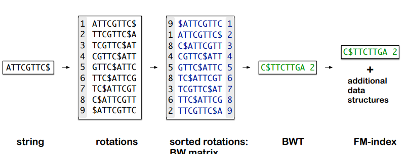

예를 들어, FM 인덱스(FM Index)와 같은 구조를 구축하여 대용량의 게놈 시퀀스 데이터를 빠르게 검색할 수 있습니다.

BWT를 이해하기 위해서는 먼저 BWT 매트릭스에 대한 이해가 필요합니다. BWT 매트릭스는 다음과 같이 정의됩니다:

- BWT 매트릭스는 주어진 문자열의 모든 cyclical rotations을 행으로 갖습니다. 이때, 문자열의 끝에 특정한 토큰(보통은 $ 기호)를 추가하여 회전합니다.
- 토큰을 넣은 문자열을 왼쪽으로 한칸씩 cyclic shift를 수행하며 매트릭스을 형성합니다. 즉, 각 행은 주어진 문자열을 이동시켜 새로운 문자열을 형성하는 것을 나타냅니다.
- 이러한 행들은 정렬되어 있지 않지만, 각 행의 마지막 문자들을 기준으로 정렬됩니다. 이렇게 정렬된 형태의 매트릭스을 BW매트릭스이라고 합니다. 
- 이를 통해 BWT는 원래 문자열을 정렬된 회전들의 마지막 문자를 모은 형태로 나타냅니다. 이때, 정렬된 회전들은 실제로 원래 문자열의 접미사(suffixes)를 정렬한 것과 동일합니다. 즉, 정렬된 매트릭스의 맨 마지막 열의 문자들로 생성된 문자열이 변환된 결과입니다. 

**FM-Index**는 BWT에 추가적인 데이터 구조를 포함하는 방식으로, 압축 알고리즘의 적용을 포함합니다. 

Bowtie 알고리즘인 **FM-Index**는 BWT으 Last first mapping 법칙을 이용하여 문자열 Index를 만드는 방법으로, 문자열에 대해 BWT를 수행함으로써 얻어질 수 있습니다. 

이러한 BWT 기반 approace를 사용하면, 인덱스는 대부분의 컴퓨터의 램 크기에 맞출 수 있을정도로 메모리에 매우 효율적입니다. 또한 사전에 계산된 인덱스는 저장 및 공유가 가능해서 다양한 분석 및 프로그램에 재사용이 가능합니다. 이는 또한 일반적으로 해시테이블 기반 접근방법보다 평균 10배정도 빠릅니다. 

BWT 기반 접근 방식은 게놈 맵핑 및 정렬에서 mismatches에 대응하기 위해 다양한 방법을 사용합니다. 여기에는 다음과 같은 특징들이 있습니다:

- mismatch 처리:

  - 정렬 과정에서는 작은 수의 - mismatch 및 삽입/삭제(indels)를 허용합니다.
  - 이를 통해 reference 게놈와 샘플 독서 간의 유전적 변이를 고려할 수 있습니다.
  - 이러한 문제에 대한 다양한 구현 방식이 있으며, 성능이 감소할 수 있는 경우가 있습니다.
- 빠른 구현:

  - 일부 BWT 기반 매핑 및 정렬 솔루션은 GPU를 활용하여 속도를 높입니다.
  - 하드웨어 가속화 접근 방식을 사용하는 것도 가능합니다. 예를 들어, Illumina의 DRAGEN과 같은 솔루션은 하드웨어 가속을 사용하여 게놈 데이터를 처리하고 속도를 높입니다.
  - 하지만 이러한 방법을 사용하기 위해서는 소프트웨어를 다시 작성해야 할 수도 있습니다.
- 방법의 지속적인 개선 및 발전:

  - 게놈 분석 분야는 계속해서 발전하고 있으며, BWT 기반 접근 방식도 이러한 발전에 맞추어 지속적으로 개선되고 있습니다.
  - 새로운 기술 및 알고리즘의 도입으로 인해 - mismatch 처리 및 속도 문제에 대한 해결책이 지속적으로 개발되고 있습니다.

##### long read mapping

long read mapping은 일반적으로 short read보다 더 많은 시퀀싱 오류와 다양한 종류의 오류를 가지고 있습니다. 이는 주로 long read가 긴 길이를 가지고 있어서 오류가 발생할 가능성이 높기 때문입니다. hash-based와 BTW-based 접근방법이 사용될 수 있습니다. 

long read는 일반적으로 매우 긴 길이를 가지므로, 이걸 다루기 위해서는 각 리드를 많은 짧은 시드로 분할해야 합니다. 그러나 많은 시드를 사용하는 것은 비효율적일 뿐 아니라 노이즈도 많이 발생할 수 있습니다.

이를 극복하기 위해, 일부 최소화된 대표적인 시드만을 이용하여 매핑을 수행하는것이 일반적입니다. 


#### SAM

alignment에 대한 결과는 주로 SAM 혹은 BAM형식으로 제공됩니다. SAM파일은 용량이 크기 때문에 압축된 파일을 보통 사용하며 이것을 BAM(binary alignment map) 파일이라 부릅니다. SAM 혹은 BAM 파일에는 게놈 위치뿐 아니라 매핑의 정확도를 나타내는 점수(mapping quality, MAPQ), 시퀀싱 리드에서 표준게놈 서열과 다른 염기를 표시해주는 정보(CIGAR string), paired-end 시퀀싱에서 같은 가닥의 반대편 시퀀싱 리드(mate)의 정보 등이 기록됩니다. BAM은 인간이 읽을 수 없습니다. 

SAM 및 BAM 파일은 ㅈ어렬된 데이터를 메모리에 로드하지 않고도 분석을 진행할 수 있습니다. 이는 대규모 데이터세트를 처리할때 유용하며, 메모리 제약이 있는 상황에서도 유용합니다. SAM 및 BAM 형식은 다양한 정렬 뷰어 및 도구(예: IGV, samtools)에서 사용할 수 있습니다. 이러한 도구를 사용하여 정렬된 데이터를 시각화하고 분석할 수 있습니다.

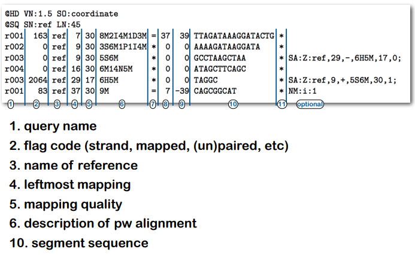

SAM이 가진 정보 중 매핑 퀄리티는 리드가 잘못된 위치에 매핑되었을 가능성을 나타냅니다. 따라서 작으면 작을수록 좋겠죵? 이는 다음과 같은 이유로 중요합니다.

- 반복적인 게놈 영역, SNP, 시퀀싱 오류, 이러한 지역에서는 리드가 여러 위치에 동일하게 매핑될 수 있습니다. 이는 올바른 게놈 위치로 리드를 할당하는 확률을 줄일 수 있습니다.
- 리드가 여러 위치에 동일하게 매핑될 때, 올바른 위치를 결정하기가 더 어려워집니다. 매핑 품질은 이러한 혼동을 감지하고 올바른 매핑을 식별하는 데 도움이 됩니다.
- 매핑 품질은 다양한 프로그램에서 서로 다르게 계산될 수 있습니다. 이는 프로그램 간에 결과를 비교하고 품질을 평가할 때 주의해야 함을 의미합니다. 또한, 일부 프로그램에서는 매핑 품질을 계산하지 않는 경우도 있습니다.


#### SNP

SNP(Single Nucleotide Polymorphism)는 최소 1%의 빈도로 인구 내에서 발생하는 단일 염기 변화를 나타냅니다. 이는 게놈 내에서 특정 위치에서 하나의 염기가 다른 염기로 대체됨을 의미합니다. SNP는 일반적으로 이중 염기를 가지며, 따라서 두 가지 대립적인 알렐을 갖게 됩니다.

SNP는 다양한 데이터베이스에서 관리되며, 각 SNP에는 표준 식별자가 할당됩니다. 이를 통해 연구자들은 특정 SNP를 식별하고 reference할 수 있습니다.

또한, SNP/variant calling은 reference 게놈와 샘플 게놈 간에 적어도 하나의 염기가 다른 위치를 식별합니다. 이는 게놈 분석에서 중요한 단계로, 샘플과 reference 사이의 차이를 식별하여 다양한 분석 및 연구에 활용됩니다.

그러나 시퀀싱에서 발생하는 오류는 정확한 SNP식별을 방해할 수 있습니다. 또한, paralog(한 게놈 내에서만 유전자를 비교할 때 중복돼 나오는 유전자)같은 유사한 서열이 여러개 있을때 정확한 정렬 및 SNP식별이 어려울 수 있습니다. diploidy나 polyploidy의 경우도 마찬가지입니다.

SNP를 식별하기 위해서는 충분한 리드의 수가 필요하며, 리드의 품질, 또한 alignment qulity가 중요합니다. 또 SNP의 빈도 및 비율이 분석에 영향을 미칠 수 있으며, 이런 것들을 고려해야 정확한 SNP의 식별이 가능합니다. 

SNP를 식별하기 위한 접근방법에는 확률적인 방법과, Allele counting방법이 있습니다. 

- 알렐 계수(allele counting): 리드 또는 게놈 중에서 특정 알렐의 수를 세는 방법을 사용하여 SNP를 식별합니다.
- 확률적 방법: 확률 모델을 사용하여 SNP를 식별하는 방법을 사용합니다. 이러한 방법은 리드의 품질과 빈도를 고려하여 SNP를 식별할 수 있습니다.

##### bcftools

bcftools는 SNP를 분석하기 위한 도구입니다. 

- bcftools mpileup:

  - 이 명령어는 각 위치마다 해당 위치를 포함하는 모든 리드 데이터를 고려합니다.
  - 리드의 매핑 품질, 염기 품질, 지역 정렬 오류 확률, 개별 염기 정렬 품질(BAQ) 등을 고려하여 유전형 가능성을 계산합니다.
  - 각 위치에서 가능한 각 유전형에 대한 가능성을 계산합니다.
- bcftools call:

  - 이 명령어는 Hardy-Weinberg 균형 가정 하에 가장 가능성 있는 유전형을 호출합니다.
  - 이 때, 데이터로부터 추정된 알렐 빈도 또는 사용자가 명시적으로 제공한 알렐 빈도를 사용하여 유전형을 호출합니다

##### Structural variation

Structural variants 일반적으로 50bp 이상의 큰 DNA 조각에 대한 변화를 나타냅니다. 이러한 변이에는 다양한 유형이 포함되어 있으며 주요 유형으로는 삽입(insertions), 삭제(deletions), 복제(duplications), 역전(inversions), 재배열(rearrangements), 그리고 복사수 변이(copy number variations)가 있습니다.

인간 게놈에서 Structural variation는 약 2%를 차지하며, 이러한 변이는 의학, 분자 생물학, 진화 등에 관련이 있습니다. 그러나 단일 염기 다형성(SNP)에 비해 Structural variation는 연구가 가장 적게 이루어진 유형 중 하나입니다. 이는 짧은 리드로는 Structural variation를 감지하기가 매우 어렵기 때문입니다.

Structural variation는 짧은 리드의 시퀀싱 데이터로는 감지하기 어려운데, 이는 대부분의 시퀀싱 기술이 짧은 리드를 생성하기 때문입니다. 따라서 Structural variation를 정확하게 식별하고 그 특성을 이해하기 위해서는 보다 긴 리드를 생성할 수 있는 시퀀싱 기술이 필요합니다. 

이론적으로는 짧은 리드 데이터를 사용하여 샘플에서 Structural variation를 감지할 수 있습니다. 예를 들어, 샘플에서의 삭제(deletion)를 식별할 수 있습니다.

그러나 실제로는 몇 가지 문제가 있습니다:

- **uneven coverage**: 시퀀싱 데이터의 커버리지가 불균일할 수 있으며, 이는 일부 영역에서는 높은 커버리지를 가지고 다른 영역에서는 낮은 커버리지를 가질 수 있습니다. 이로 인해 일부 Structural variation의 식별이 어려워질 수 있습니다.
- **sequencing errors**: 시퀀싱 과정에서 발생하는 오류는 잘못된 리드를 생성하거나 잘못된 리드 정렬을 초래할 수 있습니다. 이는 Structural variation의 패턴을 흐릴 수 있습니다.
- **mapping errors**: 리드를 게놈에 매핑할 때 발생하는 오류도 Structural variation의 감지를 어렵게 만듭니다.
- **중첩 및 겹침**: 일부 Structural variation는 서로 중첩되거나 겹칠 수 있으며, 이로 인해 정확한 식별이 어려울 수 있습니다.
- **매핑 패턴의 Similarity**: 일부 Structural variation는 매핑 패턴이 매우 유사하므로 이를 구별하기 어려울 수 있습니다.

실제로는 Structural variation를 감지하기 위해 짧은 리드와 긴 리드를 사용하는 몇 가지 접근 방법이 있습니다.

- short read:

  일부 전문화된 매핑 도구들이 존재하지만, 모든 Structural variation 유형을 식별하는 것은 어렵습니다. 이는 짧은 리드가 가지는 한계 때문에 발생합니다.

  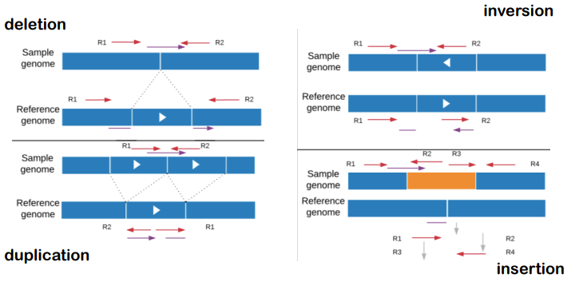

- long read:

  이론적으로는 긴 리드를 사용하는 것이 유리하며, Structural variation 영역을 넘어서는 데 도움이 될 수 있습니다. 그러나 현재로서는 이를 위한 많은 방법이 아직 존재하지 않습니다. 또한, 이러한 방법들은 종종 특정 시퀀싱 기술에 특화되어 있습니다.

  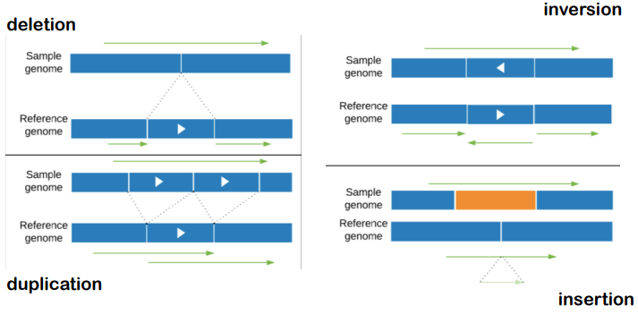

- Genome assembly:

  Structural variation를 식별하고 이해하기 위해 게놈 정렬이 필요합니다. 이를 위해서는 de novo 조립(de novo assembly)가 필요하며, 이는 Structural variation를 포함한 게놈 영역을 효과적으로 탐색할 수 있도록 해줍니다. 이러한 접근 방식은 유용하고 중요하며, 관련된 방법들은 여전히 발전 중입니다.

  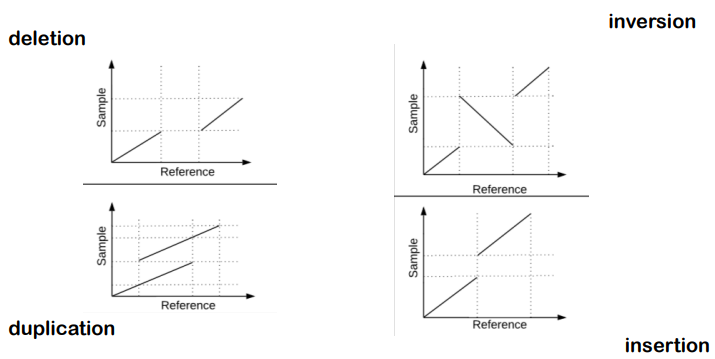


##### VCF 

VCF 파일은 Variant Call Format으로 생물정보학적 텍스트 파일 포맷입니다. GATK tool kit의 결과 파일이며, 유전자 서열 변이(Gene Sequence variation) 정보를 가지고 있습니다. 이 파일 포맥을 유전형 분석(Genotyping)과 1000 Genome Project 같은 DNA 서열을 해독하는 대규모 프로젝트와 함께 발전되었습니다.

VCF 파일을 열어보면 해당 데이터에 대한 설명이 ##을 통해 주석으로 달려있습니다. CHROM, POS, ID, REF, ALT, QUAL, FILTER, INFO, FORMAT, Sample1 등과 같은 헤더 정보가 있으며, 그 아래에 실제의 variant 정보를 확인할 수 있습니다.

위치에 따른 게놈 variation정보와, structural variation에 대한 정보가 포함될 수 있습니다. 


### read mapping application

- RNA-seq:

  RNA 시퀀싱 데이터를 분석할 때, RNA 서열은 전사 중에 스플라이싱(splicing)이 발생하므로 DNA 서열과 완전히 일치하지 않습니다. 이 때문에 전사체 서열을 DNA 게놈에 매핑하는 것이 아닌, 스플라이싱 된 RNA 서열을 게놈에 매핑하는 것이 필요합니다. 따라서 RNA-seq 데이터를 분석하기 위해서는 스플라이싱된 서열에 대한 정확한 매핑이 필요합니다.

- DNA methylation

  - DNA 메틸레이션은 게놈에서 메틸화된 염기(mC)의 위치를 식별하는 생물학적인 질문에 대한 연구입니다. 다음은 DNA 메틸레이션을 분석하는 접근 방법과 이를 위한 일부 도전과 함께 설명됩니다:

  - 생물학적인 질문:

    - 게놈 내에서 메틸화된 염기인 mC의 위치를 식별하는 것이 주된 목표입니다.

  - 접근 방법:

    - 이를 위해 bisulfite 처리, 즉 메틸화된 시퀀스를 어떻게 변형하는지를 이용합니다.
    - 메틸화된 C는 bisulfite 처리 과정에서 언제나 어떤 염기로 변환됩니다.
    - 변환된 시퀀스를 증폭하고, 시퀀싱을 수행하여 메틸화된 C의 위치를 파악합니다.
    - 시퀀싱 데이터를 게놈 reference 게놈에 매핑하고, 메틸화 상태를 결정합니다.

  - challange:

    - 시퀀스의 복잡성 감소: bisulfite 처리 및 증폭 과정에서 시퀀스의 복잡성이 감소합니다.
    - 시퀀스 리드와 reference와의 불일치: bisulfite 처리로 인해 시퀀스 리드와 reference의 일치가 감소합니다.
    - 메틸레이션이 대칭적이지 않음: DNA의 두 가닥이 서로 다른 메틸레이션 패턴을 가질 수 있습니다.
    - 리드 및 reference의 수정: bisulfite 처리로 인해 시퀀스 리드와 reference의 염기가 수정됩니다.

  - 해결책:

    - 리드 및 reference의 수정: bisulfite 처리 후에는 리드와 reference의 염기가 수정되므로, 리드를 C➜T 및 G➜A로 수정하고, reference도 C➜T, G➜A 및 그들의 역순으로 수정합니다.
    - 수정된 리드를 수정된 reference에 매핑하고, 최적의 정렬을 결정하며, 메틸레이션 상태를 결정합니다.

### Data Format

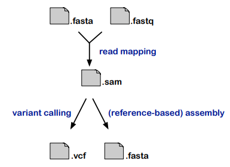

## Lecture 7: Pairwise sequence alignment


### Homology & similarity

Homology와 Similarity은 유전체 및 단백질 서열 등 다양한 유전체 요소 간의 관계를 설명하는 데 중요한 개념입니다.

- **Homology**

  - Homology이란 모양의 구조, 서열, 도메인, 정렬 위치 등이 공통 조상으로부터 유래되었음을 의미합니다.
  - Homology는 모든-또는-아무것도 아닌 조건이며, 서로 다른 종이나 개체 간에 존재할 수 있습니다.
  - Homology는 서로 다른 종이나 개체 간의 서열 Similarity을 비교하여 파악됩니다.
  - 예를 들어, 서로 다른 종에서 유사한 단백질 도메인을 가진 것들은 공통 조상에서 유래된 것으로 간주될 수 있습니다.

- **Similarity/Identity**
  
  - Similarity 또는 Identity은 두 서열 또는 유전체 요소 간의 얼마나 많은 부분이 동일하거나 비슷한지를 나타내는 양적 측정값입니다.
  - 이는 일반적으로 서열 비교를 통해 측정됩니다.


Homoloy, Ortholog, paralog 등은 similarity와 관련이 있으며, 이들을 추론하는데 사용될 수 있지만, **similarity 자체로는 종 또는 개체간의 관계를 명확히 알려주지 않습니다.**

### Pairwise comparison

pairwise sequence comparison는 두 서열 간의 similarity 또는 (homology)를 평가하고, 최적의 정렬을 계산하는 프로세스를 의미합니다.

Sequence Alignment는 기능이 알려진 DNA, protein의 sequence와 기능이 알려지지 않은 sequence의 유사도를 계산하여 기능을 유추하거나 공통의 조상을 찾는데 활용됩니다. 물론 두 sequence가 유사도가 높다고 하더라도 Analogs의 경우처럼 전혀 상관없을 수도 있습니다.

그래픽적으로는 dotplot을 사용할 수 있으며, 두 서열이 서로 유사한지, 혹은 locally or globally similar한지 체크할 수 있습니다. 

또한 alignment에서, 서로다른 alignment를 비교하고 평가하기위해, 여러 가지 평가 척도가 사용됩니다. 예를 들어, match score와 penalty를 사용하여 정렬의 품질을 평가할 수 있습니다.

pairwise sequence comparision은 두개의 시퀀스를 서로 비교하고, 어레인지 합니다.

두 시퀀스 사이의 매치를 찾아내고, good mismatches를 찾아냅니다. 때로는 완전히 일치하지 않는 문자열도 유용할 수 있습니다. 예를 들어, 동일한 기능을 하는 두 서열에서 서로 다른 아미노산 또는 염기가 있을 수 있습니다.

good mismatches는 이러한 차이를 나타내며, 서열 간의 비슷한 구조 또는 기능을 보여줄 수 있습니다.

또한 두 서열을 정렬할 때, 일치하지 않는 문자열 사이에 **갭**을 삽입할 수 있습니다. 이는 한 서열의 문자열이 다른 서열의 문자열과 일치하지 않을 때 사용됩니다.

갭 삽입은 두 서열 간의 유사성을 유지하면서 서열을 최적으로 정렬하는 데 도움이 됩니다.

#### scoring an alignment

서열 정렬을 평가하기 위해 일치(matches), 불일치(mismatches), 및 갭(gaps)을 점수화하는 과정이 있습니다.

이를 위해 scoring matrix가 필요합니다. 매치와 미스매치에 대한 점수는 일반적으로 scoring matix를 이용하여 할당됩니다. 이는 각 sequence pair에 대한 매치 또는 미스매치에 대한 weight를 정의합니다. PAM과 BLOSUM이 가장 널리 사용됩니다.  

갭 삽입에 대한 페널티는 일반적으로 갭을 여는(opening) 데 필요한 페널티와 갭을 확장(extended)하는 데 필요한 페널티로 구성됩니다. 이러한 페널티는 일반적으로 갭의 크기와 관련하여 증가합니다.

alignment score는 각 서열 위치에서 일치, 불일치 및 갭에 대한 점수의 합으로 계산됩니다. 이는 서열 간의 유사성을 나타내며, 높은 점수는 더 좋은 정렬을 나타냅니다.

scroing sheme, 예를 들어 미스매치 상황에서 미스매치로 판단할건지 갭을 삽입할건지, 이 전략을 선택하는것은 결과에 큰 영향을 미칠 수 있습니다. 

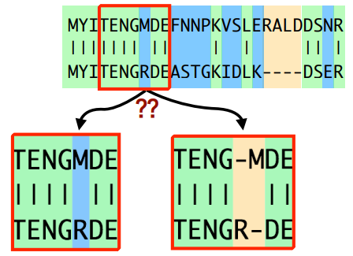

### Dotplot

Dotplot은 두 서열 간의 similarity를 시각적으로 나타내는 도구입니다. 각 서열의 염기 또는 아미노산이 X축과 Y축으로 표시되고, 동일한 위치에 일치하는 부분이 Dot로 표시됩니다. 주로 서열의 각 위치(아미노산 또는 염기)에 대한 개별적인 정보는 제공되지 않으며, 대신 동일한 위치에서의 일치 및 similarity 신호를 시각적으로 나타냅니다.

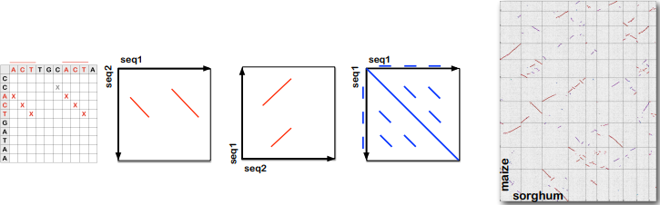


도트플롯은 주로 두 서열을 비교하는 데 사용되지만, 하나의 서열을 자신과 비교하는 데에도 사용될 수 있습니다. 이러한 방식으로 서열 내에서 반복된 패턴이나 다양한 유사성을 확인할 수 있습니다.

### Scoring matrix

scoring matrix를 얻는 방법은 주로 관련된 단백질 간의 신뢰할만한 alignment를 관찰하는 것입니다. 이를 통해 두 서열간의 매치 및 미스매치가 어떤 경향으로 나타나는지 이해하고, 이를 기반으로 각각의 서열 쌍에 대한 가중치를 결정합니다. 

그러나, 서로 다른 진화적 과정을 거쳐온 시퀀스들은 서로 다른 값을 가지기 때문에, 분석하고자 하는 시퀀스 쌍에 따라 다른 scoring matrix를 사용해야 합니다. 

이런 substitution matrices는 시퀀스 간의 similarities혹은 근연관계를 식별하는데 쓰이거나, alignment를 optimize하는데 사용될 수 있습니다. 

#### PAM

Point Accepted Mutation (PAM)은 단백질 서열에서 하나의 아미노산이 다른 아미노산으로 치환되는 것으로 natural selection 과정에 의해 일어납니다. 

PAM1은 100개의 아미노산 당 1회의 치환을 나타내며, 이는 보다 관련성이 높은 단백질 간의 관찰된 대체 비율을 기반으로 합니다. 

PAM 매트릭스는 유사도가 높은 단백질 서열들, 즉 진화적으로 관련된 단백질 가족에서 관찰된 아미노산 치환를 기반으로 합니다. 이러한 대체는 단백질 진화의 역사에 기인한 것으로서, 단백질 간의 관련성을 파악하는 데 유용한 정보를 제공합니다.

주어진 서열의 서열정렬에 가장 적합한 PAM 매트릭스는 서열의 길이와 서열들 사이에서 기대되는 유사도에 따라 달라집니다. 매우 유사한 서열들에 대해서는 PAM-1이 사용될 수 있고 매우 상이한 서열들에 대해서는 PAM-1000이 사용될 수도 있지만, 가장 일반적으로 사용되는 것은 이 둘을 절충한 PAM-250입니다.

- PAM1은 100개의 아미노산 당 1회의 대체를 나타내며, 이는 상대적으로 관련성이 높은 단백질 간의 관찰된 대체 비율을 기준으로 합니다.
- PAM250는 PAM1을 250번 거쳐서 얻어진 값으로, 더욱 진화적으로 관련성이 떨어지는 단백질 간의 관찰된 대체 비율을 나타냅니다.

#### BLOSUM

BLOSUM (BLOcks SUbstitution Matrix) 매트릭스는 유사한 단백질들에 대하여 **갭을 허용하지 않는 sequence alignment를 수행**하고, 통계학에서 사용되는 군집분석법(clustering technique)을 적용한 후, 군집(cluster)간의 아미노산 치환률을 계산하여 만들어진 것입니다. 

이는 서로 다른 서열 간의 아미노산 치환에 대한 관찰에 기반하여 구성됩니다. BLOSUM 매트릭스는 서로 다른 서열 간의 local alignment에 기반하여 만들어집니다. 이는 서로 다른 서열 간의 상대적으로 작은 local 영역에 대해 비교를 수행하여 매트릭스을 구성합니다.

BLOSUM 매트릭스는 서로 다른 유사성 수준을 가진 서열 집합에 대해 각각 독립적으로 구성됩니다. 예를 들어, BLOSUM50 매트릭스는 서로 50% 동일한 서열에 대한 정렬에 기반하여 만들어지며, BLOSUM80 매트릭스는 서로 80% 동일한 서열에 대한 정렬에 기반하여 만들어집니다.

BLOSUM 매트릭스는 일반적으로 정렬하려는 서열의 유사성 수준에 맞게 선택됩니다. BLOSUM 매트릭스의 종류를 지정하는 숫자는 PAM 매트릭스의 종류를 지정하는 숫자와는 반비례 관계입니다. 즉, 낮은 숫자로 지정된 PAM 매트릭스는 매우 유사한 서열들의 분석에 적합하고, 낮은 숫자로 지저된 BLOSUM 매트릭스는 유사도가 낮은 서열들의 분석에 적합합니다. 

예를 들어 BLOSUM-62 매트릭스는 서열 간 유사도가 약 62%인 경우에 적합하고, BLOSUM-80 매트릭스는 서열간의 유사도가 약 80%인 경우에 적합합니다.

PAM과 BLOSUM같은 substitution 매트릭스는 대부분 실험적 데이터를 기반으로 구성됩니다. 이는 실제 단백질 서열에서 관찰된 치환 및 유사성을 기록하고 이를 통해 서열간의 점수를 할당할 수 있음을 의미합니다. 

substitution matrix는 alignment column에서 함께 자주 등장하는지의 정보를 가지고 있습니다.

#### Gap panalty


갭 패널티(gap penalty)는 서열 정렬 과정에서 갭을 삽입하는 데에 부여되는 패널티로, 갭의 삽입을 통해 서열의 정렬을 조절합니다. 이는 서열 간의 정렬을 수행하는 데 중요한 요소 중 하나입니다.

주로 두 가지 종류의 갭 패널티가 사용됩니다:

- linear score:

  선형 갭 패널티는 각각의 갭 위치마다 독립적인 패널티가 할당됩니다. 즉, 각각의 갭 위치에 동일한 패널티(p)가 부여됩니다.

- affine gap penalties:

  affine gap penalties는 갭의 길이에 따라 패널티를 조정합니다. 이는 보다 복잡한 패널티 체계로, 갭을 여는(opening) 데 필요한 큰 패널티(d)와 갭을 확장(extended)하는 데 필요한 작은 패널티(e)를 사용합니다. 따라서 갭의 길이에 따라 패널티가 선형적으로 증가하지 않고, 갭의 연속성을 고려하여 점수가 할당됩니다. 이를 통해 작은 여러 갭이 아닌 긴 한개의 갭을 기대할 수 있습니다.

  $$\gamma(g) = -d-(g-1)e$$ 


### Optimal alignment

Optimal alignment는 다양한 측면에서 정의될 수 있습니다. 

- 기능적으로 올바른 (Optimal) alignment

  이러한 Optimal alignment는은 정렬된 서열의 각각의 아미노산 또는 염기가 동일한 기능을 수행하는 경우를 나타냅니다. 즉, 서로 정렬된 서열의 각 위치에 있는 아미노산 또는 염기가 비슷한 기능을 가지고 있습니다

- 구조적으로 올바른 (Optimal) alignment

  구조적으로 올바른 Optimal alignment는 서로 정렬된 아미노산 또는 염기가 3차원 구조에서 유사한 위치에 있거나 비슷한 역할을 하는 경우를 나타냅니다. 이는 단백질의 구조적 특성을 고려하여 정렬된 서열 간의 관련성을 나타냅니다.

- 진화적으로 올바른 (Optimal) alignment

  진화적으로 올바른 Optimal alignment는 서로 정렬된 아미노산 또는 염기가 동일한 조상을 공유하는 경우를 나타냅니다. 즉, 정렬된 서열 간의 관련성이 진화적으로 유래된 경우를 나타냅니다.

- 알고리즘적으로 올바른 (Optimal) alignment

  알고리즘적으로 올바른 Optimal alignment는 특정 치환 모델과 갭 패널티에 대한 가장 높은 점수의 정렬을 나타냅니다. 즉, 주어진 정렬 모델 및 점수 계산 기준에 따라 가장 적절한 정렬을 나타냅니다

안타깝게도, 우리는 알고리즘 적으로 최적인 alignment이외에는 알 수 없습니다. 우리가 가진 알고리즘으로 얻은 alignment가 기능적, 구조적, 진화적으로 올바를 것이라고 기도하는 방법밖에 없습니다.

### Dynamic programming

pairwise alignment의 목표는 Optimal(최고 점수)의 쌍으로 된 서열 정렬을 찾는 것입니다. 그러나 모든 가능한 정렬을 만들고 점수를 매기고 최상의 것을 선택하는 것은 현실적으로 불가능합니다. 이를 해결하기 위한 대안은 동적 프로그래밍(dynamic programming)입니다.

동적 프로그래밍은 다음과 같은 방법으로 Optimal의 정렬을 찾습니다:

- 부분 문제로 나누기: 두 서열을 점진적으로 비교하여 정렬을 만드는 데 사용되는 부분 문제로 분해됩니다.

- Optimal 부분 구조: 각 부분 문제의 Optimal soluion이 다른 부분 문제의 Optimal soluion을 포함하고 있는지 확인하여 문제를 해결합니다.

- Memorization: 이미 계산된 값을 저장하여 중복 계산을 피하고 계산 속도를 향상시킵니다.

- bottom-up 또는 top-down 접근 방식: 문제를 해결하기 위해 bottom-up 또는 top-down 접근 방식 중 하나를 선택합니다.

이런 DP를 이용한 pairwise sequence alignment는 두 서열간의 optimal alignment를 보장합니다. 여기에는 global alignment와 local alignment 두가지 유형이 있습니다.

- global
  - 두 서열 전체를 대상으로 가장 최적의 정렬을 찾는 방법입니다. 이 방법은 두 서열 간의 전체 유사성을 고려하며, 서열 전체에 대한 정렬을 찾습니다.

- local
  - 서열의 특정 부분에서 가장 높은 유사성을 갖는 서브시퀀스를 찾는 방법입니다. 이 방법은 서열 내의 특정 영역에서의 유사성을 분석하여 정렬을 수행합니다.

DP는 두 서열의 길이가 증가함에 따라 실행 시간과 메모리 요구량이 증가하는 경향이 있습니다. 이는 많은 응용 프로그램에서 사용하기에는 너무 느리거나 메모리를 많이 사용한다는 한계가 있습니다. 그러나 이 방법은 많은 접근 방법과 프로그램의 핵심 요소로 사용되며, 이러한 한계를 극복하기 위해 여러 가지 휴리스틱 방법이 개발되었습니다.

heuristics:

- 우리는 검색을 가속화하기 위해 unpromising region을 제외할 수 있습니다. 계산비용을 줄이고 불필요한 비교를 피할 수 있습니다.
- suffix trees, dotplots, pre-processing using substitution matricies를 이용해 검색을 최적화할 수 있습니다.
  - 다수의 short NGS read와 reference간의 매핑에 사용할 수 있습니다.
  - 매우 긴 sequence에 대한 genome alignment에 사용할 수 있습니다.
  - 여러 gene sequence에 대한 데이터베이스 서치에 사용할 수 있습니다.  

#### Smith-Waterman algorithm

Smith-Waterman algorithm은 서열의 로컬 정렬(local pairwise alignment)을 수행하는 동적 프로그래밍 기법입니다. 이 알고리즘은 다음과 같은 단계로 작동합니다:

- Initialization: 두 서열을 비교하기 위한 행렬을 만듭니다. 이 행렬은 각 위치에 대해 현재까지의 최대 점수를 저장하는 값들로 채워집니다. 초기에는 행렬의 모든 값을 0으로 초기화합니다.
  
  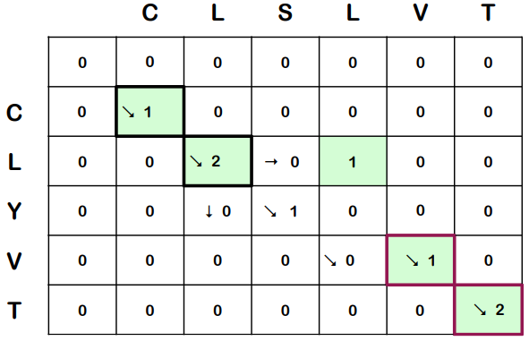

- 점수 계산: 각 셀에서 현재 위치까지의 최대 점수를 계산합니다. 각 셀의 점수는 해당 위치에서의 대응하는 서열 문자끼리의 일치 또는 불일치에 따라 결정됩니다. 이때, 음수 값은 0으로 설정됩니다.

- trace back: 최대 점수를 가진 셀부터 출발하여 최적의 로컬 정렬을 찾기 위해 역추적을 수행합니다. 역추적은 0에 도달할 때까지 진행되며, 각 단계에서 이전에 최적으로 이동한 방향을 따라가면서 정렬된 서열을 구성합니다.

이에 사용되는 패널티는 다음과 같습니다

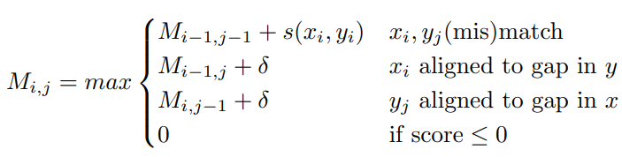

#### MUMmer

MUMmer는 suffix tree algorithm을 이용하여 genome sequence수준의 alignment를 생성하는 도구입니다. 발표된지는 오래되었으나 매우 완성도가 높아 여전히 많은 프로그램에서 활용됩니다. 이는 주로 게놈의 유사성 또는 차이를  분석하는데 사용됩니다. 

이는 같은 방향의 매치들, translocation들을 식별합니다. 기본 컨셉은 20nt의 짧은 exact match를 reference와 query genome에서 모두 찾아내는 것입니다. MUMmer는 alignment를 시각화 하는 도구는 탑재하고있지 않으므로 gnuplot에 의존합니다. 

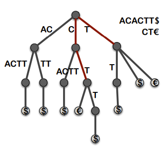

MUMmer는 먼저 reference의 suffix tree를 구축하고, 쿼리 시퀀스를 이 트리에서 스트림합니다. 그 뒤 short exact match를 식별하고, 이를 확장합니다. 이 과정은 매우 빠른 속도로 진행됩니다.

MUMmer로 할수있는 작업은 다음과 같습니다:

* Aligning two finished sequences (highly similar with/without rearrangements, fairly similar/dissimilar sequences)
* Aligning two draft sequences
* Mapping a draft sequence to a finished sequence
* SNP detection
* Identifying repeats


## Lecture 8: BLAST

시퀀스 alignment는 두 서열을 비교하는 것 뿐만 아니라, 수많은 시퀀스 데이터를 보유하고 있는 데이터베이스에서 내가 가진 샘플 시퀀스를 검색하는데도 사용됩니다. 알맞은 시퀀스를 찾기 위해서는 데이터베이스에의 시퀀스들에 대해 샘플 alignment를 정렬하는 과정이 필요합니다. 

데이터베이스 서치를 실행하면 통계적 유의성, 즉 E-value에 따라 순위가 매겨지며, 쿼리 서열과 하나 이상의 데이터베이스 서열 간의 정렬이 나타납니다. 

> BLAST (Basic Local Alignment Search Tool)는 뉴클레오타이드 데이터베이스 (nucleotide database)와 단백질 데이터베이스 (protein database)에 있는 자료들로부터 query와 유사한 서열을 찾기 위한 신속한 검색 방법을 제공하는 NCBI에서 이용할 수 있는 하나의 tool이다. 
> 
> 서열비교 혹은 서열정렬 (sequence alignments) 분석의 목적은 관심 있는 서열의 유사성과 차이점을 분석하여 염기와 아미노산 수준에서
> 서열간의 구조적, 기능적 및 진화론적 관련성을 추론하는 것에 있다. 즉, 잘 제작된 query와의 정렬들로부터 유전자의 구조적, 기능적
> 정보뿐만 아니라 진화적인 정보도 추출할 수 있다는 이야기이다. 
> 
> BLAST에서 사용하는 알고리듬은 global alignment뿐만 아니라 local
> alignment도 탐지하기 때문에, 관련이 없는 단백질 내에 파묻혀 있는 유사성 (similarity)의 영역도 탐지될 수 있고, 이들 모든 타입의
> 유사성은 미지의 단백질의 기능에 대한 중요한 단서를 제공할 수도 있다. 
> 
> 이런 특성으로 인하여, 생물학자들은 BLAST와 같은 서열 정렬
> 프로그램을 사용하여 짧은 시간 안에 거대한 서열 데이터베이스로부터 query 서열과 일치하는 수십 개의 유사 서열을 찾아낼 수 있게
> 되었으며, 또한 요즈음은 이 BLAST가 생물학자들이 생물학 데이터베이스를 사용할 때 가장 먼저 접하게 되는 일반적인 도구가 되었다.

검색에 사용되는 BLAST의 프로그램은 다양하며, 상황에 맞는 프로그램을 사용해야 합니다. 

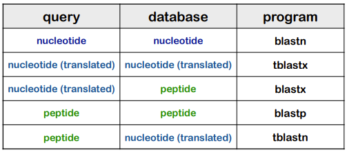

## BLAST

BLAST로 검색을 하기 위한 과정은 여러 단계로 나눠집니다.

1. **Seeding**

- identity나 match 스코어가 높은 짧은 영역을 포함하는 매치를 식별합니다. 이 매치는 생물학적으로 유의해야 합니다. 이를 식별한 뒤, seed로 사용합니다. 

- 일반적으로 BLAST는 inexact matching보다는 exact매칭을 선호합니다. inexact 매칭에 대한 처리는 느리지만, exact 매칭에 대한 처리는 빠릅니다. 

- 높은 스코어를 가진 짧은 word를 컴파일하여 동일한 매치를 찾습니다. 

- 쿼리는 짧은 overlapping words로 분해됩니다. 기본값은 11nt 또는 3(5) 아미노산입니다.

  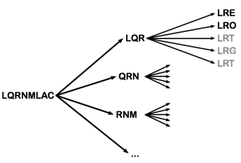

- 하이스코어를 가지는 매칭 단어들의 위치를 확인합니다. 그리고 이 word매치는 시드로 사용됩니다.

  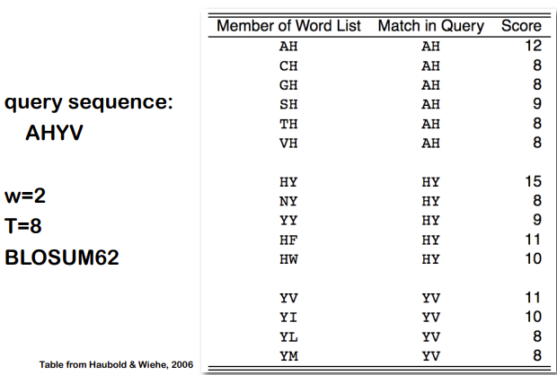

  여기서 T값은 threshold값으로, 이 T 스코어를 넘는 매치들만 선택됩니다.

2. **Extension**

- Extension은 가장 시간을 많이 잡아먹는 단계입니다. 
- Two-hit algorithm을 사용합니다. 
  - 대부분의 데이터베이스 내 서열은 extension 이전 단계에서 버려집니다.
  > - BLAST는 quary 서열과 gap 없이 일정 값 이상의 HSP를 기록하지 못하는 서열들을 미리 제거한다.  그래서 FASTA에 비해 훨씬 비교속도 가 빠르다. 하지만 두 서열이 특정 부분이 높은 일치성을 가지고 있지는 않지만 대부분의 서열에서 유사성을 가지고 있는 경우에 BLAST는 검색을 해 낼 수 가 없다.
  - 같은 대각선 ㅅ상에 있는 segment pairs는 서로 c개의 셀 내에 있으면 양방향으로 확장됩니다. 

    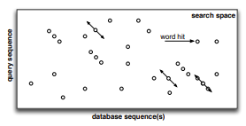

  - extention은 가진 최고점수에서 점수가 어느정도 감소할 때 까지 진행됩니다.
  - extension중에는 점수가 X만큼 이전 최대 점수보다 낮아질 수 있습니다. 
  - extended alignment는 최대 점수까지 딱 자릅니다. 

    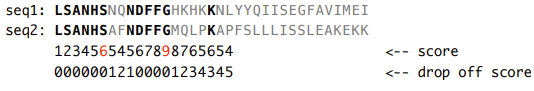

  - extended region은 간격(갭)이 있는 alignment 또는 high-score segment pair(HSP)로 결합됩니다.
  - extension 이후 얻어진 각 HSP의 스코어를 평가하고, 통계적으로 HSP의 유의성을 평가합니다. 
  - 각 HSP는 E-값에 따라 순위가 매겨집니다. 
  - Evaluating scores
    - 각 HSP는 연관된 점수를 가지고 있습니다. 그러나 이 점수가 얼마나 좋은지, 랜덤 서열에 대한 예상 점수와 비교했을 때 통계적으로 유의미한지를 알아야 합니다. 
    - 여기에는 empirical evaluating 방법과 analytical evaluating 방법이 있습니다. 
    - 예시는 다음과 같습니다. 
      ```
      인간 β-헤모글로빈:    50 TPDAVMGNPKVKAHGKKV 67
                              | . ||...|| ||
      루핀 레그헤모글로빈:  50 TSEVPQNNPELQAHAGKV 67
      ```
      이 정렬의 점수는 39입니다. 이 점수는 두 서열 간의 유사성을 나타내는 값으로, 두 서열 간의 일치 및 불일치를 고려하여 계산됩니다.

      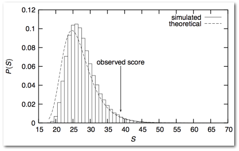

      그러나 통계적으로 봤을때 이 점수는 높지 않습니다. 

> Short repeat sequence 나 특정한 residue들이 많이 존재하는 서열들을 query 서열로 이용하였을 경우, 별로 연관성이 없는 서열들이 결과로 나오는 경우도 있다. 이런 결과들을 피하기 위하여 BLAST는 filtering하는 기능을 기본적으로 가지고 있다. 결국 repeat sequence같은 것들은 검색하기 이전에 제거된다는 사실을 기억해야 한다. 
> 
> FASTA와 마찬가지로 BLAST도 단백질 서열을 위해 개발된 프로그램이다. **염기 서열의 검색이 가능하지만 sensitivity가 떨어지**므로 염기 서열로 염기 데이터베이스를 검색해 진화적으로 떨어져 있는 서열을 찾고자 한다면 **FASTA를 사용하는 더욱 좋은 결과를 얻을 가능성이 높다.**

### Score Probabilities

BLAST의 점수를 이론적으로 유도할 수 있습니다. 

BLAST의 점수는 Gumbel 분포를 따르는 것으로 가정됩니다. 이를 이용하여 특정 점수 이상을 얻을 확률을 계산합니다. 즉, 주어진 점수와 같거나 더 큰 점수를 얻을 확률을 계산하여 이를 통해 이 점수가 우연히 발생할 가능성을 평가합니다.

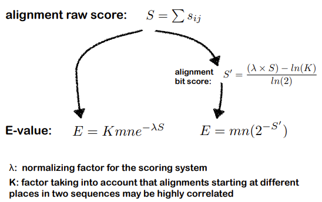

이를 통해서 **Expected value(E)**가 계산될 수 있습니다.

이 Expected value는 주어진 점수 이상의 점수를 랜덤 서열에서 얻을 기댓값을 의미합니다. 이는 동일한 환경에서 유사한 점수를 기대할 때, 우연한 일치의 기대 횟수를 나타냅니다. 

Expect value는 정렬 점수, 쿼리의 길이(m), 그리고 데이터베이스의 크기(n)에 따라 결정됩니다. 

Expect value는 종종 1보다 작거나 큰 값을 가질 수 있습니다. 1보다 작을 경우, 이는 랜덤 서열에서 기대보다 더 많은 일치를 얻을 것으로 예상됩니다.

또한 Expect value는 검색된 데이터베이스에 따라 달라지므로 서로 다른 데이터베이스 간에 비교할 수 없습니다. 서로 다른 데이터베이스에서는 Expect value가 다른 의미를 가질 수 있습니다.

### BLAST Result

Blast는 온라인과 터미널에서 모두 사용할 수 있습니다. 

BLAST 검색 결과는 일반적으로 다음과 같은 요소로 구성됩니다:

- 헤더(Header)

- Reports: 검색 요약(Summary), 분류 보고서(Taxonomy reports), 결과의 거리 트리(Distance tree of results), 다중 정렬(Multiple alignment) 등과 같은 다른 보고서를 포함합니다.

- Graphic Summary: 보존 도메인(Conserved Domains), 검색 결과의 그래픽 개요(Graphical Overview of Hits) 등을 시각적으로 보여줍니다.
- Summary table
- Alignments
- Footer: 온라인 터미널 등의 추가 정보가 포함될 수 있습니다.
  
온라인에서 사용할 경우 푸터를 제외한 모든 정보가 제공되지만, 터미널에서 사용하는 경우 Reports와 그래픽 서머리는 제공되지 않습니다. 

### Masking low-complexity regions (LCR)

Low complexity regions는 일반적으로 compositional bias하기 때문에 significant position-by-position alignment보다 높게 scoring되기 쉽습니다. 

따라서 BLAST 검색 결과 보고에서 잠재적으로 high score를 받을 수 있는 matches(예를 들어 proline-rich region이나 poly-A tails에 대한 hits로 표시될 수 있음)들을 필터링을 통해 제거하고 BLAST 통계자료에서 pairwise alignment의 specificity를 반영할 수 있는 영역들은 보존합니다.

LCR은 정렬 및 점수 계산을 왜곡시킬 수 있습니다. 이러한 영역을 고려하지 않으면 서열 간의 실제 유사성이 왜곡될 수 있습니다.

LCR은 BLAST 정렬 결과에서 'X'로 나타납니다. 이를 통해 사용자는 정렬된 서열에서 마스킹된 영역을 쉽게 식별할 수 있습니다.

### How to improve BLAST searches*

* default parameters 사용하지 않기: 
  
  BLAST의 기본 매개 변수는 모든 상황에 적합하지 않을 수 있습니다. 검색 대상과 문제에 따라 매개 변수를 조정하여 최적의 결과를 얻을 수 있습니다.

* BLAST 검색을 scientific experiments로 간주하기: 
  
  검색을 실험적으로 처리하고, 다양한 매개 변수와 옵션을 실험하여 최적의 조건을 찾습니다.

* complexity filters를 언제 사용해야하는지 알기: 
  
  LCR을 필터링하여 정확한 결과를 얻을 수 있도록 합니다. 이는 서열 정렬 및 결과 해석에 영향을 줄 수 있는 부분을 제거하는 데 도움이 됩니다. 따라서 이를 언제 어떻게 사용해야 하는지 아는 것이 중요합니다.

* 결과 해석을 위한 도구 배우기: 
  
  BLAST 결과를 효과적으로 해석하기 위해 BioPerl 및 Linux 도구와 같은 다양한 도구를 사용하여 결과를 파싱하고 분석하는 방법을 익히는 것이 중요합니다.

* 자체 데이터베이스 만들기/사용하기: 
  
  자체 데이터베이스를 만들거나 사용하여 특정한 연구나 분석에 필요한 서열 집합을 보다 정확하게 검색할 수 있습니다.

* **BLAST를 사용하지 말아야 할 때 알기**: 
  
  BLAST가 적합하지 않은 경우에는 다른 방법을 사용해야 합니다.

  * **perfect matches**: 더 빠른 방법이 있는 경우
  * **primer sequences**: 너무 짧기 때문에 다른 방법을 사용해야 함
  * **assembly**: 보다 특화된 도구들이 존재
  * **cDNA를 게놈에 대조하는 경우**: 보다 특화된 정렬 도구들이 존재


## Lecture 9: Multiple Sequence Alignment

MSA는 여러 시퀀스 간의 similarity를 고려하여 서열을 align하는 과정입니다. 주로 fasta 포맷의 파일을 사용합니다. 

MSA는 일단 BLAST search에 사용될 수 있습니다. 혹은 수집된 서열들을 align해서, 서열간의 유사성을 기반으로 최적의 alignment를 찾는데 사용됩니다. 

MSA는 시퀀스가 얼마나 잘 보존되었는지를 평가합니다. 서열의 residues들을 열별로 정리하여 align한 뒤, 주어진 scoring scheme에 따라 스코어를 매깁니다.

MSA는 따라서 추가적인 분석에도 사용될 수 있습니다. 예를 들어, 여러 시퀀스에서 동일하게 conserved된 영역을 식별하고 비교하면, 진화적으로 서열의 기능에 매우 중요한 부분을 찾을 수 있습니다. 

분석에는 다양한 알고리즘이 사용될 수 있겠지만, 대표적으로 HMM이 있습니다. 

### Positional Homology

Positional homology는 MSA의 진화적 분석 맥락에서 사용되는 개념입니다. 이는 서로 상호 관련된 시퀀스에서 residues의 positional homology가 homologues sequence에서 파생되었음을 가정하는 가설입니다. 

MSA에서 aligned된 서열 간에는 positional hology가 존재하며, 이는 서로 **공통 조상 서열**에서 파생되었음을 추측할 수 있습니다. col에서의 변화는 돌연변이를 나타내고, 이는 두 서열의 공통 조상에서부터의 진화적 거리에 비례할 수 있으며, 이는 서열간의 진화적 관계를 이해하는데 중요한 정보를 제공합니다. 

이러한 positional homology는 어째서 등장합니까?

우리는 multiple domain protein을 예시로 생각해볼 수 있습니다. 서로 다른 멀티 도메인 단백질들은 서로 다른 구조를 가집니다. 그러나 이들이 공통 조상 서열에서 유래한 도메인을 가지고 있을 경우, 이들을 align하면 이 부분이 locally aligned될 것이고, 이를 통해 우리는 이 보존된 서열이 공통 조상 서열에서 유래된 position homology라고 유추할 수 있습니다.

### Software

MSA는 일반 sequence alignment방법과 마찬가지로 크게 de novo alignment와 reference or seed-based methods로 나뉩니다.

이에 대해 여러 소프트웨어가 있으며, 각기 다른 목적, 다른 방식으로 작동합니다.

- De novo
  - Dialign: 여러 로컬 얼라인먼트를 수행하며, 서열간의 로컬 유사성을 고려하여 정렬을 수행합니다.
  - Clustal, MAFFT: 서열을 점진적으로 정렬하여 최종 정렬을 생성합니다. 일반적인 방법입니다. 
    - T-Coffee, MAFFT: 서열간의 일관성(consistency)을 최대화하여 정렬을 수행합니다.
    - Prank: 서열간의 진화적 관련성을 고려합니다.
    - MAFFT: 대량의 데이터셋에 대해 효율적인 매우 빠른 휴리스틱 알고리즘입니다.
  - PASTA: 거대한 데이터셋을 다루기 위해 분할정복을 사용합니다.
  - M-Coffee: 다양한 MSA 툴의 결과를 결합하여 보다 정확한 정렬을 얻습니다.
- Reference or seed-based methods
  - HMMer: 확률적 접근 방법으로, 서열의 확률적 모델을 사용하여 정렬합니다. 


### Progresive alignment

점진적 정렬방법입니다. 주요단계는 다음과 같습니다.

1. pairwise distance matrix를 계산
2. alignment score를 이용하여 guide tree를 만듭니다.
3. 가장 비슷한 두 서열에서 정렬을 시작합니다.
4. 가이드 트리를 사용하여 서열을 그룹화하고, 서로 가까이 위치한 관련성이 높은 서열을 먼저 정렬합니다. 그런 다음, 이러한 sub-alignment를 기반으로 점진적으로 더 멀리 떨어진 서열을 추가하면서 전체적인 MSA를 완성합니다.
5. 서열 간의 서로 다른 관련성을 고려하여 점진적으로 서열을 추가함으로써, 서열 간의 유사성이 높은 영역은 "얼려진(frozen)" 상태로 유지됩니다. 이는 서열의 구조적인 유사성을 보존하고 다중 서열 정렬의 정확성을 유지하는 데 도움이 됩니다.

Guide tree는 neigbor-joining나 UPGMA와 같은 효율적인 clustering method로 만듭니다. 
또한 dynamic programming alignment 보다는 distance를 바탕으로 alignment를 진행합니다.

또 sub-alignment에 대한 profile을 계산합니다. 각 열에 대한 residue conservation 및 통계적 정보에 대해 요약합니다.

이러한 progressive MSA는 가장 빠른 방법이며, MS pairwise alignment보다도 빠릅니다. 그러나 첫 두 서열에 의해서 서열정렬의 정확성이 정해지고, 에러가 나머지 부분에 영향을 미치기 때문에 이를 보완하기 위한 방법이 iterative MSA입니다. 

#### Sum-of-paris Score

이는 MSA의 품질을 측정하는데 사용되는 score 척도입니다. 

이 점수를 계산하기 위해,

- 각 열에서 서열들은 통계적으로 독립적이라고 가정
- substitution matrix를 사용하여 서열간의 유사성을 평가
- 모든 서열 pairs의 점수를 합산하여 계산됨

각 서열 pairs에 대한 weight sum of pairs(WSP)가 계산될 수 있습니다. 이때 이 평균은 진화적 분포를 고려하여 서열 간의 bias를 조정합니다. 

#### Challenge

좋은 MSA를 위해서는 여러가지 조건들이 만족되어야 합니다. 그러나 이들은 기술적 한계 등으로 인해 충족되지 못한 경우가 대부분입니다. 다음과 같은 것들이 있습니다. 

- MSA의 결과는 실제 생물학적 의미와 일치해야합니다. 즉, MSA는 서열간의 진화적 관련성을 올바르게 나타내고, 공통조상의 위치를 정확하게 추론해야 합니다. 그러나 이는 쉽지 않습니다.

- 서열간의 유전적 거리가 매우 큰 경우, 일반적인 서열 정렬 알고리즘은 유용하지 않을 수 있습니다. 
- 대규모 데이터셋의 정렬에는 시간과 많은 자원이 소모됩니다. 따라서 효율적이고 빠른 방법이 필요합니다. 보통 대규모 데이터셋을 처리하는데 사용되는 방법은 일부 정보를 손실하거나 근사화하는 경향이 있으며, 정확성을 보장하기 어렵습니다.
- NP-complete문제입니다. 최적의 해를 찾는것은 계산적으로 어렵습니다. 따라서 대부분의 알고리즘은 최적 해 대신 근사 해를 찾도록 설계됩니다. 

여러 Challenge들이 있지만, 많은 것들이 여러 소프트웨어에서 해결되었습니다. 

- Errors that are frozen in subalignments
  - 한번 정렬된 sub-alignment들은 frozen되며, 이후 수정되지 않습니다. 이는 처음 생긴 오류가 고정되어 마지막까지 이어질 수 있다는 것을 의미합니다. 그러나 오류들은 다른 서열들과의 비교를 통해 해결될 수도 있습니다. 이를 위해 초기에 얻은 sub-alignment들을 기반으로 전체정렬을 개선하는 반복적인 과정을 수행하여 오류를 최소화 합니다. 이는 위에서 언급한 iterative alignment로, 대부분의 프로그램에서 수행됩니다.
- Suboptimal pw alignments in MSA
  - sub-alignment에서 발생하는 suboptional pw ailgnment문제를 해결하기 위해, consistency score를 도입합니다. 이 방법은 서로 다른 sub-optimal-alignment간의 consistency를 비교하여 더 나은 최종정렬을 얻습니다. T-Coffee는 이 방법을 사용합니다.
- evolutionary correct (aware) MSAs
  - 이를 위해, 일부 프로그램들(PRANK)는 갭 비용을 수정합니다.
- guide tree takes long for huge data sets
  - 거대한 데이터 세트의 가이드 트리 생성이 시간이 오래 걸릴 때, Clustal-O와 같은 일부 프로그램은 빠른 시퀀스 클러스터링 방법을 사용하여 가이드 트리 생성을 가속화합니다. 이를 통해 대규모 서열 집합에 대한 효율적인 다중 서열 정렬이 가능해집니다.


#### Iterative alignment(refinement)

Progressive alignment은 다중 서열 정렬의 강력한 방법이지만, 한 번 오류가 도입되면 이를 수정하기가 어려운 주요한 약점이 있습니다. 이는 서브 정렬(subalignments)에서 오류가 고정되어 있기 때문에 발생합니다. 이러한 약점을 극복하기 위해 후속 처리(post-processing) 중에 오류를 수정하는 해결책이 존재합니다. 가장 흔한 해결책은 iterative refinement(반복적 개선) 기술입니다. 이 기술은 대부분의 다중 서열 정렬 프로그램에서 구현되어 있습니다.

Iterative MSA(Multiple Sequence Alignment)는 말 그대로 MSA 과정을 여러번 반복하는 동안 순서를 계속해서 재정렬하는 과정이며 이를 통해 최적화 할수 있는 Alignment방법입니다.

MSA는 서브그룹내의 서열 pair-wise 재정렬을 시작으로 다시 subgroup을 재정렬 합니다.
subgroup의 선택은 guide tree의 sequence 관계와 random selection, 등에 의하여 정해집니다. 핵심은, iterative MSA는 유전자 알고리즘과 숨겨진 마르코프 모델을 사용한 최적화 방법입니다. 하지만 단점은 프로세스가 로컬 최소값에 갇혀서 훨씬 느려질 수 있습니다.

다른 방법도 있습니다. 가지고 있는 서열 중 몇 서열을 제거하고 재정렬할 수 있습니다.

혹은 서열을 무작위로 트리기반으로 두 그룹으로 나눈 뒤, 재정렬 하고 다시 합칠 수 잇습니다.

seq-profile, 혹은 profile-profile 정렬 후에 재정렬을 수행할 수 있습니다??
  

### T-Coffee

T-Coffee는 최적 정렬을 선택하기 위해 다음과 같은 접근 방식을 취합니다:

1. Sum of pairs Score를 최대화
   - Sum of pairs score는 모든 서열 쌍의 점수 합으로, 이 점수가 가장 높은 정렬을 일단 최적 정렬로 선택합니다. 
2. Consistency based alignment
   - T-Coffee는 Consistency를 Objective Function으로 사용하여 최적의 정렬을 선택합니다. 이는 최적의 로컬 정렬 및 휴리스틱한 전역 정렬에서 발견된 서열의 쌍 간의 Consistency를 평가합니다. 이러한 Consistency는 서로 다른 서열 쌍 간의 정렬 결과가 얼마나 일치하는지를 나타냅니다.

또한 T-Coffee는 extraneous information, 외부 정보를 포함할 수 있습니다. 

T-Coffee는 또한 Position-Specific Library를 사용하여 정렬을 개선합니다. 이 라이브러리는 다음을 고려합니다:

- 서열 쌍의 유사성: 각 서열 쌍의 유사성을 고려하여 서열의 조각(fragment)에서 나온 서열 쌍을 평가합니다.
- 다른 모든 서열 쌍과의 일관성을 평가
- xi와 yj를 정렬하는 데 필요한 점수: 각 위치별 서열 라이브러리를 기반으로 xi와 yj를 정렬하는 데 필요한 점수를 계산합니다.


### Gap: MAS

MSA에서 갭의 처리는 중요한 문제중 하나입니다. MSA에서 Deletion은 deletion이 발생한 위치에서만 패널티를 부여해야합니다. insertion또한 마찬가지로, 한번의 패널티만 적용됩니다.

대부분의 MSA 메소드는 deletion과 insertion을 구분하지 않습니다. 그냥 각 위치의 gab을 deletion으로 간주하고, insertion을 구분하지 않습니다. 따라서 single insertion에 대해 과도한 패널티가 부여될 수 있습니다. 이 때문에 문제가 발생할 수 있습니다.

이는 기존 갭이 있는 영역에서는 갭 비용을 줄이고, 기존 갭 주변에서는 갭 비용을 증가시키는 것으로 해결할 수 있습니다.

그러나 한가지 문제가 더 있습니다. 위 방법으로, gab이 overlapping될 수 있습니다. 이는 **서로 인접하나 독립적인 각각의 insertions를 합칠 수 있습니다.** 

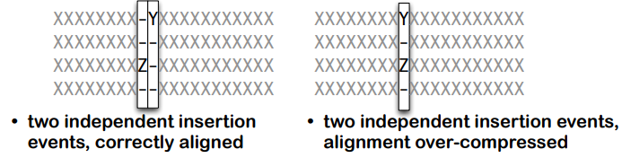

이렇게되면 갭이 중첩될 수 있습니다. 이는 **정렬이 지나치게 압축되는 것을 유발**할 수 있습니다. 이는 **positional homology를 위배하고, 잘못된 정렬을 유발**할 수 있습니다.


#### Gap: PRANK

PRANK는 이 갭을 조금 다르게 처리합니다. 

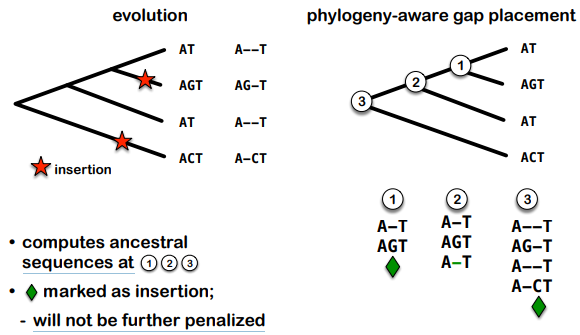

PRANK는 갭을 처리하기 위해 ancester 서열을 계산합니다. 이를 통해 각 위치에 대해 추가 서열을 생성하여 갭을 insert합니다. 

또한 PRANK는 ancester sequence에 insertion을 표시하여 해당 insertion이 추가적으로 패널티를 받지 않도록 합니다. 이는 후속 정렬 단계에서 해당 삽입이 잘못된 매치나 패널티를 받지 않도록 보장합니다.

PRANK는 보다 밀도가 높은 샘플링 및 가이드 트리가 실제 트리와 일치할 때 보다 향상된 결과를 제공합니다. 이는 정확한 가이드 트리와 밀도가 높은 샘플링이 정렬 품질을 향상시킬 수 있다는 것을 의미합니다.

따라서 PRANK가 제공하는 MSA 결과는 다른 프로그램들에 비해 넓은 갭을 나타냅니다. 이는 다른 프로그램들에선 포인트 뮤테이션의 중첩에 의한 shrinkage/expansion이 발생했기 때문입니다. 

### Large alignment

대규모 정렬에 대해서는 주로 MAFFT, Clustal-Omega, PASTA가 사용됩니다.

이들은 클러스터링과 가이드 트리를 사용하여 pairwise comparision을 신속하게 수행합니다. 그러나, 이러한 방법들은 정확도를 감소시킵니다. 이들의 정확도는 60퍼센트밖에 되지 않습니다. 

또한 대규모 데이터셋에서는 대부분의 정렬 프로그램이 완료되지 못합니다. 이는 시간과 리소스의 한계때문입니다. 그러나, 낮은 정확도로는 비교적 빠르게 완료될 수 있습니다.

알맞는, best 정렬 프로그램을 사용하거나, 또는 indel의 evolution rate가 낮은 경우에는 빠르게 정렬을 완료할 수 있습니다.

이런 대규모 정렬은 MSA, phylogenetics, evolutionary analysis, protein structure prediction의 분야에서 사용되기 때문에, 여전히 필요합니다.

따라서 분할정복 방법(Sate, PASTA, SATCHMO-JS, PROMALS, MAPGAPS)이나 시드 기반 접근방법(Sate, PASTA, SATCHMO-JS, PROMALS, MAPGAPS)을 더 사용할 수 있습니다. 

이미 시중에는 100개가 넘는 프로그램들이 존재합니다. 이들은 서로 다른 휴리스틱을 사용하고, 모든 프로그램에서 에러는 피할 수 없습니다. 따라서 에러의 양과 부정확성에 대해 고려해야합니다.

따라서 소프트웨어를 선택하는 것과 얻어진 정렬을 잘 평가하는것이 중요합니다.

### Selecting Software

- 정렬의 accuracy:

  해당 방법이 (근사적으로) 올바른 정렬을 재구성할 수 있는지 확인해야 합니다. 그러나 실제로는 진정한 정렬이 대부분 알려져 있지 않기 때문에 이는 일종의 도전적인 문제입니다.

- Methode의 강점과 약점:

  해당 방법의 출판된 강점과 약점을 고려해야 합니다. 이는 방법이 더 빠르거나 정확한지, 적은 양의 서열이나 많은 양의 서열에 적합한지, 구조적 또는 진화적 분석에 적합한지 등을 파악하는 데 도움이 됩니다.

- 벤치마크 데이터셋에 대한 테스트:

  해당 방법이 벤치마크 데이터셋 또는 기준 데이터셋에 대해 테스트되었는지 확인해야 합니다. 이러한 데이터셋은 일반적으로 알려진 정렬에 대한 비교를 통해 방법의 성능을 평가하는 데 사용됩니다.

- Balibase 또는 모의 정렬을 기반으로 한 테스트:

  구조 기반 정렬에 대한 Balibase 또는 모의 정렬과 같은 테스트 케이스를 기반으로 한 테스트를 통해 방법을 평가할 수 있습니다. 이러한 테스트는 일반적으로 다양한 상황에서 방법의 성능을 평가하는 데 도움이 됩니다.

### Evaluating Alignment

정렬을 평가할 때 다음과 같은 기준을 사용할 수 있습니다:

- Column 기준으로 평가:

  - **각 열이 얼마나 일관되게 정렬되었는지**를 확인합니다. **다른 방법 간의 정렬 또는 동일한 방법 내의 다른 서열 간의 일관성을 평가**할 수 있습니다. 예를 들어, M-Coffee는 다양한 정렬 방법을 결합하여 일관된 정렬을 생성합니다.

- 서열 또는 서열 region별로 평가:

  - 정렬이 non-homologue 서열인지 여부를 확인합니다. non-homologue 서열은 잘못된 정렬을 나타낼 수 있습니다.
  - homologue 서열 중 잘못된 정렬이 있는지 확인합니다. 이는 서열 간의 진정한 identity를 보장하는 데 중요합니다.
  - non-homologue 서열 구간, 즉 조립 또는 주석 오류와 같은 정렬이 부적절한 구간을 식별합니다.

- 전체 점수로 평가:

  - 전체적인 정렬의 점수를 통해 정렬의 품질을 평가할 수 있습니다. 이 접근 방식은 일반적으로 각 열 또는 서열의 일관성을 종합하여 종합적인 평가를 제공합니다.

### Meta Alignment

메타-alignment는 여러 다른 방법을 사용하여 생성된 다양한 정렬을 조합하거나 평균화하여 단일 "최선" 정렬을 생성하는 방법입니다. 이는 여러 다른 정렬 방법을 사용하여 동일한 입력 데이터에 대해 여러 번 정렬한 후 결과를 조합하여 더 일관된 또는 종합된 정렬을 얻는 것을 의미합니다.

meta alignment는 여러 다른 방법으로 생성된 각 정렬의 투표를 진행하여 각 위치에 대해 가장 많은 투표를 받은 서열을 선택합니다. 이렇게 하면 가장 많은 방법에서 동의한 정렬을 얻을 수 있습니다.

또는 각 위치의 서열에 대해 여러 다른 정렬 방법을 사용하여 생성된 점수의 중간값을 계산합니다. 중간값은 이상치에 민감하지 않으므로, 이를 사용하여 일관된 정렬을 생성할 수 있습니다.

- M-Coffee와 같은 Meta Alignment 도구:

  다양한 정렬 방법을 사용하여 각각의 서열에 대해 다양한 정렬을 생성한 후, 이러한 다양한 정렬을 통해 원래의 입력 서열에 대한 일관된 정렬을 생성합니다. M-Coffee는 서로 다른 방법을 결합하여 일관된 정렬을 생성하는 데 사용됩니다.


#### M-Coffee

M-Coffee는 여러 가지 대안적인 다중 서열 정렬(MSA)을 결합하여 하나의 최종 출력을 생성하는 도구입니다. M-Coffee의 아이디어는 독립적인 방법에 의해 생성된 오류가 일관되어서는 안 된다는 것입니다. 따라서 서로 다른 방법 간에 일치가 발생한다면 올바른 정렬을 시사합니다. 그러나 상관된 방법은 M-Coffee의 가정을 위배하며, 방법 선택이 중요합니다.

M-Coffee의 접근 방법은 다음과 같습니다(주로 T-Coffee를 기반으로 합니다):

1. 여러 서열 정렬(MSA)을 포함하는 라이브러리를 구성합니다.

2. 다양한 MSA를 하나의 새로운 MSA로 결합합니다. 이를 통해 각 서열의 적절한 배치를 유지하면서 다양한 방법에서 나온 서로 다른 조정을 통합할 수 있습니다.
3. T-Coffee와 같은 방법으로 서로 다른 정렬을 비교하고 평가하여 새로운 MSA에 점수를 할당합니다. 이 점수는 색 또는 숫자 형식으로 제공됩니다.

### MSA

MSA를 평가함으로써, 불확실성이나 alignment가 잘 수행되지 않은 부분을 찾을 수 있습니다.

이런 부분을 찾는다면, 부적절한 서열 또는 영역을 제거할 수 있습니다. 이것은 정렬의 품질을 개선시킵니다. 또한 낮은 점수를 받는 부분을 마스킹 하여 후속 분석에서 무시할 수 있습니다. 이를 통해 부정확한 결과가 전체 해석에 영향을 미치는것을 방지할 수 있습니다. 

MSA는 homologus coding sequence(DNA, Protein)에 대해 사용될 수 있습니다. 주로 linear or global alignment에 사용되고, 서열간의 구조적 유사성이나 기능적 연관성을 파악할 수 있습니다.

MSA가 genome이나 genome scaffold에 사용되는 경우, inversion, translocation, duplication등을 찾을 수 있습니다. 이 밖에도, 동질한 블록을 식별하고 이러한 블록을 정렬할 수 있습니다.

MSA가 RNA 패밀리에 사용되는 경우, 이는 서열이 아닌 2차 구조의 보존에 중점을 둡니다. 서열보다는 2차구조의 보존을 파악하여 RNA 패밀리 간의 관계를 분석합니다. 

## Lecture 10: HMM

단백질 패밀리 정렬에서, position-specific information은 중요합니다. 같은 단백질 패밀리 내에서라도 서로 다른 영역은 서로 다른 보존 수준을 나타낼 수 있기 때문입니다. 또한, 서로다른 영역은 서로 다른기능적이나 구조적 제약을 가질 수 있습니다. 일부 영역은 특정 기능이나 구조를 유지하기 위해 보존되어야 하지만다른 영역은 더 큰 다양성을 허용할수도 있습니다.

또한, 서로 다른 영역은 서로 다른 선택압을 받습니다. 

이 position specific information은 통계적으로 다뤄질 수 있습니다. 

### Position-specific scoring matrix (PSSM)

PSSM은 단백질 또는 DNA 서열의 각 위치에서 특정 아미노산 또는 염기에 대한 점수를 나타내는 행렬입니다. 이 행렬은 주어진 위치에서 특정 서열 요소의 발생 가능성을 나타내며, 주어진 위치의 특성을 보다 정확하게 모델링하는 데 사용됩니다.

PSSM은 주로 단백질 또는 DNA 서열의 정렬에서 생성됩니다. 먼저, 서열 정렬에서 위치별 점수를 계산하기 위해 통계적 프로필 또는 정렬 프로필을 만듭니다. 이 프로필은 각 위치에서 특정 아미노산 또는 염기의 발생 빈도를 나타냅니다. 그런 다음, 이러한 빈도를 바탕으로 위치별로 점수를 할당하여 PSSM을 생성합니다.

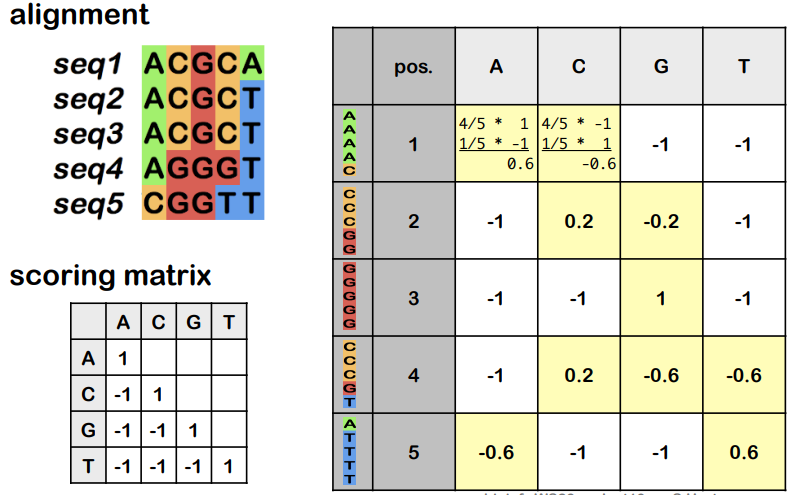

PSSM은 일반적으로 BLOSUM이나 PAM과 같은 점수 행렬과 유사한 형태를 가지고 있습니다. 각 위치에서 특정 아미노산 또는 염기에 대한 점수는 해당 위치에서의 발생 빈도와 관련이 있습니다. 더 높은 점수는 해당 위치에서 특정 아미노산 또는 염기의 발생이 더 자주 발생한다는 것을 나타냅니다.

이를 사용하는 툴로는 PSI-BLAST가 있습니다. 

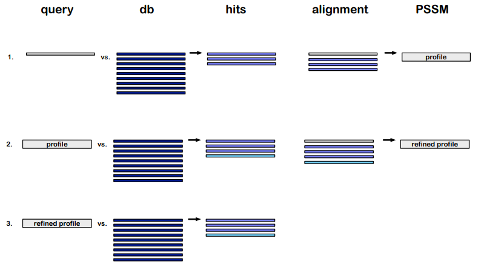

이는 BLAST의 변형으로써, 기본 BLAST와 유사하게 작동하지만 iterative 단계에서 이전 단계에서 찾은 유사한 서열을 사용하여 PSSM을 만듭니다. 이는 초기 쿼리 서열과 유사한 서열을 반복적으로 찾아내어, 보다 빈감한 서열 유사성 검색을 제공합니다. 이를 통해 초기단계에서 식별하지 못한, 약간의 similarity가 있는 서열도 식별할 수 있습니다. 

### Generative Model

아래는 간단한 예시입니다.

- ACGCT 0.8×0.6×1.0×0.6×0.8 = 0.2304
- CGGTA 0.2×0.4×1.0×0.2×0.2 = 0.0032
- TCGCT 0.0×0.6×1.0×0.6×0.8 = 0

문제는 이상태로 프로파일을 생성할 시, 일부 드문 base에 대해서는 0의 확률이 나올 수 있다는 것입니다. 자연에는 완전 0의 확률은 존재하지 않기 때문에, 이를 조정해야합니다.

우리는 드문 요소에 대해 각 열에 pseudocounts를 삽입함으로써 아미노산 출현빈도를 증가시킬 수 있습니다. 

### HMM

HMM은 가장 가능성이 높은 MSA를 결정하기 위해서 gap, match,mismatch의 가능한 조합에 확률을 부여하는 방식입니다.
HMM은 생물학적 중요도를 평가하기 위해서 single high scoring, local alignments, global alignments를 output으로 내줄 수 있습니다.

HMM의 그래프는 directed acyclic graph로 표현할 수 있습니다.
이 그래프에서 노드는 MSA에 있는 column의 entry입니다.(즉 단백질이면 아미노산입니다!)
여기서 만약 해당 column이 완전히 보존되었다면 single node로 표현됩니다.
(보존되었다라는 것의 의미는 MSA에 전재하는 모든 시퀀스들에서 해당 위치의 아미노산이 모두 같음을 의미)

그렇게해서 각 state에 대한 확률을 구해가면서 중요한 시퀀스를 뽑아냅니다.

HMMs은 숨겨진 상태(hidden state)와 관측 가능한 결과(outcomes) 간의 확률적 상호작용을 모델링하는 데 사용되는 확률적 모델입니다. 이 모델은 다음과 같은 구성 요소로 이루어져 있습니다:

- **은닉 상태(states)**: 실제로 관찰되지 않지만 모델이 있는 상태를 나타냅니다. 각 상태는 모델이 취할 수 있는 내부 상태를 나타냅니다.

- **transitions**: 은닉 상태 간의 transitions는 각 상태에서 다른 상태로의 이동을 나타냅니다. transitions는 특정 상태에서 다음 상태로 이동할 확률을 정의합니다.

- **transition probabilities**: 각 transitions에 대한 확률 값으로, 모델이 한 상태에서 다음 상태로 이동할 확률을 결정합니다.

- **outcomes/emissions**: 은닉 상태에 대한 관찰 가능한 결과 또는 방출을 나타냅니다. 이것들은 관측 데이터에 해당합니다.

- **emission probabilities**: 각 은닉 상태에서 특정 결과가 발생할 확률을 나타냅니다.

서열 길이 heterogeneity를 모델링하는 데 있어, 일부 서열이 다른 것보다 길거나 짧을 수 있으며 이를 모델링하기 위해 추가적인 transition을 많이 추가하지 않고도 처리할 수 있습니다. 예를 들어, 삭제된 서열의 경우, 서로 다른 길이의 삭제를 나타내는 여러 노드(상태)를 추가할 수 있습니다. 이렇게 하면 각 노드는 해당 길이의 삭제를 나타내며, 길이가 다른 다양한 삭제를 표현할 수 있습니다.

마찬가지로, 삽입된 서열의 경우에도 서로 다른 길이의 삽입을 나타내는 노드를 추가할 수 있습니다. 더 긴 삽입은 삽입된 노드에 대한 자체 루프를 형성하여 표현될 수 있습니다. 이렇게 하면 서로 다른 길이의 삽입이 서로 다른 노드를 통해 나타낼 수 있습니다.

- for Gene Structure

  - 먼저 적절한 데이터를 사용하여 **HMM을 훈련**시켜야 합니다. 훈련 데이터는 유전자가 포함되어 있는지 여부를 알려주는 주석이 달린 DNA 서열일 수 있습니다. 이 훈련 단계에서 HMM은 유전자와 비유전자 영역 간의 특징을 학습하고 각 상태(은닉 상태)에서의 전이 확률과 방출 확률을 조정하여 모델을 최적화합니다.

  - 훈련된 HMM을 사용하여 주어진 DNA 서열에 대해 유전자 특징이 어디에 있는지 예측할 수 있습니다. 모델은 각 위치에서 유전자와 비유전자 영역 간의 가장 적절한 경계를 결정하고 이를 통해 서열을 분류합니다. 또한 각 위치에서 예측에 대한 확률을 제공할 수 있습니다. 이 확률은 주어진 위치가 유전자인지 아닌지에 대한 신뢰도를 나타냅니다.

- for Alignment

  - 마찬가지로 Training이 선행되어야 합니다. 

  - 훈련된 HMM을 사용하여 주어진 단백질 서열에 대해 정렬된 열과 관련된 아미노산이 어디에 있는지 예측할 수 있습니다. 모델은 서열의 각 위치에서의 아미노산이 어떤 정렬된 열과 관련되어 있는지 결정하고, 예측 결과에 대한 신뢰도를 제공합니다. 예측된 위치의 아미노산이 정렬된 열과 관련되어 있을 확률을 계산하여 제공합니다.

#### Profile Hidden Markov Model

프로파일 HMM은 다양한 서열에서 관찰되는 보존된 영역에 대한 통계적 정보를 포착합니다. 이러한 정보는 각 위치에서의 아미노산 또는 염기의 점수, 갭 패널티 등을 포함합니다.

프로파일 HMM은 초기에 "Seed" 정렬이라고 하는 작은 정렬을 사용하여 훈련됩니다. 훈련 단계에서는 이러한 Seed 정렬을 기반으로 모델이 각 상태에서의 전이 확률 및 방출 확률을 추정하기 위해 Baum-Welch 알고리즘과 같은 알고리즘이 사용됩니다. 또한 훈련 데이터에 가중치를 부여하여 **특정 서열이 더 중요하게 고려**되도록 합니다.

프로파일 HMM은 주어진 서열이 특정 단백질 패밀리에 속하는지 여부를 결정하기 위해 데이터베이스 검색에 사용될 수 있습니다. 각 서열에 대해 프로파일 HMM이 매칭되는 정도를 점수화하여 유사성을 측정합니다.

주어진 시퀀스를 profile HMM에 align함으로써 중요한 정보를 디텍팅할 수 있습니다. 

#### Emissions

각 state의 확률에 따라 현 state를 emit할 수 있습니다. 일반적으로 다음과 같은 세가지 종류의 emission이 있습니다:

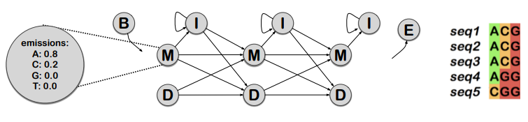

**M(Match)**

- 이 상태는 정렬 열에서 관찰된 아미노산의 빈도에 따라 단일 아미노산을 방출합니다. 즉, 해당 열에서 가장 일반적으로 나타나는 아미노산이 발생됩니다.

**I(Insertion)**

- 이 상태는 하나 이상의 아미노산을 방출하며, 이들은 시퀀스의 background frequency에 따라 선택됩니다. 일반적으로 background frequency는 시퀀스 데이터 세트 전체의 아미노산 확률 분포를 나타냅니다.

**D(Deletion)**

- 이 상태는 아미노산을 방출하지 않고 대신 갭을 방출합니다. 따라서 이 상태는 정렬 열에서 빈 공간 또는 갭을 나타냅니다.

매 M node마다 아미노산에 따른 확률, 그리고 다른 노드로 transition될 확률이 존재합니다.

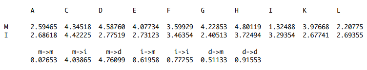

#### HMMer

HMMer는 생물학적 서열 분석을 위한 프로파일 HMM의 구현 중 하나입니다. 이는 주로 단백질 및 DNA 서열을 분석하기 위해 사용됩니다. HMMer는 Janelia Research Campus에서 제공되며, 해당 도구에 대한 포괄적인 사용자 매뉴얼이 제공됩니다.

HMMer는 Pfam 데이터베이스의 기초가 되었습니다. Pfam 데이터베이스는 1997년에 시작되었는데, 이는 단백질 데이터베이스의 크기가 계속 커지면서 새로 추가되는 단백질이 기존 단백질(도메인) 패밀리의 새로운 구성원임을 확인하는 데 사용되었습니다. Pfam은 단백질 서열을 분류하고 관리하기 위해 단백질(도메인) 패밀리로 구성된 데이터베이스입니다. 현재 Pfam 데이터베이스에는 약 20,000개의 패밀리가 있으며, 이는 InterPro와 통합되어 다양한 생물학적 서열 분석 및 비교 분석에 사용됩니다.

HMMer의 구조는 다음과 같습니다:

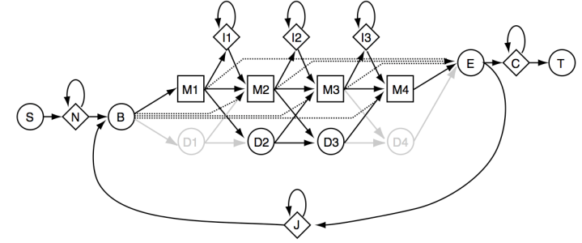

- M, D, I는 위에서 설명한 것과 동일합니다.
- B, E: 각각 Begin, end를 나타내는 더미 state입니다.
- N, C: 각각 N- C-터미널, 혹은 unaligned를 나타냅니다.
- S, T: 각각 Start, Termination을 나타냅니다.
- J: unaligned 시퀀스의 joining을 나타냅니다.

위의 구조로 align할 수 있는 가능성은 다양합니다. 

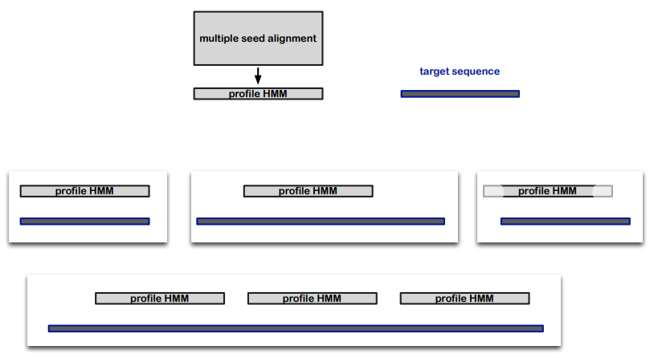

#### Pros and Cons

HMM을 이용하면 결과의 확률적 해석이 가능하며, 프로파일 HMM을 사용해서 추가 패밀리 멤버에 대해 높은 품질의 빠른 MSA이 가능합니다. 

그러나, Profile HMM을 트레이닝 시키기 위해선 충분하고 좋은 훈련 데이터가 필요하며, Model dependencies를 캡처할 수 없으므로, dependency가 있는 RNA같은 데이터를 잘 모델링하지 못합니다.

## Lecture 12: Phylogenies I

MSA의 결과에서 Phylogenies로 넘어가는 것은 어려운 과정입니다. MSA 결과를 해석하기 위한 다양한 방법이 존재하며, 고려해야할 많은 것들이 있습니다. 

Phylogenic 관점에서 MSA는 여러 방면으로 해석될 수 있습니다.

- homologoues sequence에 대한 positional homology 가설
- aligned된 residue들은 공통 조상의 시퀀스에서 유래한 공통된 anccestor residue를 공유합니다. 따라서 정렬된 residue들은 공통조상에서 유래한 것으로 간주할 수 있습니다.
- column의 변화는 돌연변이에 해당합니다.
- 돌연변이들은 진화의 시그널로 해석될 수 있습니다.

Aligned regions들은 세 가지 경우로 나뉩니다:

- **Positionally homologous**
  - 실제로 정확하게 정렬 되었으며, MSA에서 서열 간에 위치적으로 homologue한 부분을 나타냅니다. 이 부분에는 phylogenetic signal이 포함되있으며, 진화적 관련성 및 거리를 파악하는데 중요한 역할을 합니다.
- **Uninformative**
  - 갭이 굉장히 많고, 제대로 정렬이 되지 않았으며, 딱히 phylogenetic 시그널을 찾아볼 수 없습니다.
- **Incorrectly aligned**
  - 함정입니다. 

위의 uninformative 혹은 incorrectly aligned alignment들을 다루기 위해, column 혹은 sequence를 제거하거나 마스킹하는 작업이 필요합니다. 

Remove는 진짜 그냥 열 자체를 지워버리는 것이고, 마스킹은 서열을 보존하되 분석에 포함하지 않는 것을 의미합니다.

이 제거/마스킹의 기준은 다양할 수 있습니다. 일반적으로, uninformative 혹은 incorrectly aligned alignment를 제거/마스킹 합니다. 이는 alignment의 accuracy를 향상합니다. 

그러나, 이 과정을 잘못 시행할 경우 오히려 진화적 신호를 부정확하게 제거할 수 있으며, 결과적으로 accuracy가 감소할 수 있습니다. 

다양한 접근 방법이 존재하고, Gblocks, Guidance, TrimAI, HMMCleaner등이 사용될 수 있습니다. 

### Phylogenetic Tree

Tree형 다이어그램을 통해 엔티티간의 관계를 설명합니다. 이 Entities에는 Functional domains, gene sequences, genomic regions, genomes, organisms 등이 포함됩니다.

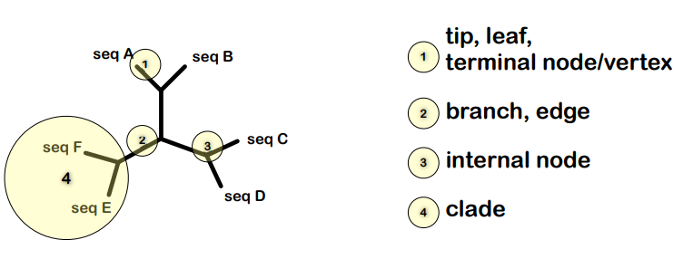

1. tip, **leaf**, terminal node, vertex: 트리의 끝에 있는, 개별 개체 혹은 종을 나타냅니다. 이들은 더이상 branch를 가지지 않습니다.
2. Branch, **Edge**: 엣지입니다.
3. **Internal Node**: 진화적 관계의 분기점을 나타내며, 공통조상을 나타내기도 합니다.
4. **Clade**: 트리의 한 부분으로, 공통조상과 해당 조상의 모든후손을 포함하는 그룹을 나타냅니다. 종종 공통의 형질이나 유전적 특징을 공유하는 생물군을 나타냅니다.

같은 Tree이더라도 서로 다른 모양이나 방향을 가질 수 있습니다. 트리는 rooted일수도 있고, unrooted일 수도 있습니다.

또한 엣지의 길이가 진화적 거리를 나타내는 경우도 있고, 아닌 경우도 있습니다. 

- Cladogram은 가지의 길이를 고려하지 않으며, 각 분기점에서 동일하게 분기됩니다. 

- Phylogram은 종간의 진화적 거리를 나타내며, 각 branch의 길이는 종간의 진화적 거리를 나타냅니다. 

#### Rooting Tree

MSA데이터로 일단 Phylogenetic Tree를 만들면, 초기에는 root가 설정되어있지 않습니다. Root를 설정하기 위한 한가지 방법은 outgroup을 사용하는 것입니다. outgroup은 ingroup종 각각보다 더 멀리 관련된 서열을 가지고 있는 종입니다. 이를 root로 설정하면 ingroup종들 간의 진화적 관계를 보다 명확히 파악할 수 있습니다.

- Outgroup rooting
  - 가장 멀리 떨어진, 혹은 가장 먼저 분기된 것으로 보이는 그룹을 선택합니다.
  - prior/ independent information이 필요합니다.
- Midpoint rooting
  - 가장 멀리 떨어진 두 taxa의 분기점, 중간 지점을 루트로 선택합니다.
  - molecular clock을 가정합니다.

#### Resolved vs unresolved trees

Tree의 형태는 resolved, unresolved가 있습니다. 

resolved tree는 모든 분기점이 딱 두개의 가지로 나뉜 binary 형태의 tree입니다. 이러한 tree는 진화적 관계에 대한 확실한 정보를 제공합니다.

unresolved tree는 binary divergence가 아닌 multifurcation이 존재합니다. 종 간의 관계가 불분명하거나 충분하지 않은 경우 사용될 수 있습니다. 

불충분한 데이터 또는 상충하는 데이터로 인해 binary furcation을 결정할 수 없는 경우 **soft polytomy**라 하며, 빠른 진화로 인해 두개 이상의 분기로 나뉘는 경우 **hard polytomy**라 합니다.


### Gene Tree

우리가 phylogenetic tree로 할 수 있는것은, functional domains, gene sequence, genomic region을 entities로 설정하여 분석하는 것입니다. 이가 organisms의 phylogenetic tree로 이어지는 것은 매우 드뭅니다.

우리는 Gene Tree를 다룹니다. 

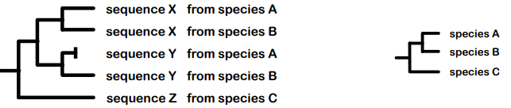

Gene tree는 homologous sequence의 진화를 묘사합니다. 여기서 발생할 수 있는 이벤트는 speciation(종화), duplication, loss, horizontal transfer, hybridization, introgression 등등이 있습니다. 

#### Homologuous genes

여기서 중요한 개념이 등장합니다.

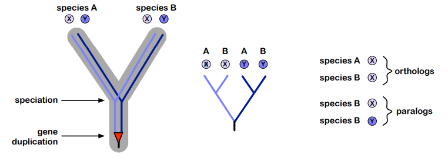

- **orthologs**: 종으로 분화된 후 갈라짐. last common ancestor가 speciation node인 경우
- **paralogs**: Duplication 이후 갈라짐. last common ancestor가 duplication node인 경우

Gene의 분화는 종에 무관할 수 있으며, 이것이 계통 분석을 복잡하게 만드는 원인입니다.

#### Duplication // loss

복제 및 손실은 유전자 진화에서 중요한 역할을 하는 현상입니다. 이를 통해 새로운 기능이 생성되거나 기존의 기능이 수정되며, 종 내의 다양성이 유지되고 증가됩니다. 

게놈은 유전자가 동일한 염색체 내에서 여러본 복제되는 작은 규모의 duplication과, 여러개의 큰 유전자가 중복되는 duplication을 흔히 가집니다.

또한 자주 일어나는 loss는 유전자가 기능을 상실하거나 유전자가 소실되는것을 의미합니다. 이는 pseudogenization을 유발하여 남은 유전자가 더이상 기능적이지 않게 됩니다. 

수백 개의 유전자는 single copy로 존재할 수 있으며, 대부분의 Eurokaryotes들은 multi copy 유전자를 가집니다. 이들은 한 종 내에서 여러개의 복사본을 가집니다.

#### Terms

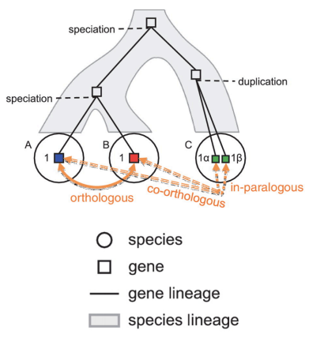

1. **Homology**:
   - 공통의 조상으로부터 유래한 유전자들을 가리킵니다. 이들은 진화적으로 관련되어 있으며, common ancestor으로부터 유사성을 물려받았습니다.

2. **Analogy**:
   - 수렴적 진화로 인해 동일한 기능을 수행하는 비동기성 유전자들을 가리킵니다. 이들은 common ancestor으로부터 유래하지 않았지만, 독립적으로 비슷한 기능을 진화시켰습니다.

3. **Orthology**:
   - last common ancestor에서 분화한 유전자들을 가리킵니다. 이는 종간 분화에 의해 발생한 것입니다.

4. **Paralogy**:
   - 복제로 인해 발생한 last common ancestor에서 분화한 유전자들을 가리킵니다. 이들은 동일한 종 내에서 나타나며, 복제 이후 진화적으로 다양성을 띄게 됩니다.

5. **Xenology**:
   - 다른 생물체로부터 수평적 유전자 이전을 통해 발생한 유전자들을 가리킵니다.

6. **In-/Out-paralogy**:
   - 특정 종의 분화 이전 또는 이후에 발생한 파라로그 유전자들을 가리킵니다.

7. **Co-orthology**:
   - 내원성 유전자들이 다른 계통의 유전자들과 개별적으로는 orthology이 아니지만, 집단적으로는 orthology임을 나타냅니다.

8. **Orthologous group**:
   - 특정 분화 이후에 common ancestor으로부터 파생된 모든 유전자들의 모음입니다.

#### In general

- Gene tree는 유전자 및 그 기능의 진화적 관계를 나타냅니다.
- 연구 범위와 질문에 따라 Gene tree는 오로지 orthologs만 필요한 경우도 있고, orthologs와 paralogs 모두를 포함해야 하는 경우도 있으며, 가능한 한 포괄적인 유전자 집합을 포함해야 합니다.

species tree의 proxy로서의 Gene tree 활용
- Gene tree는 종의 진화를 대표하는 대리자로 활용될 수 있으며, 이를 통해 생물의 진화에 대한 통찰력을 얻을 수 있습니다.
- 이러한 응용 프로그램은 보통 엄격한 orthologs (예: rRNA 유전자) 또는 특정한 진화적 역사를 연구하는 데 사용되는 paralogs를 수용할 수 있는 방법에 따라 달라집니다.

또한 여기서 phylogenetic inference는 statistical inference와 동일시될 수 있습니다.

phylogenetic tree가 애초에 statistical procedure을 통해 도출되었기 때문입니다.

### Substitution Model

substitution model은 DNA나 단백질 서열의 진화적 변화를 설명하는 모델입니다. 아미노산 대체의 경우, PAM(Poisson Model), BLOSUM(Block Substitution Matrix), WAG 등과 같이 사전에 계산된 모델이 있습니다. 이러한 모델들은 특정한 변화 확률을 나타내며, 서열 간의 대체가 얼마나 자주 발생하는지를 설명합니다. 마찬가지로 DNA 대체 모델도 다양한 일반적인 모델이 존재하며, 이러한 모델은 변화 속도와 염기 조성 등을 주로 데이터에서 추정합니다.

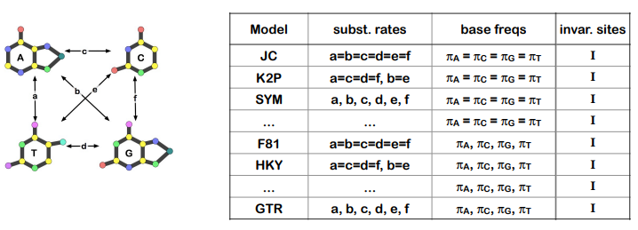

#### Rate variation

Rate(변이율) variation은 한 트리 전체 또는 모든 사이트에 대해 단일한 rate matrix를 사용하는 것과 같이 모든 사이트에서 일정한 rate을 가정하는 것이 아니라, 사이트 간에 rate이 다를 수 있다는 개념을 나타냅니다. 즉, 일부 사이트는 더 빠르게 진화할 수 있고, 다른 사이트는 더 느리게 진화할 수 있습니다. 

rate의 차이는 유전자 내에서 나타날 수 있으며, 예를 들어 보존된 도메인이나 모티프와 같은 영역, 서열의 위치(첫 번째 vs 세 번째 코돈 위치), 코딩과 비코딩 부위, 그리고 서로 다른 유전자 간에도 나타날 수 있습니다. 이러한 rate의 차이는 주로 **감마 분포**를 사용하여 모델링됩니다.

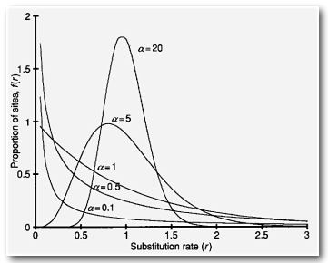

감마 분포는 다양한 site 간의 rate를 모델링하는 데 사용됩니다. 이 분포는 "알파" 모수에 의해 결정되며, 알파 값에 따라 변이율의 다양성이 조절됩니다. 알파 값이 1보다 작으면 사이트 간의 강한 다양성이 있으며, 알파 값이 높을수록 변이율의 다양성이 낮아집니다. 감마 분포는 많은 소프트웨어 패키지에서 구현되어 있어 다양한 분자 시계 및 진화 모델에서 사용됩니다.

#### Choosing Model

위에서 언급한 이유로 인해, 모델 선택은 매우 중요합니다. 이는 통계적 검정 방법을 통해 이루어질 수 있습니다. 

가능성비율검정(Likelihood Ratio Test, LRT), AIC(Akaike Information Criterion), BIC(Bayesian Information Criterion)과 같은 통계적 검정을 사용하여 최적의 모델을 결정할 수 있습니다.

또한 서로 다른 site간에 rate의 차이가 있는지 여부를 확인해야 합니다.

서로 다른 정렬 영역이 서로 다른 진화 모델에 따라 발전하는지 여부또한 확인해야합니다.

모델 선택에 사용되는 여러 소프트웨어가 있습니다. 

### Inferring phylogeny

일단 가능한 최선의 MSA 데이터에서 시작해야합니다. 

- distance methods로는 Neighbor Joining이 있습니다. 
- character based methods로는 Parsimony 등이 있습니다.....

pairwise distance를 계산하는 방법은 아미노산과 염기서열에 따라 다릅니다.

아미노산을 분석하는 경우, 적절한 subtitution matrix를 통해 두 서열간의 거리를 계산합니다.

염기서열을 분석하는 경우, 사용가능한 모델 중 하나를 사용하여 두 서열 간의 거리를 계산합니다. 

DNA substitution model은 일반적으로 multiple substitution에 대해 정확합니다. 

이렇게 계산한 값을 가지고 tree를 구축할 수 있습니다. 보통 이렇게 만들어진 tree는 실제 진화적 거리를 나타냅니다.

그러나, stochastic error 또는 inappropriate model은 부정확한 결과를 나타냅니다. 

이론적으로는 디스탠스 스코어를 기반으로 트리를 만들고, 모든 트리를 평가한 후, 베스트 스코어를 가지는 트리를 픽하는게 최선이지만, 이렇게 할수는 없습니다. 너무 오래걸립니다.

따라서 실제 환경에서는 싱글 트리를 구축한 뒤, Neighbor Joining 알고리즘을 이용하여 빠른속도로 tree를 구축합니다. 

#### Neighbor Joining

초기에 substitution model에 따른 pairwise distance matrix를 형성합니다. 

이후 star형태의 phylogeny를 형성합니다. 

거기다가 이제 점진적으로 노드를 추가합니다. 

이 과정에서, 모든 페어의 평균 및 최소 거리를 계산하고, 가장 가까운 두 끝점을 새로운 노드로 병합합니다. 

새로운 노드에서 모든 남은 끝점까지의 거리를 계산하고, 두 노드만 남을때까지 이 과정을 반복합니다.

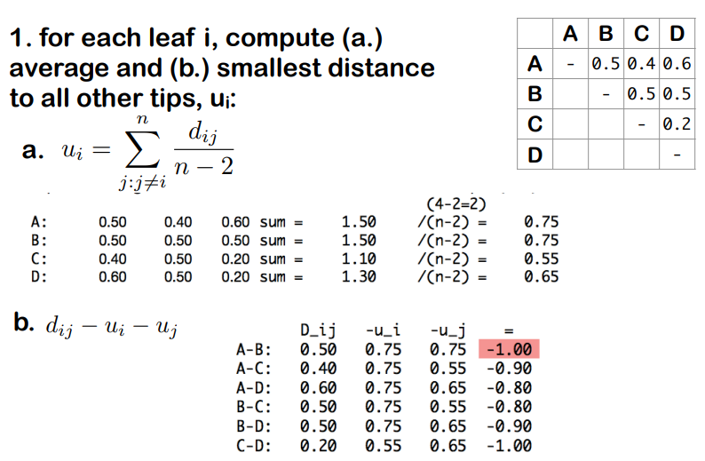 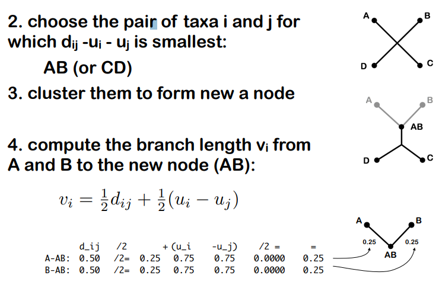 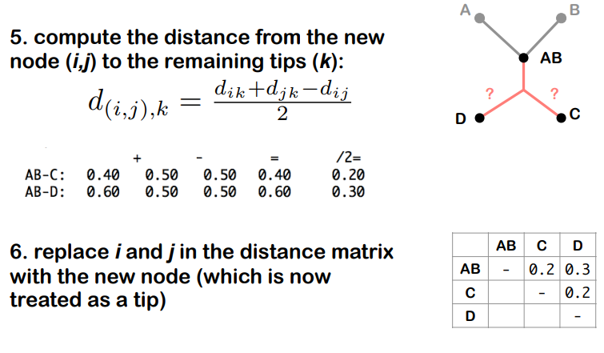 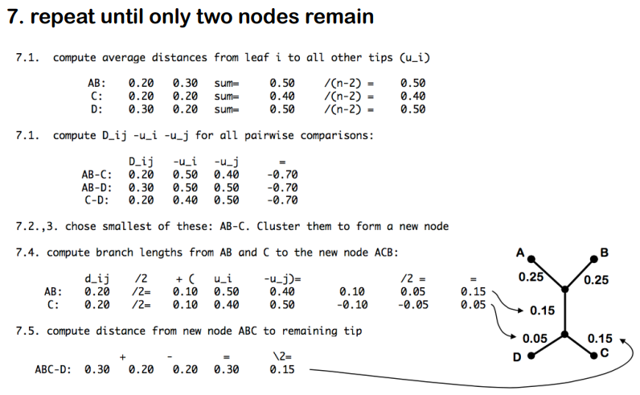


## Lecture 13: Phylogenies II

위 강의에서 Distans matrix based method인 Neighbor joining tree에 대해서 알아보았으니, 이번에는 character based methode에 대해 알아봅니다. distance matrix based method는 분기 시점이 깊어질수록 신뢰도가 떨어지지만 tree를 빠르게 만들 수 있는 방법입니다. 이 방법은 데이터에 대한 빠른 이해를 도와주지만, 정확도가 떨어지기 때문에 완전히 신뢰하긴 어렵습니다. 

character based method는 MSA에서 '바로' tree를 생성합니다. 이렇게 만들어진 starting tree를 branch swapping, tree rearrangement를 통해 향상시킵니다. 이 과정을 통해 얻어진 best tree를 Optimality의 기준에 따라 유지합니다. 이 과정은 느리지만 정확합니다. Optimality의 기준엔 두가지가 존재합니다.

- Maximum Likelihood (ML): 모델(tree topology)을 가정했을 때 데이터(query sequence)가 나올 확률인 likelihood를 최대화할 수 있는 모델을 구합니다. 모든 가능한 trees를 다 고려하기 때문에 느린 속도를 가집니다.

- Maximum Parsimony (MP): 가장 적은 change를 가지는 tree를 Optimal로 판단합니다. 즉, change의 횟수를 최소화 합니다. 

- Bayesian: 여러 best tree를 가져갑니다. 

### Maximum parsimony

1. ML과 마찬가지로, 모든 가능한 trees를 고려하여 분석을 시작합니다. 
2. alignment의 각 칼럼에 대해, 각 tree topologies에 대해 요구되는 change의 수를 결정합니다. 
3. 모든 칼럼에 대한 change의 수를 모두 더하여 각 tree가 데이터를 설명하는데 필요한 총 changes의 수를 계산합니다.
4. 가장 changes의 수가 적은 나무를 선택합니다. 

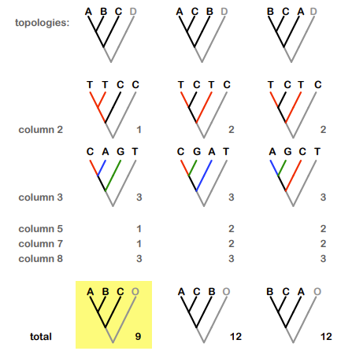

물론 장단점이 존재합니다.

Advantages

- tree의 각 branche에 따라 characters에 대한 정확한 맵핑을 제공합니다.
- non-molecular character에도 사용이 가능합니다.

Disadvantages

- substitution에 대해 현실적이지 못한 모델을 사용하고, multiple substitution에 대한 보정을 수행하지 않습니다.
- 분석이 비확률적인 방법으로 진행되며, 따라서 결과를 통계적으로 평가하는 것이 어려울 수 있습니다.
- branch의 길이를 무시하며, 진화적 거리에 대한 정보를 제공하지 않습니다. 
- 이 밖에도 서열 진화에 있어 많은 중요한 요소들을 제대로 반영하지 못합니다.

### Maximum likelihood

통계적인 접근방법입니다. Maximum likelihood는 주어진 서열의 초기 집합에서 가능한 모든 트리 topology를 검토하는 방법으로, 서열들을 가장 진화적으로 잘 설명할 수 있는 생물계통체제를 통계적으로 찾아내는 것입니다. 즉, 가능한 진화적 변화에 대한 확률을 모두 계산하여 가능성을 최대화함으로써 최적의 선택을 찾습니다.

Maximum likelihood에 의한 방법은 다중 서열 정렬에서 사용한 치환 행렬처럼 아미노산이나 핵산의 치환율에 대한 정보를 이용합니다.

Maximum likelihood 접근방식은 Markov chain Monte Carlo나 Bayesian inference 등 현대적인 통계적 방법들을 포함한 여러 가지 통계적 가설 및 검정이 가능하다는 점에서 매우 강력한 방법이지만 그 동안 컴퓨터의 능력의 한계로 계산에 오랜 시간이 걸렸다는 점이 약점으로 지적되어 왔습니다.

컴퓨터적인 계산이 많이 필요하다는 단점이 있지만, 현재 phylogenetic tree를 생성하는데 이상적인 방법입니다. 

ML은 통계적인 프레임워크를 기반으로 하며, 다음의 phylogenetic hypothesis를 테스트하는데 사용될 수 있습니다:

- tree topology
- divergence times(분기 시점)
- models of evolution
- rate heterogeneity
- 등등

Likelihood는 주어진 모델 M에서 데이터 D의 확률을 나타내며, 다음과 같이 표현됩니다.

$$\mathbf{P(D|M)}$$

예를 들어, 동전 던지기를 생각해보겠습니다. 이 동전이 공평한 동전인지, 두 개의 앞면이 있는 동전인지, 아니면 두 개의 뒷면이 있는 동전인지를 가정할 수 있습니다. 각 모델은 데이터를 설명하는 방식이 다르므로, 각 모델에 대한 데이터의 확률도 다를 것입니다.

* 모델 1(공평한 동전): 앞면과 뒷면이 나올 확률이 각각 0.5로 동등합니다.
* 모델 2(두 개의 앞면): 앞면이 나올 확률은 1이고, 뒷면이 나올 확률은 0입니다.
* 모델 3(두 개의 뒷면): 앞면이 나올 확률은 0이고, 뒷면이 나올 확률은 1입니다.

어떤 모델을 선택하는지는 데이터의 확률에 영향을 미치게 됩니다. 

우리가 사용하는 상황에서, 모델은 어떻게 data가 generated되었는지를 의미하고, 데이터는 주어진 alignment입니다. 

예를 들어, base A,T,C,G가 서로를 향해 변이될 확률은 각각 다릅니다. 이는 현재 존재하는 base의 frequencies를 통해 계산될 수 있습니다. 

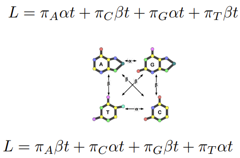

그렇다면 실제 분석 과정은 어떻게 되는지 알아봅시다.

1. 먼저 tree의 topology와 branch length를 생성(설정)합니다.
2. 주어진 데이터셋의 각 칼럼(site)에 대해 likelihood를 계산하고, 모든 site의 likelihood를 계산하기 위해 이를 곱합니다.
3. branch length를 modify하고, topology의 likelihood를 optimize합니다. 
4. 휴리스틱을 이용해 다음 topology를 선택하고, branch length를 modify합니다. 이 과정은 반복될 수 있습니다.
5. 가장 높은 likelihood를 가지는 topolgy와 branch length를 최종적으로 선택합니다. 

따라서, Maximum likelihood tree에서는 주어진 데이터가 특정한 tree와 branch length에서 발생할 수 있는 확률인 P(DATA|TREE)를 최대화 하는것이 목표입니다. 최종 얻어진 결과는 주어진 데이터를 생성할 가능성이 가장 높은 tree와 branch length입니다. 

ML는 항상 best tree 하나만을 선택하고 나머지는 고려하지 않습니다. 

그러나, 다른 tree들이 optimal tree와 비슷하지만 조금 낮은 likelihood를 가질 수 있습니다. 이러한 경우 우리는 optimal tree와 유사한 alternative tree를 고려할 필요가 있습니다. 

이는 Bayesian inference에서 보존될 수 있습니다.

### Bayesian

Bayesian Inference는 주어진 증거에 따라 무작위 사건에 대한 belief를 업데이트하는 것을 의미합니다.

예를 들어, 주어진 데이터가 alignment이고, 이 시퀀스의 진화와 관련해서 best guess를 사용한다고 할 때, 베이시안 룰을 이용하여 우리가 가지고 있던 prior probability를 업데이트하고, 모델과 파라미터의 posterior probability를 얻을 수 있습니다. 

Posterior Probability는 다음과 같이 나타납니다.

$$P(\theta|Data)$$

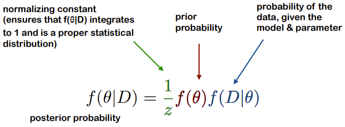

엄..

암튼 posterior probability를 정확하게 계산하는 것은 계산적으로 매우 비용이 많이 드는 작업입니다. 따라서 우리는 일반적으로 posterior probability distribution에서 tree를 샘플링 하여 approximate합니다. 이렇게 되면 분포에서 높은 확률을 가진 tree를 자주 방문합니다. 

MCMC는 이러한 샘플링을 수행하는데 사용되는 기술입니다. MCMC는 tree의 posterior probability에 비례하여 trees의 sequence를 샘플링합니다. 

예를 들어봅시다. 10,000,000번의 반복을 수행하고, 매 1000번째 반복에서 방문한 tree를 저장한다고 합시다. 이렇게 되면 총 1만개의 tree를 얻을 수 있습니다. 

결과는 이런 샘플된 tree들의 합의 형태로 사용될 수 있습니다. 그러나 이 작업은 몇주, 혹은 몇달정도의 시간이 소요됩니다.

물론 장단점이 존재합니다.

Advantages

- 확률적 프레임워크로써, 확률적 추론 또한 가능합니다. 따라서 자연스러운 해석이 가능합니다.
- divergence time을 추정하는데 좋습니다.
- 분석 과정에서 각 branch의 support 값을 함께 계산하므로 결과 해석이 용이합니다. 이는 tree의 특정 branch가 데이터에 얼마나 잘 부합하는지 측정하는데 도움이 됩니다.

Disadvantages

- prior probability를 지정해줘야하는데, 이게 좀 어려울 수 있습니다.
- 모델 및 매개 변수의 선택이 매우 중요합니다. 이 과정이 잘못되면 결과가 왜곡될 수 있습니다.
- non-convergence 문제가 발생할 수 있습니다. 

얻어진 tree에는 bayesian confidence level이 표기됩니다. 이는 샘플 트리중에서 특정 그룹이 관찰된 비율입니다. posterior probability distribution에서 특정 그룹이 나타난 빈도를 계산하여 해당 그룹에 대한 신뢰도를 추정합니다. 

이런 방식으로 계산된 신뢰도 값은 트리의 구조에 대한 신뢰도를 측정하는데 사용될 수 있습니다.

계통발생학적 분석을 진행하고 tree를 만든다면, ML과 베이지안 방법을 모두 수행하는 것이 좋습니다. 

### Bootstrap

confidence를 평가하는데 사용되는 한가지 방법은 Bootstrap값입니다. **부트스트래핑은 단일 노드에 대한 신뢰도를 측정**하는 데 사용됩니다. 이는 tree를 생성하는 resampling 기법으로, replacement를 이용해 alignment를 리샘플링합니다. 전체 tree에 대한 정확도를 측정하는 것이 아니라 tree의 개별 노드에 대한 반복성을 나타냅니다.

오리지널 데이터는 Multiple alignment의 컬럼입니다. 같은 길이의, x개의 새 alignment를 샘플합니다. 이는 pseudosample 혹은 bootstrap dataset이라 불립니다. 

데이터를 **반복적으로 샘플링** 하고, 각 리샘플링된 데이터 세트에 대해 하나의 tree를 생성합니다. 

이를 반복하여 여러번 tree를 구성합니다. **각 tree에서 어떤 그룹이 나타나는지를 계산**하고, 이를 기록합니다. 이후 각각의 트리에서 분석된 **branch의 빈도가 계산**됩니다. 

즉, 부트스트랩 값은 각 branch가 나타나는 빈도를 나타내며, 일반적으로 백분율로 표시됩니다. 
값이 높을수록 해당 특성이 분석 결과에서 더 강력하고 신뢰할 수 있음을 나타냅니다. 일반적으로 70% 이상의 부트스트랩 값은 신뢰도가 높다고 간주됩니다.

그러나 부트스트랩 값은 데이터 세트가 크거나 불안정한 세포가 있는 경우에는 문제가 될 수 있습니다. 문자 및 분석할 세포 수가 증가하거나, 불안정한 세포가 있는 경우 부트스트랩 값이 감소할 수 있습니다.

부트스트랩 값은 Neighbor Joining(NJ), Maximum Parsimony(MP), Maximum Likelihood(ML)과 같은 다양한 트리 구축 방법에 모두 적용될 수 있습니다.

### Evaluation Data set

모든 방법은 최소한 하나의 트리를 찾을 것입니다. 심지어 무작위 데이터에서도 어떤 '최적' 트리가 있을 것입니다. 

이것은 주어진 데이터에서 트리를 발견하는 것은 항상 가능하다는 것을 의미합니다. **하지만 이것이 실제로 진화적 관계를 잘 반영하는 것인지에 대해서는 따로 판단해야 합니다.**

따라서 우리는 데이터에는 진화적 관련성이 있는지 여부를 확인해야 합니다.

그러나 데이터에 진화적 신호가 없을 수 있습니다. 이것은 진화 속도가 느린 경우에 나타날 수 있습니다. 또한 데이터에는 non-phylogenetic 시그널이 존재할 수 있습니다. 예를 들어, 진화 속도, 염기 구성 등이 서로 다른 종 간에 다양하게 변할 수 있습니다.

잘못된 트리가 있더라도 높은 신뢰도를 가질 수 있습니다. 실제로 데이터에 non-phylogenetic 시그널이 있는 경우, 잘못된 트리에도 높은 신뢰도가 부여될 수 있습니다. 예를 들어, 돌연변이 포화(mutational saturation)는 데이터에 매우 중요한 영향을 미칠 수 있습니다. 서열 간의 유사성이 염기 빈도의 유사성과 동일할 때 돌연변이 포화가 발생합니다. 이 경우, 진화적 신호가 손실되고 정확한 진화 관계를 추론하는 데 어려움을 겪을 수 있습니다.


#### Comparing trees

트리를 비교하는데는 다양한 방법이 있습니다. 일반적으로는 여러 방법이나 분석 결과를 비교하여 일관된 결과를 얻는 것이 중요합니다.

- same alignment, different methods
- same alignment, posterior trees of Bayesian analyses 
- same genomes/samples, different loci 

보통 결과를 요약하는데에는 consensus methods가 사용됩니다. 이는 다양한 분석결과를 통합하여 각 분석 결과의 공통적인 부분을 요약하는 방법입니다. 

비교에는 visual method와 quantitative method가 사용될 수 있습니다.

#### Comparing tree topologies

이는 트리의 구조를 비교하는 방법입니다.

- Robinson Foulds distance
  - 두 개의 트리 사이의 차이를 측정하는데 사용되는 지표중 하나입니다. 이 거리는 두 트리가 가지고 있는 분할(partition)의 차이를 계산하여 나타냅니다. 여기서 분할이란 트리의 branch를 자르는 모든 가능한 방법을 의미합니다.
  - 로빈슨-파울즈 distance는 두 트리 사이의 차이를 정량화하여 나타내므로 두 트리가 얼마나 다른지를 알 수 있습니다. distance가 클수록 두 트리의 차이가 크고, distance가 작을수록 두 트리의 유사성이 높습니다. 
  
  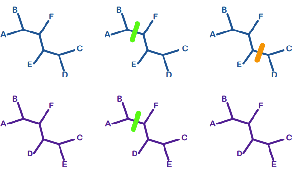

- Quartet distance
  - 이 distance는 두 트리 사이의 각각의 Quartet(4개의 리프로 구성된 트리)가 서로 다른지를 계산하여 나타냅니다. 여기서 Quartet란 어떤 4개의 리프를 선택하여 만든 서브트리를 의미합니다.
  - Quartet distance는 두 트리 간의 차이를 정량화하여 나타내므로, 두 트리가 얼마나 다른지를 알 수 있습니다. 두 트리 사이의 Quartet distance가 클수록 두 트리의 차이가 크고, distance가 작을수록 두 트리의 유사성이 높습니다. 

  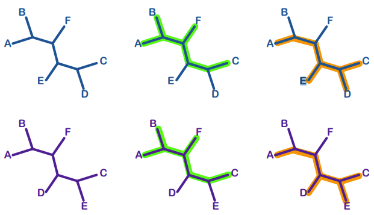


트리 구조를 비교하는 데는 RF(Robinson-Foulds) 거리가 일반적으로 가장 널리 사용되지만 일부 문제가 있을 수 있습니다. RF 거리의 통계적 해석은 명확하지 않을 수 있고, 또한 낮은 해상도와 작은 변화에도 큰 거리가 발생할 수 있는 문제가 있습니다.

### Discribig gene tree

Gene tree를 설명할 때 필요한 용어들은 다음과 같습니다.

* Ancestor: 현재의 생물들의 공통 조상으로 거슬러 올라가는 생물의 세대.

* Ancestral Lineage: 현재의 생물군에 대한 공통 조상의 진화적인 선조들로 이루어진 계통.

* Basal Group: 나무에서 가장 근본적인 위치에 있는 군.

* Clad: 공통 조상과 그 후손들로 이루어진 진화적인 단위.

* Diversification: 다양한 형태나 종이 발생하는 과정.

* Homolog: 공통 조상으로부터 유래된 유사한 특성이나 유전자.

* Ingroup: 연구 대상이 되는 특정 군 또는 종을 의미합니다.

* Sister Group: 공통 조상을 가진 두 개의 군 중 하나.

* Node: 나무에서 두 가지 이상의 가지가 만나는 지점.

* Species Tree: 다양한 종 간의 진화적 관계를 나타내는 나무.

* Gene Tree: 특정 유전자 또는 유전자 세트의 진화적 관계를 보여주는 나무.

* Paralog: 동일한 종 내에서 유전체 중복으로 인해 생긴 유사한 서열.

* Root: 나무에서 가장 근본적인 위치에 있는 지점.

* Duplication Event: 유전체 중복으로 인해 유전자가 두 개로 복제되는 사건.

* Speciation Event: 새로운 종이 형성되는 과정.


### workflow


## Lecture 14: Large scale analysis

지금까지는 한개의 gene familiy 혹은 phylogeny에 해당하는 small-scale analysis만 봐왔습니다. 이젠 좀더 큰 genome-scale의 진화적 분석에 대해 알아봅시다.

게놈 스케일의 분석은 일반적으로 코딩 영역에 기반하며, 모든 게노믹 영역을 조사합니다.  종 당 하나의 개체를 분석하며, 보통 re-sequencing data를 이용하여 이루어집니다.

homology/orthology 할당이 필요하며, 보통은 같은 종이나 근연한 관계의 종을 분석합니다. 

다음과 같은 일반적인 접근방식이 있습니다:

- tree based
- graph based
  - RBH
  - clustering
- hybrid

### Large-scale assignment of orthologs/homologs

Large-scale assignment of orthologs/homologs에 대한 최선의 전략은 여러 접근 방식을 결합하는 것입니다. OMA 알고리즘 및 데이터베이스는 이러한 전략을 구현하는 데 사용될 수 있습니다.

OMA 알고리즘 및 데이터베이스는 다음과 같은 특징을 가지고 있습니다:

- multiple 파이프라인: OMA 알고리즘은 multiple 파이프라인을 사용하여 유전자의 orthologs 및 homologs을 평가합니다.
- pre-computed: OMA 데이터베이스는 미리 계산된 결과를 제공하며 다른 데이터베이스와 상호 연결될 수 있습니다.
  - 1:1 orthologs: OMA는 1:1 orthologs을 식별하고 제공합니다.
  - homologs: OMA는 homologs(orthologs 및 paralogs)을 평가하고 제공합니다.
  - standalone software: OMA는 독립적인 소프트웨어로 제공되며 이와 함께 분석 및 시각화 도구를 제공합니다.

orthologs/homologs 할당에는 여러가지 어려운 점이 존재합니다. 

- pairwise orthology definition (non-transitive): orthology은 종에 따라 다르기 때문에 pairwise orthology 정의는 non-transitive합니다. 즉, A가 B와 orthology이 있고 B가 C와 orthology이 있더라도 A와 C가 orthology이 있는 것은 아닐 수 있습니다.

- differential gene loss (또는 불완전한 샘플링): 다양한 종 간에 유전자 손실이나 유전자 샘플링이 서로 다를 수 있습니다.

- multi-domain proteins / mosaics: 여러 도메인을 가지고 있는 단백질이 있는 경우, 단백질의 각 부분이 다른 종에서 발생한 것일 수 있습니다.

- horizontal transfer (xenologs): 외래 유전자 전송은 종 간에 유전자 전달이 발생할 때 orthology 할당을 어렵게 만들 수 있습니다.

- high rates of sequence divergence: 고도로 분화된 종에서는 서열이 빠르게 변화할 수 있으며, 이로 인해 orthology 할당이 더 어려워집니다.

- poor genome assembly / annotation: 부정확한 게놈 어셈블리 또는 annotation은 orthology 할당에 대한 신뢰성을 낮출 수 있습니다.

- computational demand: 대규모 데이터셋에서 orthology을 할당하려면 많은 계산 리소스가 필요할 수 있습니다.

### Population genomic

동일한 (또는 밀접한 관련성을 가진) 종으로부터 여러 게놈 데이터가 있으며, 각 개체당 수천에서 수백만 개의 단일 염기 다형성(SNP)이 있습니다.

linkage disequilibrium, genetic drift, coalescent, 다변량 통계 등과 같은 통계학적 개념 및 방법을 사용하여 분석합니다. 

### Phylogenetic incongruence

게놈을 이용한 트리를 만드는 경우, 여러 요인으로 인해 유전자 유래 트리와 게놈 유래 트리가 서로 일치하지 않을 수 있습니다. 이를 Phylogenetic incongruence라고 하며, 여러 이유가 존재할 수 있습니다.

기술적 요인:

- insufficient taxon sampling
-  orthology mis-assignment
-  misalignment
-  excessive trimming
-  inappropriate model

생물학적 요인:

- incomplete lineage sorting / deep coalescence
- hybridization or introgression
- horizontal gene transfer
- differential duplication and loss
- natural selection
  

  서로 다른 유전자나 유전체 영역은 다양한 진화적 압력이나 진화 속도를 경험할 수 있으며, 이로 인해 유전체 전체에 걸쳐 불일치한 진화학적 신호가 발생할 수 있습니다.

#### Incomplete lineage sorting & coalescence

이는 종이 분리되는 과정에서 발생하는 진화적 현상으로, lineage sorting이 종 간에 무작위로 분할될 수 있음을 나타냅니다. 이는 종의 형성 과정에서 발생하는 현상으로, 종이 분리될 때 lineage sorting이 어떤 종에 먼저 나타날지 예측할 수 없습니다.

알렐 polymorphisms이 종의 분화 이벤트를 횡단하여 존재합니다. lineage sorting은 종의 분화 이벤트가 발생할 때까지 유지되며, 종이 형성될 때 발생하는 다양한 변이 형태를 나타냅니다.

알렐은 더 멀리 있는 종의 알렐과 먼저 결합됩니다. lineage sorting의 경우, 종 간에 존재하는 알렐은 종의 관련성에 관계없이 더 멀리 떨어진 종의 알렐과 먼저 결합될 수 있습니다.

이로 인해 유전자 트리가 종 트리와 다를 수 있습니다. 불완전한 계통 분류는 종의 형성 및 분화 과정에서 유전자의 coalescence과 lineage sorting을 나타내므로, 유전자 트리가 종 트리와 일치하지 않을 수 있습니다.


유전자의 공통 조상으로의 coalescence는 lineage sorting의 일부로서 발생하는 현상입니다. 이것은 A, B, C와 같은 다양한 종이 공통 조상을 공유하는 상황에서 나타날 수 있습니다. lineage sorting의 경우, 여러 종이 공통 조상의 선조적 다양성을 공유하기 때문에 coalescence가 발생할 수 있습니다.

coalescence가 발생하면 유전자의 진화적 관계를 나타내는 트리에서 서로 다른 토폴로지가 발생할 수 있습니다. 즉, 두 가지 이상의 다른 트리 형태가 발생할 수 있습니다. 이것은 종 간의 관계가 불분명할 수 있다는 것을 의미합니다. 따라서 A, B, C와 같은 다양한 종에서 발생한 공통 조상의 coalescence는 불일치하는 토폴로지가 발생할 가능성이 있습니다.

그러나 이러한 coalescence 특성은 종 간에 gene flow가 발생하지 않는 한 비슷한 빈도로 나타나는 현상입니다. gene flow가 발생하면 서로 다른 종 간에 유전자가 이동하고 혼합될 수 있으므로 종 간의 진화적 관계를 나타내는 트리 토폴로지가 다르게 나타날 수 있습니다. 종 간의 gene flow가 있으면 종 내부의 유전자 혼합이 더 빈번하게 발생할 수 있으므로 종 간의 유전자 트리 토폴로지가 더 불일치할 수 있습니다.

### Gene flow & Introgression

**Gene Flow**는 진화적으로 근연한 종 끼리 발생하는 현상입니다. 한 종의 개체가 다른 근연한 종 집단에 섞이는 경우, 어떤 한 종의 유전자가 다른 종의 유전자로 이동할 수 있으며, 이는 세대를 거치며 희미해지지만 끝까지 남아있기도 합니다. 


Introgression은 Gene flow의 한 형태로 두 종 또는 모집단 사이에서 유전자가 서로 섞이는 과정을 나타냅니다. 이는 일반적으로 희귀한 하이브리드가 부모 종 또는 모집단과 교배하여 생성된 후 다시 부모 종 또는 모집단과 교배하는 과정으로 발생합니다. 이 과정에서 부모 종은 독립적으로 유지되지만, 유용한 특성을 전달하는 유전자가 전환되고 전파될 수 있습니다.

Gene Flow은 종 트리와 다른 유전자 트리를 생성할 수 있습니다. 이러한 불일치를 식별함으로써 Gene Flow의 존재를 추정할 수 있습니다.

gene flow가 발생하면 하이브리드하는 모집단 간에 shared alleles이 증가할 수 있습니다. ABBA-BABA 테스트 또는 D-통계를 사용하여 하이브리드하는 모집단 간에 shared alleles의 과잉을 식별할 수 있습니다.

gene flow된 영역이나 gene flow의 방향 또는 양을 식별하기 위해 다양한 통계 테스트를 사용할 수 있습니다. 이러한 테스트는 gene flow이 발생한 지점을 파악하고 특정 유전자 영역의 유입을 추정하는 데 도움이 됩니다.

### D-statistic


D-statistic은 ABBA-BABA 테스트에서 사용되는 측정 지표입니다. ABBA-BABA 테스트는 gene Flow을 식별하기 위해 사용되며, 특히 gene Flow과 완전한 세대 분류의 차이를 나타내는 경우에 관심이 있습니다.

D-statistic을 계산하기 위해 다음 단계를 수행합니다:

Alleles A 및 B: 분석하려는 두 유전자 종을 나타냅니다.
outgroup: 유입이 없다고 가정하는 유전자 종 또는 모집단을 나타냅니다. 보통은 Allele A가 이 역할을 합니다.
candidate introgressor P3: 유입이 발생한 것으로 의심되는 유전자 종 또는 모집단을 나타냅니다. 보통은 Allele B가 이 역할을 합니다.
P1 및 P2: outgroup과 candidate introgressor P3 사이의 다른 모집단을 나타냅니다.
D-statistic은 다음과 같이 계산됩니다:

D = (ABBA - BABA) / (ABBA + BABA)

여기서 ABBA 및 BABA는 네 가지 순열 유형의 발생 빈도를 나타냅니다. ABBA는 candidate introgressor P3에서 나온 유전자가 먼저 외부군으로부터 나온 것과 같은 순열입니다. BABA는 candidate introgressor P3가 아닌 다른 모집단에서 나온 유전자가 외부군으로부터 나온 것과 같은 순열입니다.

D-statistic은 gene Flow이 없는 경우에는 0입니다.

gene Flow이 발생한 경우에는 0이 아닌 값을 나타낼 것으로 예상됩니다. 따라서 D-statistic이 0에서 벗어날수록 gene Flow의 가능성이 더 높아집니다.


## Summary

- haplotype: haploid(홑배수체)와 genotype(유전자형)의 합성어로, 어떤 생명체에서 한 부모로부터 함께 유전되는 대립유전자의 집합, 즉 생식자의 유전자형을 의미한다.


- OLC vs De brujin
  - 둘다 read들을 합쳐 contig를 형성하는데 사용되는 알고리즘이다. 
  - Overlapping layout consensus:
    - Read들이 겹치는 구간을 찾아 나열하고, 가장 가능성이 높은 서열을 선택
    - Sanger 시퀀싱할때 주로 사용
    - repeat를 더 잘 해결, 그러나 pairwise overlap을 계산하기 때문에 많은 시간 및 계산 필요
  - De Brujin graph
    - Read들을 k-mer로 자른 뒤 겹쳐진 k-mer를 연결
    - 여러갈래로 나뉘는 경우 해당 k-mer가 몇번 나왔는지 카운팅
    - coverage가 낮은 경로는 제외하여 contig 형성