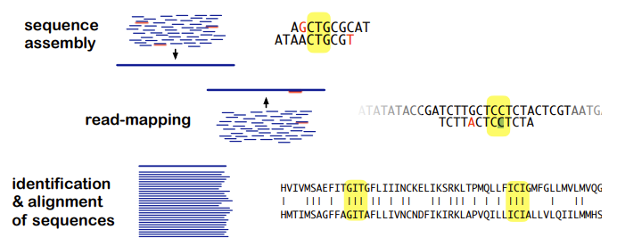
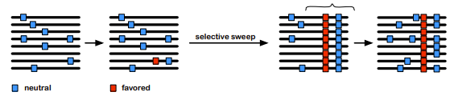

# Sequence Bioinformatics4

## 목차

- [Sequence Bioinformatics4](#sequence-bioinformatics4)
  - [목차](#목차)
  - [Lecture 1: Intro](#lecture-1-intro)
    - [Early sequence bioinformaticists](#early-sequence-bioinformaticists)
      - [Assembling the target sequence](#assembling-the-target-sequence)
      - [Margaret Dayhoff](#margaret-dayhoff)
      - [Walter Goad](#walter-goad)
    - [Early RNA Sequencing](#early-rna-sequencing)
    - [Early DNA Sequencing](#early-dna-sequencing)
    - [Sequencing bioinformatics](#sequencing-bioinformatics)
  - [Lecture 2: Big Data](#lecture-2-big-data)
    - [Algorithm](#algorithm)
    - [Brute force (exhaustive) algorithms](#brute-force-exhaustive-algorithms)
    - [Heuristic algorithms](#heuristic-algorithms)
      - [seed-filter-extend](#seed-filter-extend)
      - [k-mer (길이 k의 부분 문자열)](#k-mer-길이-k의-부분-문자열)
    - [Process, access, store big data](#process-access-store-big-data)
      - [Parallel computing](#parallel-computing)
      - [Multi-core computers](#multi-core-computers)
      - [Cluster](#cluster)
      - [Heterogeneous Computing](#heterogeneous-computing)
      - [Cloud computing](#cloud-computing)
      - [SLURM(Simple Linux Utility for Resource Management)](#slurmsimple-linux-utility-for-resource-management)
    - [Graph](#graph)
      - [트리(Tree)](#트리tree)
      - [Suffix Tree](#suffix-tree)
      - [Suffix Array](#suffix-array)
  - [Lecture 3: Genomes, Evolutionary Forces](#lecture-3-genomes-evolutionary-forces)
    - [Prokaryotes vs Eukaryotes](#prokaryotes-vs-eukaryotes)
      - [Organisms vs. their genomes](#organisms-vs-their-genomes)
      - [Prokaryotic genomes](#prokaryotic-genomes)
      - [Eukaryotic nuclear genomes](#eukaryotic-nuclear-genomes)
      - [Eukaryotic organellar genomes](#eukaryotic-organellar-genomes)
    - [Evolutionarly Forces](#evolutionarly-forces)
      - [Meiotic recombination](#meiotic-recombination)
      - [Selection](#selection)
      - [(Random) genetic drift](#random-genetic-drift)
      - [Gene flow](#gene-flow)
      - [Pan-genome](#pan-genome)
      - [Evolutionary Forces](#evolutionary-forces)
      - [Taxonomic relationships](#taxonomic-relationships)
    - [Mutations](#mutations)
      - [Single nucleotide mutations](#single-nucleotide-mutations)
      - [Larger scale Mutation](#larger-scale-mutation)
      - [Segmental duplications in humans](#segmental-duplications-in-humans)
      - [Wohle Genome Duplication in plants](#wohle-genome-duplication-in-plants)
      - [Fate of duplicated genes](#fate-of-duplicated-genes)
      - [Gene \& genome duplications](#gene--genome-duplications)
      - [Transposable / Mobile elements](#transposable--mobile-elements)
      - [Orphan genes](#orphan-genes)
  - [Lecture 4: Genome Assembly](#lecture-4-genome-assembly)
    - [Online database](#online-database)
    - [Raw and pre-processed data](#raw-and-pre-processed-data)
    - [Assembly: Principle](#assembly-principle)
    - [Assembly: General Steps](#assembly-general-steps)
      - [Greedy](#greedy)
    - [Overlap-layout-consensus: OLC](#overlap-layout-consensus-olc)
      - [Algorithm](#algorithm-1)
    - [De Brujin Graph](#de-brujin-graph)
      - [Best k-mer size](#best-k-mer-size)
      - [Softwares](#softwares)
    - [Scaffolding](#scaffolding)
      - [with Mate pairs](#with-mate-pairs)
      - [with long reads](#with-long-reads)
      - [with long range linkage information](#with-long-range-linkage-information)
    - [Finishing genome assembly](#finishing-genome-assembly)
    - [Evaluation](#evaluation)
    - [Genome sequence](#genome-sequence)
    - [SLURM](#slurm)


## Lecture 1: Intro 

### Early sequence bioinformaticists

물리학자와 통계학자들이 생물학적 데이터에 관심을 가지게 되었고, 이에 따라 생물학에 도구, 문제 및 관행을 수입했습니다. Margaret Dayhoff와 Walter Goad과 같은 인물들은 생물학적 서열에 대한 연구를 이끌었으며, 이러한 서열은 생물학에서 근본적인 중요성을 가지게 되었습니다.

1950년대 이후 생물학적 서열 데이터가 점점 더 많이 확보되었습니다. 이러한 데이터는 일차원으로 표현되며, 기호 패턴의 형태로 나타납니다. 이러한 특성은 양적 및 계산 도구에 적합하며, 이들을 통해 생물학적 서열의 분석 및 이해에 기여할 수 있습니다. 따라서 물리학자와 통계학자들의 기술과 지식이 생물학 분야로 수입되어 새로운 연구 방법과 접근 방식이 발전하게 되었습니다.

1. **데이터 저장 및 관리**:

* **centralizing of data**: 초기에는 생물학적 서열 데이터가 분산되어 있었으나, 생물정보학의 발전으로 데이터가 중앙 집중화되었습니다.
* **sequence database**: 생물학적 서열을 저장하고 관리하기 위한 데이터베이스가 개발되었습니다.
  
2. **서열 분석 ➟ 수학적 문제**:

* **pattern matching and detecting**: 서열 분석은 수학적 문제로 볼 수 있습니다. 서열을 Assembly하고 보존된 서열 패턴을 분석하며, 동일성을 갖는 유전자를 식별하는 등의 작업이 수행됩니다. 
* **statistical problems**: 서열 분석에서는 통계학적 기법이 사용됩니다. 예를 들어, 코돈 바이어스(특정 코돈이 다른 코돈보다 더 자주 사용되는 경향)를 분석하는 데 통계적 기법이 적용됩니다.
* "**paleogenetics**"(고생물학): 서열을 사용하여 서열 및 생물체의 진화적 역사를 문서화합니다. 과거의 생물학적 이벤트를 이해하고 서열 데이터를 통해 이를 추적하는 것이 목적입니다.

#### Assembling the target sequence

단백질 서열 조각들을 가지고 목표 서열을 추론(Assembly)하는 접근 방법에 대해 알아봅시다. 주어진 데이터는 단백질 서열의 조각들이며, 접근 방법은 가능한 모든 조합을 시험하여 P와 Q 조각 간의 Overlap을 확인하는 것입니다.

이 과정은 다음과 같이 진행될 수 있습니다:

1. 주어진 단백질 서열 조각들을 P와 Q의 두 그룹으로 나눕니다.
2. 모든 가능한 P와 Q 조각의 조합을 만듭니다.
3. 각 조합에서 P와 Q 조각 간의 Overlap을 확인합니다.
4. Overlap이 발견되는 조합은 후보 서열로 유지됩니다.
5. 후보 서열을 검증하여 모든 조각이 순서에 맞게 Assembly되었는지 확인합니다.
6. 올바르게 Assembly된 서열이 발견되면 목표 서열로 인정됩니다.
7. 이 접근 방법은 비효율적이고 계산 비용이 높을 수 있지만, 초기에는 이러한 방법을 사용하여 서열을 결정하는 데 일부 화학적 분석 방법이 적용되었습니다.

#### Margaret Dayhoff

Margaret Dayhoff가 개발한 다양한 생물정보학적 기법

* MAXLAP: 임의의 순서 정보를 가진 두 펩타이드 간의 최대 가능한 중첩을 찾습니다.

* MERGE: 두 펩타이드의 모든 가능한 중첩 구성을 찾습니다.

* PEPT: 어떤 수의 펩타이드의 중첩과 일치하는 모든 가능한 단편을 찾습니다.

* SEARCH: 확률적 고려를 기반으로 특이한 아미노산 그룹을 포함하는 모든 펩타이드를 찾습니다.

* QLIST: 각 qi 단편이 맞을 수 있는 P 펩타이드의 가능한 관련 세트의 Q-리스트를 생성합니다.

* LOGRED: 데이터와 일치하는 모든 가능한 단백질 구조를 얻기 위해 Q-리스트의 논리적 축소를 수행합니다.

#### Walter Goad

핵 물리학자가 로스 알라모스에서 핵융합 및 핵분열과 같은 데이터 중심의 문제를 다루었으며, 수치 및 통계적 방법을 사용하여 이를 해결했습니다. 1960년대부터 **그는 이러한 방법을 DNA 서열에 적용했으며, 패턴 매칭 및 데이터 관리와 같은 작업을 수행했습니다. 1970년대 초기에는 GenBank의 초기 버전을 만들었으며,** 이는 현재의 유전 데이터베이스와 많은 생물정보학 알고리즘의 기초가 되었습니다.

### Early RNA Sequencing 

초기 RNA 서열 결정에 사용된 방법과 일부 중요한 RNA 분자의 서열 결정

* **similar degradation approaches**
  * RNA의 서열 결정은 화학적 분해 방법을 사용했습니다.
  * 효소적 분해: RNA 분자를 특정 효소를 사용하여 분해하였습니다.
  * 방사능으로 표시하고 조각들을 분리하였습니다. 이렇게 하면 서열 결정에 필요한 조각들을 얻을 수 있었습니다.
  * overlapping fragments들을 결정하여 서열을 Assembly할 수 있었습니다.
* **sequence determination of short RNA molecules**
  * 초기에는 짧은 RNA 분자의 서열 결정이 주로 이루어졌습니다.
  * 예시로는 세균의 페닐알라닌 전달 RNA(Phe tRNA) 및 세균의 5S 리보솜 RNA(rRNA)가 있습니다.
  * Phe tRNA는 76 염기 쌍(nt)으로, 5S rRNA는 120 nt로 구성되어 있습니다.

### Early DNA Sequencing

DNA 서열 결정에 사용된 두 가지 접근 방법

* **degradation approach은 작동하지 않음**
  * 초기에는 화학적 분해를 사용하여 DNA 서열을 결정하는 시도가 실패했습니다.
  * DNA 분자가 매우 크기 때문에 서열을 결정하기에 어려웠습니다.
  * 특정 부위에서 DNA를 분해할 수 있는 효소가 없었습니다.
* **duplication approach**
  * 이 실패를 극복하기 위해 **duplication approach**가 사용되었습니다.
  * 이 방법은 DNA를 복사하여 작은 조각을 생성하는 것입니다.
  * DNA를 합성하는 효소(폴리머라아제)를 사용하여 DNA를 복제합니다.
  * 특정 부위에서 폴리머라아제 활동을 멈추게 하는 방법을 사용하여 중복되는 조각을 생성합니다.
  * 결과적으로 서로다른 길이의 overlapping fragments가 생성되며, 마지막 염기(nucleotide)는 알려져 있습니다.
  * 이 방법은 1977년에 Sanger에 의해 발표되었습니다.
  * 초기에는 약 120bp 정도의 작은 조각의 서열만을 결정하였습니다.

최초의 DNA 서열 Assembly 소프트웨어는 Rodger Staden이 개발했으며, 다음과같은 주요 원리에 기반하여 작동합니다.

* 오버랩(Overlap) 확인:

    두 조각의 5' 끝이 다른 조각의 3' 끝과 동일한 경우, 이러한 데이터를 "오버랩"이라고 합니다.

* 조각의 연속성 확인:

    충분한 길이의 오버랩이 있는 경우, 두 서열은 연속적이라고 가정됩니다.
이러한 경우, 두 조각의 데이터를 결합하여 하나의 연속된 서열을 생성할 수 있습니다.

* 상호작용 프로그램:

    이러한 과정을 수행하기 위해 세 가지 상호작용 프로그램이 사용되었습니다:
  * OVRLAP: 오버랩을 탐색하는 프로그램
  * XMATCH: 오버랩을 검토하고 수정하여 결합하는 프로그램
  * FILINS: 최종적으로 정렬된 서열을 생성하는 프로그램

* 추가적인 분석 프로그램:

    이후에는 "스타든 패키지(Staden package)"라고 불리는 많은 추가 분석 프로그램이 개발되었습니다.

### Sequencing bioinformatics

연속적인 발전이 계속되면서 3세대 시퀀싱 기술과 링크드 리드(linked-reads) 기술이 등장했습니다.

* 3세대 시퀀싱:

  * 3세대 시퀀싱 기술은 오랜 기간에 걸쳐 연속적인 개발이 이뤄졌습니다.
  * 이 기술은 보다 긴 DNA 분자의 시퀀싱을 가능하게 합니다.
  * 일반적으로 싱글 분자 시퀀싱(single-molecule sequencing)이라고도 불립니다.
  * 이러한 기술은 더 긴 DNA 분자를 시퀀싱할 수 있어서, 복잡한 genome나 긴 유전자의 시퀀싱에 유용합니다.

* linked read 기술:

  * 링크드 리드 기술은 단일 세포 또는 인디비듀얼 DNA 분자로부터의 시퀀싱 데이터를 더 연결되고 정확하게 만드는 기술입니다.
  * 이 기술은 하나의 genome 또는 RNA 분자의 모든 구성 요소 사이의 상호 작용과 연결을 이해하는 데 도움이 됩니다.
  * 예를 들어, genome 변이 분석, 염색체 구조 및 복잡한 유전자 조절 네트워크 등에 활용됩니다

시퀀스 데이터는 다음과 같이 사용될 수 있습니다. 

* entire genomes:

* 단일 생물체:
  * 개별 생물체의 entire genomes를 분석합니다.
    * 풀링된 세포:
      * 여러 세포를 함께 풀링하여 genome를 분석합니다.
    * 단일 세포:
      * 단일 세포 수준에서의 genome를 분석합니다.
  * 풀링된 생물체:
    * 여러 생물체를 함께 풀링하여 genome를 조사합니다.
    * 이를 통해 메타게놈 데이터를 얻을 수 있습니다.

* selected genome regions:

  * RNA 및 전사체(transcriptome):
    * 유전자 발현을 분석하기 위해 mRNA의 서열을 조사합니다.
  * 엑솜(exome):
    * genome 중 단백질 코딩 부분인 엑솜의 서열을 분석합니다.
  * 기타 타겟:
    * 질병 관련 영역, 16S rRNA 등과 같은 특정 영역을 대상으로 합니다.
    * 유전변이 연구 및 세균 균주 분류에 활용됩니다.
  * 복잡도 감소:
    * RAD tags:
      * DNA 서열의 특정 지점에 위치한 단일 염기의 서열을 분석합니다.

* selected molecules / treatments:

  * 상호작용:
    * 단백질-단백질, 단백질-DNA, 단백질-RNA, RNA-DNA, DNA-DNA 등의 상호작용을 조사합니다.
  * 열린 염색질:
    * 염색질이 열린 지역을 조사하여 유전자 발현을 이해합니다.
  * 메틸화된 DNA 상태:
    * DNA 메틸화 상태를 조사하여 유전자 발현과 조절을 이해합니다.
  * nascent transcripts:
    * RNA 분자가 생성되고 있는 초생 트랜스크립트를 조사하여 발현 패턴을 이해합니다.

서열 데이터는 종 내/간, 인구 내/간, 개체 간 등 다양한 수준에서 얻어지고, 데이터는 서로 다른 위치, 시간, 조건에서 수집됩니다. 이러한 데이터는 세포 및 발달 생물학, 진화, 임상 진단, 농업, 법의학 등 다양한 분야에서 사용됩니다.

1. **DNA, RNA, 단백질의 기본 구조와 기능**:
   - DNA(디옥시리보핵산)는 염기로 구성된 두 개의 연결된 가닥으로 이루어진 분자로, 유전 정보를 저장하고 RNA 합성에 대한 템플릿으로 작용합니다.
   - RNA(리보핵산)은 하나의 가닥으로 이루어진 분자로, mRNA(메신저 RNA), tRNA(전송 RNA), rRNA(리보솜 RNA) 등을 포함하여 유전자 발현에서 다양한 역할을 합니다.
   - 단백질은 아미노산으로 구성된 대형 분자로, 세포 내에서 구조적 지지부터 효소의 생화학적 반응 촉매, 신호 전달 및 운송 등 다양한 기능을 수행합니다.

2. **유전자 구조 (엑손, 인트론)**:
   - 유전자는 단백질이나 기능적 RNA 분자를 만드는 지침을 포함하는 DNA 세그먼트입니다.
   - 엑손은 유전자의 코딩 영역으로, mRNA로 전사되어 결국 단백질로 번역됩니다.
   - 인트론은 유전자 내의 비 코딩 영역으로, 전사되지만 mRNA 처리 중에 제거되어 단백질로 번역되지 않습니다.

3. **유전 코드, 리딩 프레임**:
   - 유전 코드는 mRNA의 염기 삼중체인 코돈과 단백질에서 아미노산 간의 대응 관계를 지정하는 규칙의 집합입니다.
   - 리딩 프레임은 염기 서열이 어떻게 코돈으로 분할되는지를 나타내는 특정한 방법입니다.

4. **전사, 번역**:
   - 전사는 DNA에 인코딩된 유전 정보가 RNA 분자(메신저 RNA, 전송 RNA, 리보솜 RNA 등)로 복사되는 과정입니다.
   - 번역은 mRNA의 염기 서열이 리보솜에 의해 해독되어 단백질로 번역되는 과정입니다.

5. **핵 genome vs. 기관 genome**:
   - 핵 genome는 유핵 세포의 핵 내에 포함된 DNA로, 대부분의 유전자 정보를 포함합니다.
   - 기관 genome는 미토콘드리아나 엽록체와 같은 기관에 포함된 DNA로, 독립적인 genome를 가지고 있습니다.

6. **원핵 생물 vs. 진핵 생물**:
   - 원핵 생물은 핵과 세포막으로 구성된 세포를 가지고 있지만, 내부에 핵막과 같은 구조가 없는 단세포 생물체입니다.
   - 진핵 생물은 핵과 기관을 가진 세포로, 핵 내에 다수의 선형 염기 서열을 포함하고 있습니다.

## Lecture 2: Big Data

큰 데이터 셋을 처리하는 것은 큰 도전입니다. 특히 한 유전자 또는 genome 프로젝트에 대한 수많은 비교와, 여러 유전자 또는 genome에 대한 더 많은 비교를 수행해야 합니다. 또한 데이터셋의 크기가 더욱 커지고 있습니다.

예를 들어, 다윈 나무 프로젝트(Darwin Tree of Life project)는 영국과 아일랜드의 모든 종을 시퀀싱하는 프로젝트입니다. 이 프로젝트는 엄청난 양의 genome 데이터를 다루어야 합니다. 또한, 개미, 곤충, 곰팡이, 인간 등 특정 분류 계통에 대한 대규모 프로젝트도 진행되고 있습니다.

이러한 대규모 데이터셋을 다루기 위해서는 효율적인 데이터 관리 및 분석 방법이 필요합니다. 

속도를 향상시키기 위해, 우리 개인 PC로는 불가능합니다. 따라서 더 빠른 컴퓨터는 큰 도움이 되지 못합니다. 그러나 다음 항목들은 효율적인 데이터 처리와 속도 향상에 도음이 될 수 있습니다. 

* algorithm:

    적절하고 효율적인 알고리즘을 선택해야 합니다. 대용량 데이터셋을 다룰 수 있는 효율적인 알고리즘을 사용하여 처리 시간을 최소화할 수 있습니다.

* data structure:

    효율적인 데이터 구조를 선택해야 합니다. 데이터에 효율적으로 접근하고 쿼리할 수 있는 구조를 선택하여 데이터 처리 및 검색 성능을 최적화할 수 있습니다. 또한, 저장 공간을 효율적으로 활용할 수 있는 구조를 선택하여 메모리 사용량을 최소화할 수 있습니다.

* parallelization:

    작업을 분할하고 병렬로 실행하여 처리 속도를 높일 수 있습니다. 데이터 처리 작업을 여러 개의 스레드나 프로세스로 분산하여 병렬 처리를 수행하면 전체 처리 시간을 단축할 수 있습니다. 그러나 병렬화를 위해서는 알고리즘과 데이터 구조가 적합하게 설계되어야 합니다.

### Algorithm

알고리즘은 잘 정의된 문제를 해결하기 위해 수행되어야 하는 순서가 지정된 명령의 시퀀스입니다. 알고리즘은 영어이나 의사코드로 작성할 수 있습니다. 또한, 다양한 프로그래밍 언어로 구현될 수 있습니다. 올바른 알고리즘은 문제의 모든 인스턴스를 해결할 것입니다. 즉, 주어진 문제에는 여러 가지 올바른 알고리즘이 존재할 수 있습니다.


알고리즘의 복잡성과 효율성은 space requirement과 time requirement 에 따라 결정됩니다.

* space requirement (→데이터 구조)
  - 알고리즘이 실행되는 동안 필요한 메모리 공간으로, 주로 사용되는 데이터 구조에 따라 결정됩니다.

* time requirement 
  - 알고리즘이 완료되는데 소요되는 절대적인 시간입니다.
  - 알고리즘이 수행하는 총 연산 횟수입니다.
  - 알고리즘이 완료되는 데 걸리는 시간:
    - 평균적으로.
    - 최선의 경우.
    - 최악의 경우.

* 입력 크기에 따른 알고리즘 실행 시간 변화
  - 일반적으로 입력 크기가 증가함에 따라 알고리즘의 실행 시간도 증가합니다. 이 증가율을 알고리즘의 시간 복잡도라고 합니다. 일부 알고리즘은 입력 크기에 비례하여 선형적으로 증가하고(O(n)), 다른 알고리즘은 제곱이나 지수 함수와 같이 더 빠르게 증가할 수 있습니다.
  
### Brute force (exhaustive) algorithms

- 최적해를 찾기 위해 모든 가능성을 시도합니다.
- 출력: 최적해
- 바이오인포매틱스에서는 작은 문제에만 사용할 수 있습니다.
- 종종 exponential  running time을 가집니다.

### Heuristic algorithms

- 모든 해결책을 평가하지 않기 때문에 최적해를 보장하지 않습니다.
- 속도와 정확도 사이의 좋은 절충안입니다.
- 많은 다양한 종류/디자인이 존재하며 사용됩니다.
- 예: 탐욕 알고리즘
  - 최적화 문제에 사용됩니다.
  - 각 단계에서 알고리즘이 최선의 즉각적인 해결책을 선택합니다.
  - 전체적으로 최상의 해결책을 찾지 못할 수 있습니다.
  - 서열 정렬 및 Assembly, 공통 조상 추론 등에 사용됩니다.
- 예: seed-and-extend 
  (seed-and-filter-and-extend)

#### seed-filter-extend

바이오인포매틱스에서 많이 사용되는 휴리스틱 알고리즘 중 하나입니다. 이 알고리즘은 유전자 서열 정렬 및 유사성 검색과 같은 문제에서 효율적인 해법을 찾기 위해 사용됩니다.

알고리즘의 이름에서 알 수 있듯이, 씨드(seed), 필터(filter), 그리고 익스텐드(extend)의 단계로 구성됩니다.

**씨드(seed) 단계**:
- 씨드는 입력 서열에서 발견된 짧은 정확한 일치 부분입니다. 길이가 몇 개의 염기서열로 제한됩니다.

**필터(filter) 단계**:
- 씨드 단계에서 찾은 각 씨드에 대해, 알고리즘은 이를 기반으로 전체 서열을 다시 검사하여 정확한 일치 부분을 찾습니다.

**익스텐드(extend) 단계**:
- 필터링된 후보 부분에 대해, 알고리즘은 이들을 확장하여 더 긴 정확한 일치 부분을 찾습니다. 

씨드-필터-익스텐드 알고리즘은 짧은 씨드를 먼저 찾아내고, 이를 기반으로 전체 서열을 효율적으로 필터링하여 후보 부분을 선택하며, 이후 후보 부분을 확장하여 정확한 매치를 찾는 방식으로 작동합니다.

실제 매치는 짧은 (정확한) 매치를 포함합니다.
- 이러한 짧은 (정확한) 매치는 긴 (부정확한) 매치에 비해 찾기 쉽고 빠릅니다.
- 두 번째 단계에서는 이러한 짧은 (정확한) 매치를 확장하고, 단 이러한 매치만 확장합니다.



#### k-mer (길이 k의 부분 문자열)

k-mer는 길이가 k인 부분 문자열을 의미합니다. 여기서 k는 일정한 길이를 가리킵니다. 이 부분 문자열은 주어진 DNA 또는 RNA 서열에서 추출됩니다. k-mer를 사용하면 서열 내의 패턴, 반복, 유전자 등을 파악할 수 있습니다.

k-mer를 사용하는 일반적인 방법 중 하나는 sequence assembly입니다. 대규모 서열 데이터를 Assembly할 때, k-mer를 사용하여 서열을 작은 조각으로 나눈 다음 이를 이용하여 전체 서열을 Assembly하는 과정을 거칩니다.

서열 데이터에서 k-mer를 추출할 때는 이동 윈도우 기법을 사용하여 서열을 순회하면서 모든 가능한 k-mer를 추출할 수 있습니다. 윈도우를 한 번씩 이동하면서 k-mer를 추출하므로 모든 서열 내의 k-mer를 효과적으로 추출할 수 있습니다.

최근에는 k-mer를 서브샘플링하여 대규모 데이터를 처리하는 데 사용하는 방법도 있습니다. 이를 통해 메모리 사용량을 줄이고 계산 속도를 향상시킬 수 있습니다.

* **전처리**: 시퀀스 데이터를 k-mer로 분할합니다.
  - 리드(Reads), 리드 + 레퍼런스(Reads + Reference), 쿼리 + 데이터베이스(Query + Database) 등 여러 방식으로 사용됩니다.
  - k의 값은 데이터 및 목표에 따라 달라집니다.
  - 이러한 k-mer를 시드(앵커 등)를 식별하기 위해 사용합니다.

* 문자열의 모든 k-mer 저장
  - 모든 k-mer를 저장하면 중복된 정보가 저장되며 많은 메모리를 사용합니다.
    - Norway rat 게놈(Rattus norvegicus genome)의 크기는 2.75 Gbp입니다.
    - 예를 들어, 600 bp의 33 × 10^6개의 리드가 있고, 길이 20의 k-mer가 4 × 10^11개 있을 경우 → 200GB의 저장 공간이 필요합니다!
  - 서브샘플링(subsample)을 통해 해결할 수 있습니다.
    - 유사한 서열에서 동일한 k-mer가 선택될 수 있도록 샘플링합니다.

* k-mer의 서브샘플링
  - minimizers, syncmers, strobemers 등을 사용할 수 있습니다.
  - 윈도우 내에서 시작 또는 끝에 가장 작은 s-mer를 가진 k-mer(s)를 선택합니다.
    - 서로 다른 서열 간의 비교에 적합합니다.

--- 

### Process, access, store big data

- **데이터 구조**:
  - 정보를 효율적으로 사용할 수 있도록 구성된 것을 의미합니다.
  - 일반적인 데이터 구조로는 문자열, 리스트, 테이블, 트리, 그래프 등이 있습니다.

- **거대한 데이터 양 및 어려운 문제**:
  - 공간 효율적인 데이터 구조가 필요합니다.
  - 효율적으로 액세스할 수 있는 데이터 구조가 필요합니다.
  - 종종 초기 데이터 전처리가 필요합니다: 다른 데이터 구조에 저장, 보조 데이터 구조 생성 등.

예를 들어, k-mer를 저장하는 방법은 대용량 데이터를 효율적으로 처리하고 공간을 절약하기 위해 중요합니다. k-mer를 저장하는 주요 방법 중 하나는 해시 테이블을 사용하는 것입니다. 이를 통해 빠르게 k-mer를 검색할 수 있습니다.

해시 테이블은 k-mer를 키(key)로 사용하여 값을 저장하는 데이터 구조입니다. 각 키는 해시 함수를 사용하여 고유한 해시값으로 변환됩니다. 이 해시값은 일반적으로 배열의 인덱스로 사용되어 k-mer와 관련된 데이터를 저장합니다. 해시 테이블을 사용하면 매우 빠르게 k-mer를 저장하고 검색할 수 있습니다.

또한 일부 알고리즘에서는 특정 k-mer 패턴에 대한 정보를 압축하여 저장하기도 합니다. 예를 들어, minimizers와 같은 기술을 사용하여 서브샘플링된 k-mer만 저장할 수 있습니다. 이렇게 하면 메모리 사용량을 줄이고 처리 속도를 향상시킬 수 있습니다.

데이터베이스 시스템을 사용하여 k-mer를 저장할 수도 있습니다. 이를 통해 대규모 데이터를 관리하고 쿼리할 수 있습니다. 또한 병렬 처리 및 분산 처리를 위한 기능을 제공하여 대용량 데이터를 효율적으로 처리할 수 있습니다.

모든 k-mer를 메모리에 저장할 수 없는 경우에는 디스크에 저장할 수도 있습니다. 여러 파일로 나누어 저장하거나 데이터베이스 시스템을 사용하여 필요할 때마다 필요한 k-mer를 검색할 수 있습니다.

#### Parallel computing

- **Serial Computing 대 Parallel Computing**:
  - **Serial Computing**: 한 번에 하나의 작업을 처리하는 방식으로, 단일 프로세서에서 순차적으로 작업을 수행합니다.
  - **Parallel Computing**: 여러 작업을 동시에 처리하는 방식으로, 병렬 프로세서 또는 컴퓨팅 리소스를 사용하여 작업을 분할하여 처리합니다.

- **Task**:
  - 컴퓨팅 문제를 해결하기 위해 수행되어야 하는 단위 작업을 나타냅니다.

- **Subtask**:
  - 큰 작업을 여러 개의 작은 작업으로 분할한 것을 의미합니다.

- **Output/Result**:
  - 각 작업 또는 하위 작업의 실행 결과를 나타냅니다.

- **클록 속도가 최대화된 상태**:
  - 컴퓨터의 클록 속도가 한계에 도달하여 더 이상 성능 향상을 기대하기 어려운 상황을 의미합니다.

- **병렬화에 의한 성능 향상**:
  - 병렬화를 통해 성능 향상을 이뤄내는 것이 중요해졌습니다. 이는 Parallel Computing에 의해 가능합니다.

- **특수 하드웨어 및 프로그램 필요**:
  - Parallel Computing을 위해서는 특수한 하드웨어 및 프로그램이 필요합니다.

- **하위 작업 간의 자주 발생하는 통신 중요성**:
  - Parallel Computing에서 하위 작업 간의 자주 발생하는 통신은 중요합니다. 효율적인 통신은 전체적인 성능에 영향을 미칩니다.

- **Embarrassing, Coarse-grained 입자 크기, 잘 세분화된 병렬화**:
  - Parallel Computing의 성능 향상을 위한 다양한 전략으로, Embarrassing, Coarse-grained, Fine-grained 병렬화 방법이 사용됩니다.

#### Multi-core computers

- Example: 
  - **한 칩, 하나의 코어(One Chip, One Core)**:
    - 초기에는 각 칩에 하나의 코어만 포함되어 있었습니다.

  - **한 칩, 네 개의 코어(One Chip, Four Cores)**:
    - 현재 많은 컴퓨터는 한 칩에 여러 개의 코어를 포함하고 있습니다. 일반적으로 네 개의 코어가 흔합니다.

- **다중 코어 프로세서가 표준**:
  - 현재 대부분의 데스크탑, 랩톱, 모바일 전화기 등은 다중 코어 프로세서를 탑재하고 있습니다.

- **코어 간의 통신이 빠르고 쉽다**:
  - 다중 코어 컴퓨터에서는 코어 간의 통신이 빠르고 쉽습니다. 이를 통해 코어들이 효율적으로 작업을 분담하고 협력할 수 있습니다.

- **소프트웨어 재작성이 필요**:
  - 다중 코어 프로세서를 지원하기 위해서는 소프트웨어를 다시 작성해야 할 필요가 있습니다. 이는 코어 간의 통신 및 작업 분배를 최적화하기 위한 파라미터 등을 수정하는 작업을 의미합니다.

#### Cluster

- **다중 컴퓨터(멀티코어)로 구성된 노드들**:
  - 클러스터는 여러 대의 컴퓨터로 구성되며, 각 컴퓨터는 여러 개의 코어를 가질 수 있습니다.

- **로그인 / 헤드 / 마스터 노드**:
  - 클러스터에는 사용자가 접근할 수 있는 로그인 노드 및 전체 클러스터의 관리와 작업 분배를 담당하는 헤드 노드 또는 마스터 노드가 있습니다.

- **고속 로컬 영역 네트워크로 연결됨**:
  - 클러스터의 각 노드는 고속 로컬 영역 네트워크로 연결되어 있습니다. 이를 통해 노드 간의 통신이 빠르고 효율적으로 이루어집니다.

- **비용**: 클러스터는 비싸지만, 동일한 크기와 속도의 단일 컴퓨터보다는 저렴합니다.

- **응용 프로그램**: 클러스터에서 실행되는 응용 프로그램은 추가적인 프로그래밍이 필요할 수 있습니다. 이는 클러스터 환경에 맞게 작업을 분산하고 효율적으로 실행하기 위한 파라미터 등을 수정하는 작업을 의미합니다.

- **작업 분배 시스템 필요**: 클러스터에서는 작업을 효율적으로 분배하기 위한 시스템이 필요합니다. 이는 작업을 각 노드로 분산하고 실행하는 역할을 수행합니다.

#### Heterogeneous Computing

Heterogeneous Computing은 여러 종류의 컴퓨팅 자원을 함께 사용하여 작업을 수행하는 컴퓨팅 패러다임을 의미합니다. 주로 중앙 처리 장치(CPU)와 그래픽 처리 장치(GPU)를 함께 사용하는 경우가 많습니다. 이러한 접근 방식은 각각의 장치의 강점을 결합하여 성능을 극대화하고 효율성을 높이는 데 중점을 둡니다.


- **컴퓨팅 자원의 다양성**
  - **CPU**(Central Processing Unit):

    일반적으로 모든 컴퓨터 시스템에 포함되어 있는 일반 목적의 프로세서입니다. 보통 몇 개의 코어를 가지고 있습니다.
  - **GPU**(Graphics Processing Unit):

    그래픽 처리에 특화된 프로세서로, 수백 개의 작은 코어를 포함하고 있습니다. 주로 그래픽 렌더링에 사용되지만, 최근에는 일반 목적의 병렬 컴퓨팅을 위한 프로그래밍이 가능합니다.

CPU와 GPU를 함께 사용하여 병렬 처리를 활용함으로써 작업의 처리량과 속도를 높일 수 있습니다.
또한 GPU는 높은 병렬 처리 능력을 가지고 있으며, 특정 작업에 대해 CPU보다 에너지를 효율적으로 사용할 수 있습니다. 그러나 Heterogeneous Computing에는 CPU와 GPU를 함께 사용하기 위해 특수화된 프로그램 또는 프로그래밍 기술이 필요합니다.

#### Cloud computing

- **가상 머신(Virtual Machines)을 활용한 컴퓨팅**:
  - 여러 대의 네트워크에 연결된 컴퓨터에서 가상 머신을 실행하는 것입니다. 
  - 물리적인 컴퓨터를 모방하여 운영 체제, 설정, 소프트웨어 등을 에뮬레이션합니다.
  - 높은 유연성을 제공하며, 가상 머신을 저장하고 복제하는 것이 매우 쉽습니다.

- **computing power rented on demand**:
  - 클라우드 공급업체(예: 아마존, 구글, 마이크로소프트)에서 필요에 따라 컴퓨팅 파워를 대여할 수 있습니다.
  - 일부 생물학적 데이터 세트가 사용 가능하지만, 데이터 업로드가 제한적인 경우도 있습니다.

- **specialized programming required**:
  - 클라우드 컴퓨팅을 활용하기 위해서는 MapReduce / Hadoop과 같은 전문적인 프로그래밍 기술이 필요합니다.
  - Go 프로그래밍 언어와 같은 새로운 도구들도 사용됩니다.

#### SLURM(Simple Linux Utility for Resource Management)

- **헤드 노드에 로그인**:
  - 클러스터에 접속할 때는 헤드 노드에 로그인하여 기본 파일/폴더 작업(cp, rm, grep, awk 등)을 수행합니다.

- **SLURM을 사용한 계산**:
  - SLURM을 사용하여 계산 작업을 수행합니다.
  - 필요한 자원(시간, RAM 등)을 SLURM에 알려줍니다.
  - SLURM은 이러한 자원을 가진 계산 노드로 작업을 보내거나, 자원이 다시 사용 가능해질 때까지 대기열에 작업을 넣습니다.

### Graph

그래프(Graph)는 노드(Node)와 엣지(Edge)로 이루어진 수학적인 구조입니다. 그래프 이론은 다양한 학문과 상호 작용하며, 데이터를 저장, 검색 및 검색하는 데 우수한 구조입니다. 그래프의 특성은 잘 연구되어 있으며, 그래프 이론에서 효율적인 해결책이 많이 존재합니다. 이러한 이유로 그래프는 데이터를 표현하고 다루는 데 매우 유용한 도구로 사용됩니다.

#### 트리(Tree)

트리는 그래프의 하위 분류 입니다. 

- **Nodes**:
  - **Node**: 최소 하나의 자식을 가진 노드입니다.
  - **Leaf**: 자식이 없는 노드로, 트리의 끝을 나타냅니다.
  - **Root**: 트리의 최상위 노드입니다. 다른 모든 노드는 루트에서 시작하는 경로를 가집니다.

- **Branches / Edges**:
  - 노드를 연결하는 선으로, 트리의 구조를 형성합니다.

- **Parent / Child**:
  - 부모 노드는 그 자식 노드를 가리키며, 각 노드는 하나의 부모 노드를 가집니다.
  - 자식 노드는 해당 부모 노드에 의해 생성됩니다.

- **Non-Binary Trees**:
  - 이진 트리는 각 노드가 최대 두 개의 자식을 가지는 트리입니다. 
  - 비이진 트리는 각 노드가 두 개 이상의 자식을 가지는 트리입니다.

#### Suffix Tree

- **개요**: 문자열의 표현으로 사용됩니다. 이는 특정 문자열의 모든 접미사를 포함하는 트리로, 이 문자열에서 효율적인 검색을 가능하게 합니다.
- **용도**: 문자열 검색 및 패턴 매칭과 관련된 문제에서 유용하게 사용됩니다.


- **개요**: 주어진 문자열의 접미사를 트리로 표현합니다. 각 접미사는 루트에서 리프까지의 정확히 하나의 경로에 대응되도록 문자열로 레이블이 지정된 엣지가 있습니다.
- **구성**: 접미사 트리를 구성하는 것은 비효율적입니다. 또한 저장하는 데에도 비효율적입니다. 따라서 더 공간 효율적인 접미사 배열로 변환합니다.
- **검색 효율성**: 한번 구축하면, 검색은 패턴의 길이에 비례하여 매우 효율적입니다.
- **응용 분야**:
  - 텍스트에서의 키워드/패턴 검색
  - (최대) 반복
  - 고유한 부분 문자열
  - 최장 공통 부분 문자열
  - 비정확한 일치 등

#### Suffix Array


- **개요**: 문자열의 모든 접미사를 사전순으로 정렬한 배열입니다.
- **구성**: 각 접미사의 시작 위치를 인덱스로 표현하여 배열에 저장합니다.
- **저장 공간**: 접미사 트리보다 훨씬 공간 효율적입니다. 일반적으로 문자열 길이에 비례하는 공간을 차지합니다.
- **검색 효율성**: 문자열 내에서 패턴을 검색하는 데에 효율적입니다. 이진 탐색 등을 사용하여 빠르게 검색할 수 있습니다.
- **응용 분야**:
  - 텍스트 검색 및 검색 엔진
  - DNA 서열 분석
  - 문자열 압축
  - 비정확한 일치 및 유사성 검색 등

## Lecture 3: Genomes, Evolutionary Forces

### Prokaryotes vs Eukaryotes

- **조직 구조 및 복잡성의 큰 차이**:
  - 진핵생물은 원핵생물에 비해 더 큰 게놈 크기와 더 많은 유전자를 가지고 있습니다.
  - 유전자 내에는 exons 사이에 존재하는 불필요한 부분인 introns이 포함되어 있습니다.
  - 진핵생물은 원핵생물에 비해 크고, nucleus, mitosis, 세포주기, meiosis, 성적 생식, 내부 구획 및 막으로 둘러싸인 세포기관을 가지고 있습니다.

#### Organisms vs. their genomes

- **prokaryotes**
  - 하나의 genome를 가지고 있으며, 이는 일반적으로 원형 염색체로 표현됩니다.

- **eukaryotes**
  - 두 개 또는 세 개의 서로 다른 genome를 가지고 있습니다.
  - 핵 genome(nuclear genomes)와 세포기관 genome(organellar genomes)로 구성됩니다.
    - 핵 genome: 생물체의 세포핵 내에 위치한 DNA로, 대부분의 유전자를 포함합니다.
    - 세포기관 genome:
      - 세포 기관인 미토콘드리아에 있는 DNA(all)와 플라스티드에 있는 DNA(autotrophs)로 구성됩니다.

- **genome의 진화적 역사**:
  - 생물체의 진화 및 관계와는 별개로, 그들의 genome 및 유전자의 진화적 역사가 있습니다.
  - 서로 다른 genome는 다양한 특성을 나타낼 수 있습니다

---

#### Prokaryotic genomes

- **genome 크기**:
  - 일반적으로 3-6 Mbp에 이르며, 약 3,000개의 유전자를 포함합니다. (예외도 있음)
  - 매우 콤팩트하고 높은 유전자 밀도를 갖습니다. 즉, intron 없이 실제로 쓰이는 유전자만 가지고 있습니다.

- **유전자 내용**:
  - 최소한의 유전자만을 가지고 있으며, 해로운 및 적응적이지 않은 유전자 손실이 신속하게 이루어집니다.
  - 유전자 내용은 동적으로 변화하며, 재배열, 돌연변이, 삭제 및 수직유전자이전(HGT)을 통해 유전자 소유를 얻을 수 있습니다.

- **유전적 특성**:
  - 매우 높은 유전자 효과적인 인구 크기(Ne; >10^9)를 갖고 있습니다.
    - ↑ 자연선택, ↓ 유전적 드리프트

- **원핵생물의 genome 특징**:
  - 원핵생물 중 일부 종은 원형 염색체를 가지고 있으며, 이들은 자유생활하는 종으로, 그 genome는 높은 밀도로 포장되어 있으며, 효율적이고 콤팩트한 형태를 띱니다.
  - 반면, 원핵생물의 일부 종은 별도의 특성을 갖고 있으며, 이는 보다 작은 크기와 다른 특성을 가지고 있습니다.
  
--- 

#### Eukaryotic nuclear genomes

- **nuclear autosomes**:
  - 이는 diploids에게 homologous한 염색체의 쌍으로 존재하며, 동일한 길이와 모양을 가진 염색체입니다.

- **nuclear sex chromosomes**:
  - 이는 동물과 식물에만 존재하며, 재조합이 중단된 후 autosomes에서 진화되었습니다.


-  핵 동물의 genome

   - **genome 구조의 보존**:
     - 포유동물의 핵 genome는 보다 보존된 구조를 갖고 있습니다.
     - 더 보존된 단일복사 유전자를 가지고 있습니다.

-  핵 꽃망울 식물의 genome

   - **genome의 이중화, 분율화 및 재배치**:
     - 꽃망울 식물의 핵 genome는 더 많은 복제, 분율화 및 재배치를 겪었습니다.
     - 더 많은 종에 특화된 유전자 군을 가지고 있습니다.

#### Eukaryotic organellar genomes

- **생물체의 진화적 역사와 별개**:
  - 세포기관의 genome는 호스트 생물체와는 별개로 진화했습니다.
  
- **감소된 유전자 내용**:
  - 세포기관의 genome는 일반적으로 호스트 genome보다 작고 유전자 수가 적습니다.
  
- **핵 genome의 조절**:
  - 세포기관의 활동은 핵 genome에 의해 조절되며, 그들의 작동과 유전자 이식에 필요한 조화가 이루어집니다.

- **미토콘드리아의 genome**:
  - 모든 진핵생물의 미토콘드리아는 하나의 공통 조상인 알파-프로테오박테리아에서 유래되었습니다.
  - 동물과 식물의 미토콘드리아는 크기와 유전자 수, 서열 및 구조 보존 수준에서 차이가 있습니다.
  
- **플라스티드의 genome**:
  - 광합성 진핵생물의 플라스티드는 공통 조상인 시아노박테리아에서 유래되었습니다.
  - 일부 계통에서는 구조적 재배치가 발생합니다.

---

### Evolutionarly Forces 

#### Meiotic recombination

- **역할**:
  - 염색체의 적절한 분리를 위해 필요합니다.
  - alleles들의 새로운 조합(haplotypes)을 생성합니다.
  - linkage disequilibrium 패턴에 영향을 줍니다.
  - 서로 다른 진화적 역사를 가진 genome 구역을 생성합니다.
  - 유전자 변환(gene conversion)을 통해 염기 구성에 영향을 줍니다.

- **장점**:
  - 생식성 재결합은 염색체의 효과적인 분리와 알렐의 새로운 조합을 가능하게 하므로 종 내에서 유전적 다양성을 유지하는 데 중요한 역할을 합니다.
  - 새로운 조합은 종 내에서 적응적 진화와 다양한 특성의 발현을 촉진할 수 있습니다.


#### Selection

- **direct selection vs linked selection**:
  - **direct selection**은 개별 allele의 빈도에 영향을 미칩니다. 
    - 예를 들어, positive selection은 선호되는 allele의 빈도가 증가하는 것을 의미합니다.
  - **linked selection**은 유용한 allele 주변의 유전적 다양성 손실을 의미합니다.
  


- **예시**:
  - positive selection: 특정 환경 조건에서 특정 특성을 갖는 개체의 생존률이 더 높은 경우 해당 특성에 대한 유리한 allele의 빈도가 증가합니다.
  - linked selection: 특정 유용한 allele이 있는 부위 주변의 유전적 다양성이 감소하고, 이로 인해 해당 부위와 연결된 다른 유전적 변이들의 빈도도 변화합니다.
  
- **direct selection과 linked selection이 genome 다양성에 미치는 영향**:
  - 직접 선택과 linked selection은 genome의 다양성을 조절하는 데 중요한 역할을 합니다.


#### (Random) genetic drift

random genetic drift는 작은 규모의 모집단에서 주로 발생하는 현상으로, 각 세대에서의 우연한 변이의 누적으로 인해 알렐 빈도가 시간이 지남에 따라 확률적으로 변동하는 것을 의미합니다. 이는 모집단의 크기가 작을수록 더 두드러지게 나타납니다.

무작위 유전적 드리프트는 직접적으로 자연 선택과는 달리 특정 유전적 특성의 적응성에 대한 결과가 아니라, 단순히 우연한 상황에 의해 발생하는 변이의 누적으로 인한 현상입니다. 이는 대체로 작은 규모의 모집단에서 더 큰 영향을 미치며, 모집단의 크기가 커질수록 무작위 유전적 드리프트의 영향력이 줄어듭니다.

이러한 무작위 유전적 드리프트는 모집단의 유전적 다양성을 감소시키고, 모든 알렐의 빈도를 변화시키며, 종 내에서 유전적 구조의 변화를 유발합니다. 


- **각 세대는 이전 세대의 샘플일 뿐**:
  - 무작위 유전적 드리프트는 각 세대가 이전 세대의 샘플일 뿐이라는 개념에 기반합니다. 
  - 즉, 각 세대의 개체는 이전 세대의 일부만을 대표합니다.

- **시간이 지남에 따른 알렐 빈도의 확률적 변동**:
  - 무작위 유전적 드리프트는 시간이 지남에 따라 알렐 빈도의 확률적 변동을 의미합니다.
  
- **작은 규모의 모집단에서 더 크게 발생**:
  - 무작위 유전적 드리프트는 작은 규모의 모집단에서 더 자주 발생합니다.


#### Gene flow

gene flow은 일반적으로 개체 또는 모집단 간에 유전적인 물질이 이동하는 과정을 나타냅니다. 이는 주로 migration, hybridization, introgression과 관련되며, 종 또는 하위 종 간의 개체들 간의 교배로 인해 발생합니다.

- **migration**: 서로 다른 지역 또는 모집단 간의 개체 이동으로 인해 유전자 유동이 발생합니다. 이는 개체들이 다른 지역으로 이동하거나 새로운 환경으로 이주할 때 발생할 수 있습니다.

- **hybridization**: 서로 다른 종 또는 하위 종의 개체들 간의 교배로 인해 유전자 유동이 발생합니다. 이는 서로 다른 유전자 풀을 가진 종들이 교차하여 새로운 유전적 조합을 형성하는 과정입니다.

- **introgression**: 유전자 유동의 한 형태로, 두 개 이상의 종이 서로간에 유전자를 교환할 때 발생합니다. 이는 종 간의 유전적 경계가 흐려지고, 한 종의 유전적 특성이 다른 종으로 전파되는 현상을 의미합니다.

유전자 유동은 많은 식물 및 동물 종의 진화에 큰 영향을 미쳤습니다. 이는 다양한 지역 또는 환경 조건에서의 개체 간의 유전적 교환으로 인해 새로운 특성이 도입되고 유전적 다양성이 유지되며, 종의 적응성과 진화에 영향을 미칩니다.

horizontal (lateral) gene flow는 서로 다른 종 간에 유전적 물질이 이동하는 과정을 나타냅니다. 이는 일반적으로 유전자 전달이 종 내에서 발생하는 것과는 달리, 서로 다른 종 간의 유전적 교환으로 인해 발생합니다. 특히 원생핵생물에서 이러한 현상이 빈번하게 나타납니다.

#### Pan-genome

pan-genome는 특정 종 내에서 발견되는 모든 개체의 DNA 서열의 비중복 컬렉션을 의미합니다. 이는 특정 종에 속하는 모든 개체의 genome의 전체적인 특성을 포괄하는 개념입니다. 이때문에 게놈 시퀀싱을 계속해도, 새 유전자가 발견되는 빈도가 줄어듭니다. 겹치는 부분이 많기 때문입니다.

pan-genome는 주로 core genome와 shell genome로 구성됩니다.


- core genome: 모든 해당 종 개체에게서 발견되는 유전자로 이루어진 부분입니다. 이는 모든 종에서 공통적으로 발견되는 핵심적인 유전자 집합으로, 종 내의 모든 개체에서 중요한 생존 및 기능적 역할을 담당합니다.

- shell genome: 특정 개체 또는 일부 그룹의 개체에서만 발견되는 부가적인(accessory) 유전자로 이루어진 부분입니다. 이는 특정 조건이나 환경에서 유용한 유전자이거나, 특정 하위 모집단에서 발현되는 변이를 포함합니다.


Eukaryoten의 pan-genome은 특정 Eukaryoten 종 내의 여러 개체나 모집단에서 발생하는 유전자와 non-coding genome region의 전체적인 집합을 의미합니다. 코리지놈과 부속 게놈을 포함하며, 대부분은 박테리아나 고균의 pan-gemone과는 달리 다양한 진화적, 생태적 요인에 영향을 받습니다.

Eukaryoten의 pan-gemone의 다양성에 영향을 주는 주요 요인은 다음과 같습니다:
- tandem and segmental duplications 
- loss, 
- mobile elements
- introgression
- selection (domesticated vs. wild relatives)
- genetic drift
- technical reasons

pan-genome게놈이 동적이라는 점을 감안하여 종 내의 모든 개체의 유전자 또는 게놈 콘텐츠를 나타냅니다. 종 내에서 발생하는 다양한 Evolutionary Forces에 의해 게놈은 계속해서 변화합니다. Pan-genome은 interspecific variation와 intraspecific variation를 포함합니다. 이 중 intraspecific variation은 bacteria에선 HGT, eukaryotes에선 보통 intergenic regions의 mutation으로 나타납니다. 

pan-genome은 한 종의 게놈 콘텐츠를 나타내는 일반적인 개체의 게놈 콘텐츠와는 다르게, 모든 개체의 유전자 또는 게놈 콘텐츠를 포함합니다. 따라서, 한개의 genome은 species 전체를 대표하지 않습니다. 


#### Evolutionary Forces

Evolutionary Forces은 모든 생물체 및 게놈에 영향을 미치며 서로 다른 규모의 다양한 수준에서 종 내 및 종 간의 유전적 변이를 유발합니다. 이러한 변이는 다음과 같은 다양한 규모로 나타날 수 있습니다.

* 단일 염기 변화
* Mbp 규모의 변이
* 염색체 재배열

**Evolutionary Forces은 종, 게놈 및 Genome 영역에 따라 강도가 다를 수 있습니다.** 시간이 흐를수록 유전적 변화가 발생할 기회가 더 많아지므로 종 간의 유전적 관계가 중요합니다. **주어진 시간이 더 길수록 더 많은 유전적 차이가 생길 기회가 많아지므로, 두 유전자가 갈라져 나온 시기가 중요합니다.** 종 간의 진화적 차이는 종의 유전적 다양성 및 게놈의 특성을 형성하는 데 중요한 역할을 합니다.

생물의 진화는 여러 가지 인자에 의해 형성되며, 이러한 Evolutionary Forces은 모든 생물체와 게놈에 영향을 줍니다. 이러한 Evolutionary Forces은 서로 다른 종 내에서 및 종 간에서 다양한 수준의 유전적 변이를 초래합니다. 유전적 다양성은 종 내부와 종 간의 다양한 수준에서 나타날 수 있으며, 이러한 다양성은 여러 가지 Evolutionary Forces에 의해 조절됩니다. 

Evolutionary Forces은 모든 생물체와 게놈에 영향을 미치며, 종 내에서 및 종 간에서 다양한 수준의 유전적 변이를 초래합니다. 이러한 Evolutionary Forces은 단일 염기 변화부터 Mbp 규모의 변이 및 염색체 재배열까지 다양한 형태로 나타날 수 있습니다. 종 간의 진화적 차이는 종의 생물학적 특성과 게놈 구조에 영향을 미치며, 유전적 다양성의 형성에 중요한 역할을 합니다. 

#### Taxonomic relationships

중요합니다. Taxonomic relationships은 생물종 간의 분류 및 진화적 관련성을 나타냅니다. 이것은 종 간의 공통 조상에 따라 결정됩니다. 생물종은 동일한 진화적 유래를 갖는 동일한 조상을 공유하는 모든 개체들의 집합입니다. 따라서 서로 밀접하게 관련된 종은 공통의 조상으로부터 유래했을 가능성이 높습니다.

Taxonomic relationships은 다양한 수준에서 확인될 수 있습니다. 종 내에서는 개체들 간의 유사성 및 다양성을 기반으로 서브종, 변종 및 군집 등의 하위 분류가 정의될 수 있습니다. 종 간의 관계는 종들 간의 공통 특징 및 진화적 상호작용을 고려하여 결정됩니다.

Taxonomic relationships은 종의 형태학적, 생리학적, 분자생물학적 특징 등을 통해 판단됩니다. 형태학적 특징은 종 간의 외부적인 형태, 내장 구조, 해부학적 특성 등을 비교하여 종 간의 관련성을 파악하는 데 사용됩니다. 분자생물학적 기술 및 유전자 서열 분석은 DNA, RNA, 단백질 등의 생물학적 분자를 비교하여 종 간의 진화적 관계를 정의하는 데 사용됩니다.

### Mutations

Mutation은 크게 다음과 같은 여러 유형과 규모로 나뉠 수 있습니다.


1. Single nucleotide changes
 
    하나의 염기가 다른 염기로 변경되는 것을 의미합니다. 이는 주로 하나의 염기가 다른 염기로 대체되거나, 삽입 또는 삭제되는 경우에 발생합니다. 이러한 변화는 종종 point mutation이라고도 불리며, 주로 돌연변이 유발 요인 중 하나입니다.

2. Duplication, inversion, insertion, deletion, translocation

    이러한 종류의 돌연변이는 일부 DNA 세그먼트의 복제, 역전, 삽입, 삭제, 또는 이동으로 인해 발생합니다. 이러한 돌연변이는 일반적으로 몇 백 또는 몇 천 개의 염기를 포함하며, 큰 염기 단위에서 전체 염색체까지 다양할 수 있습니다.

#### Single nucleotide mutations

다양한 원인으로 발생할 수 있습니다.

- Base misincorporation during DNA replication

    DNA 복제 과정에서 DNA 폴리머아제가 잘못된 염기를 삽입하여 발생할 수 있습니다. 이는 DNA 복제 중의 실수로 인한 결과로, 주로 DNA 복제 과정에서 발생하는 돌연변이 중 하나입니다.

- Spontaneous mutations

    일부 돌연변이는 자발적으로 발생합니다. 이는 DNA 구조의 자연적인 불안정성 또는 생물체 내부 환경적 요인으로 인한 결과일 수 있습니다.

- Chemical & physical mutagens

    화학 또는 물리적 뮤테이젠은 DNA에 변화를 일으키는 환경적 요인입니다. 이러한 뮤테이젠에는 화학적 물질 (예: 방사선, 화학 물질), 환경 오염물질 등이 포함됩니다.

nuclear genome의 경우, 인간을 포함한 생물들에서는 보통 1 염기 사이트 당 약 10^-8 정도의 돌연변이가 발생합니다.

이러한 돌연변이 발생율은 여러 가지 요인에 따라 다르며, CpG 사이트, transition-transversion 돌연변이,  coding-noncoding 영역, synonymous-mis/nonsense 돌연변이, 염색체 등과 같은 요소들에 따라 발생율이 다르게 나타날 수 있습니다.

#### Larger scale Mutation

- Deletion:

    특정 DNA 세그먼트가 제거되는 돌연변이입니다. 이는 일반적으로 큰 크기의 돌연변이로서, 삭제된 세그먼트의 크기는 수 천 개의 염기쌍에 이를 수 있습니다.

* Inversion:

    특정 DNA 세그먼트가 Inversion되어 원래의 방향과 반대로 재배열되는 돌연변이입니다. Inversion은 일반적으로 큰 크기의 세그먼트를 포함하며, Inversion된 세그먼트의 길이는 수천 개의 염기쌍에 이를 수 있습니다.

* Insertion:

    특정 DNA 세그먼트가 다른 위치에 삽입되는 돌연변이입니다. 이는 대개 소량의 염기쌍에서부터 수천 개의 염기쌍까지 다양할 수 있습니다.

* Translocation:

    한 염색체에서 다른 염색체로 세그먼트가 이동하는 돌연변이입니다. 이러한 세그먼트 이동은 대개 두 염색체 간의 큰 세그먼트를 포함합니다.

* Duplication:

    특정 DNA 세그먼트가 두 번 이상 복제되는 돌연변이입니다. 중복은 일반적으로 세그먼트, 단편, 전체 염색체 또는 전체 genome 수준에서 발생할 수 있습니다. 이는 큰 크기의 변이로서, 중복된 세그먼트의 크기는 수천 개에서 수백만 개의 염기쌍까지 이를 수 있습니다.


#### Segmental duplications in humans

인간의 세그멘탈 중복은 인간 genome에서 특정 DNA 세그먼트가 복제되어 두 번 이상 나타나는 현상을 가리킵니다. 이는 일반적으로 수천 개에서 수백만 개의 염기쌍에 이르는 큰 크기의 세그먼트에 대해 발생합니다. 세그멘탈 중복은 인간 genome의 중요한 특징 중 하나입니다. 

생각보다 자주 일어나며, 한 염색체에서 다른 염색체의 조각이 매우 자주 발견됩니다. 같은 염색체 내에서도 매우 자주 일어나는 현상입니다. 

인간의 세그멘탈 중복은 다음과 같은 특징을 가집니다:

* **크기**: 대부분의 경우, 세그멘탈 중복은 수천 개 이상의 염기쌍을 가지며, 때로는 수백만 개의 염기쌍까지 늘어날 수 있습니다.

* **위치**: 세그멘탈 중복은 인간의 genome 여러 영역에 고르게 분포되어 있습니다.

* **기능적 역할**: 세그멘탈 중복은 유전자의 다양한 기능적 변화에 기여할 수 있습니다. 이 중복된 세그먼트는 유전자 복제 및 조절에서 다양한 기능을 수행할 수 있으며, 종종 질병의 원인이 될 수도 있습니다.

* **genome 구조 및 진화에의 영향**: 세그멘탈 중복은 genome 구조의 다양성을 증가시키고, 진화적 변화 및 종 내 다양성에 중요한 영향을 미칠 수 있습니다.

* 질병과의 관련성: 세그멘탈 중복은 많은 유전적 질병과 관련이 있습니다. 중복된 세그먼트의 잘못된 조절 또는 기능적 이상은 질병의 발생과 관련이 있을 수 있습니다.

#### Wohle Genome Duplication in plants

Whole Genome Duplication, WGD은 식물의 진화에서 중요한 역할을 하고 매우 흔한 현상입니다. 이는 한 종의 생물이 전체 genome를 두 번 복제하여 발생하는 것으로, 이로 인해 genome의 크기가 2배로 증가합니다. 식물의 WGD는 여러 가지 중요한 특징을 가지고 있습니다:

* **진화적 현상**: WGD는 식물 진화에서 일반적으로 발생하는 현상 중 하나입니다. 과거 수백만 년 동안 많은 식물 종에서 WGD 사건이 발생했으며, 이는 식물의 다양성 및 적응성을 촉진하는 데 중요한 역할을 합니다.

* **genome 구조의 다양성**: WGD로 인해 발생하는 genome 복사본은 genome 내에서 다양한 구조적 및 기능적 변화를 초래합니다. 이로 인해 genome의 다양성이 증가하고 새로운 유전자 기능이 발생할 수 있습니다.

* **유전자 기능의 변화**: WGD로 인해 발생하는 genome 중복은 새로운 유전자 기능의 발생과 기존 유전자 기능의 변화에 영향을 줄 수 있습니다. 이는 종 내에서 적응성 및 진화적 적응성을 촉진할 수 있습니다.

* **질병 연구**: WGD는 식물 질병 연구에도 중요한 영향을 미칩니다. 중복된 genome 영역은 종종 질병 내성 및 저항성과 관련이 있으며, 이를 통해 식물의 생존 및 생산성을 향상시키는 데 기여할 수 있습니다.

* **유전자 발현 및 조절**: WGD는 유전자 발현과 조절에도 영향을 미칩니다. 중복된 genome 영역은 유전자 발현 및 조절 네트워크의 복잡성을 증가시키고, 이로 인해 식물의 발달 및 적응성에 중요한 영향을 줄 수 있습니다.

#### Fate of duplicated genes

중복된 유전자는 주로 세 가지 주요 운명을 갖게 됩니다: 손실(loss), 유지(retention), 그리고 새로운 기능 획득(neofunctionalization) 또는 기능의 분할(subfunctionalization)을 통한 기능적 변화입니다.

- **Loss**:
  
  - 물리적 손실: 중복된 영역이 genome에서 완전히 사라지는 경우입니다.
  - 기능적 손실: 중복된 유전자가 기능을 잃어버리고 pseudogene가 되는 경우입니다. 이는 주로 변이에 의한 변화나 기능상 불필요한 상황에서 발생합니다.

- **Retention**:

  - Neofunctionalization: 

      중복된 유전자가 새로운 기능을 획득하여 새로운 생물학적 기능을 수행하는 경우입니다. 이는 새로운 환경 조건이나 유전자 발현 패턴의 변화에 의해 유도될 수 있습니다.
  - Subfunctionalization: 
  
      중복된 유전자가 과거의 기능을 분할하여 하위적인 기능을 수행하는 경우입니다. 각 중복된 유전자는 원래의 유전자가 가졌던 부분적 기능을 유지하며, 이에 의해 새로운 생물학적 기능이 확장될 수 있습니다.

  - gene balance model:

      중복된 유전자가 수량적 불균형을 피하기 위해 특정 유전자나 유전자 그룹이 보존되는 현상입니다. 이 모델은 유전자의 배율이나 발현 수준을 조절하여 중복된 유전자의 기능을 조화시키는 역할을 합니다.

  - absolute dosage model:

      중복된 유전자가 새로운 기능을 획득하는 대신 증가된 유전자의 배율을 선호하는 현상입니다. 이 모델은 중복된 유전자의 수량이 유전자 발현이나 기능에 미치는 영향을 강조합니다.


#### Gene & genome duplications


유전자 및 genome 중복은 진화적 프로세스에서 중요한 역할을 합니다. 여기에는 다음과 같은 주요 측면이 포함됩니다:

- **small scale duplication and loss**

    작은 규모의 중복과 손실은 지속적으로 발생하는 과정입니다. 이러한 작은 규모의 중복 및 손실은 개별 유전자 또는 작은 DNA 세그먼트의 복사 및 손실로 이루어집니다. 이것은 생물의 다양성과 적응성에 기여할 수 있습니다.

- **large-scale duplications**

    - 식물, 곰팡이, 곤충, 척추동물 등에서 예상보다 더 자주 발생하는 대규모 중복이 있습니다. 이러한 대규모 중복은 종종 오랜 시간 동안 발생했거나 매우 오래된 경우에는 감지하기가 어려울 수 있습니다.
    - 대규모 중복은 종의 생물학적 다양성과 진화에 중요한 영향을 미칠 수 있으며, 종의 새로운 특성이나 기능의 형성에 기여할 수 있습니다.

- **multi-locus**

    대부분의 genome에서 multi-locus gene family가 존재합니다. 이는 공통 조상 유전자의 복사로부터 파생된 다양한 유전자들로 구성됩니다. 이러한 다중군 유전자는 기능적으로 관련된 유전자들로 구성되어 있으며, 서로 다른 기능을 수행하거나 다양한 조건에서 발현될 수 있습니다. 이러한 다중군 유전자는 종의 적응적 다양성과 진화적 적응에 중요한 역할을 합니다.


#### Transposable / Mobile elements

아주 씹새기죠!

Transposable or Mobile elements는 genome 내에서 이동할 수 있는 유전자입니다. 이러한 요소는 Barbara McClintock에 의해 "jumping genes"라고도 불립니다. 시퀀싱을 방해하는 요소중 하나입니다.

- **Retrotransposons (class I)**

    RNA intermediate를 통해 이동합니다. 이들은 reverse transcriptase를 사용하여 RNA를 DNA로 역전사합니다. 주요 서브 클래스에는 LTR(Long Terminal Repeat)가 있는 LTR Retrotransposons과 LTR이 없는 non-LTR Retrotransposons(SINEs, LINEs)이 있습니다.

    LTR은 Long Terminal Repeats의 약어로, LTR retrotransposons이나 일부 바이러스 등의 유전자 요소에서 발견되는 특정 유전자 지역을 가리킵니다. 이는 retrotransposons이나 바이러스 RNA의 양쪽 끝에 있는 반복적인 DNA 시퀀스를 나타냅니다.

    LTR은 retrotransposons의 삽입 및 활성화에 관련된 여러 가지 생물학적 기능을 수행합니다. 이들은 리트로트랜스포좀이 DNA에 삽입될 때 리트로트랜스포좀 유전자의 트랜스크립트를 시작하고 종료하는 데 관여하며, retrotransposons의 활성화 및 유전자 삽입에 필수적입니다.

    - **LTR retrotransposons**
      - LTR으로 둘러싸여 있습니다. 이러한 LTR은 retrotransposons의 삽입 사이트를 식별하고 트랜스크립트에 참여합니다. LTR retrotransposons은 종종 자율적인 요소로서 다른 유전자를 삽입하는 데 필요한 모든 단백질을 가지고 있습니다.
    - **non-LTR retrotransposons**
      - LTR이 없는 retrotransposons은 retrotransposons의 또 다른 유형입니다. 대표적인 예로는 LINEs와 SINEs가 있습니다.
      - **LINEs**: 
            
        L1(Long Interspersed Nuclear Elements)이라고도 불리는 LINEs는 비-LTR retrotransposons 중 하나로, 자율적인 유전자 요소입니다. 인간 게놈에서 약 17%를 차지하며, 500,000개 이상의 복사본이 있습니다.
      - **SINEs**:

           Alu가 대표적인 SINEs로, 비-LTR retrotransposons 중 하나입니다. Alu 요소는 인간 게놈에서 1,000,000개 이상의 복사본이 존재하며, 자율적이지 않은 요소입니다.

- **DNA transposons (class II)**

    RNA 중간체 없이 DNA로 직접 이동합니다. 이들은 DNA 재배열 및 삽입을 통해 이동합니다.

#### Orphan genes

Orphan genes는 다른 종이나 계통에서 (감지 가능한) homologs 유전자를 갖지 않는 유전자를 나타냅니다. 새로이 서열이 결정된 생물체의 유전자 중 약 1-25%가 Orphan 유전자로 식별될 수 있습니다.

이러한 유전자가 다른 종이나 계통에서 homologs 유전자를 갖지 않는 이유에는 두 가지 가능성이 있습니다.

- **true absence / lineage specificity**: 일부 Orphan 유전자는 새롭게 발생하거나 진화적으로 변형된 것일 수 있습니다. 이는 특정 종이나 계통에만 존재하는 생물학적인 혁신을 나타냅니다.

- **homology-detection failure**: 다른 종이나 계통에 homologs 유전자가 존재할 수 있지만, 현재의 비교 방법으로는 감지되지 않을 수 있습니다. 이는 homology 검출 기술의 한계로 인해 발생할 수 있습니다. 따라서 일부 유전자는 다른 종이나 계통에서 유사한 역할을 수행하더라도 현재의 비교 방법으로는 감지되지 않을 수 있습니다.

## Lecture 4: Genome Assembly

**Genome Assembly**

Genome Assembly은 생물의 전체 유전 정보를 구성하는 DNA 서열을 결합하여 일련의 연속적인 서열로 구성하는 프로세스입니다. 이는 대규모 프로젝트에서 발생한 DNA 시퀀싱 데이터를 분석하여 생물학적 정보를 추출하는 중요한 단계 중 하나입니다. 다음은 Genome Assembly 과정에 대한 간략한 설명입니다.

1. **Sequencing**:
   - Genome Assembly 프로세스는 먼저 대상 종의 DNA를 시퀀싱하여 수천 또는 수백만 개의 짧은 DNA 조각을 생성합니다. 이 시퀀싱은 다양한 기술을 사용하여 수행될 수 있으며, 최근에는 높은 품질의 긴 독서를 생성할 수 있는 장기 시퀀싱 기술이 발전되었습니다.

2. **Assembly**:
   - 시퀀싱 데이터를 기반으로 컴퓨터 알고리즘을 사용하여 이러한 짧은 DNA 조각을 조합하여 원래 Genome의 전체 서열을 재구성합니다. 이 과정은 종에 따라 복잡도가 다를 수 있으며, 시퀀싱 데이터의 품질과 양, 그리고 종의 크기와 복잡도에 영향을 받습니다.

3. **Scaffolding**:
   - 종종 Assembly된 DNA 조각은 큰 덩어리로 결합될 수 있으며, 이는 개별 염색체 수준의 Genome 정보를 추출하는 데 어려움을 초래할 수 있습니다. Genome 분할은 이러한 덩어리를 분리하고, Assembly된 조각을 개별 염색체로 그룹화하는 과정입니다.

4. **Validation**:
   - Genome Assembly의 마지막 단계는 Assembly된 Genome의 품질을 검증하는 것입니다. 이는 Genome Assembly의 정확성과 완전성을 평가하고, 잘못된 구조나 인위적인 수정을 식별하는 데 도움이 됩니다.


### Online database

온라인 데이터베이스는 웹 기반으로 접근 가능한 데이터 저장소입니다. 여러 종류의 정보를 저장하고 관리하며, 연구자들이 그 정보를 검색하고 활용할 수 있습니다. 여기에는 UniProt, GenBank, 그리고 genome resource와 같은 데이터베이스들이 포함됩니다.

**UniProt**:
- 목적: 기능적으로 주석이 달린 단백질 서열.
- 하위 분류:
  - 'sprot': 수동으로 주석이 달린 단백질 서열.
  - 'trembl': 컴퓨터에 의해 주석이 달린 단백질 서열.

**GenBank**:
- 목적: 과학자들이 생성하고 제출한 서열 데이터.

**Genome Resource**:
- 목적: 하나의 Genome에 대한 모든 단백질 코딩 유전자의 완전한 집합 (nt, aa).
- 다양성: 종에 특화된 데이터베이스 및 NCBI, ENSEMBL, UniProt, JGI 등에서 제공되는 데이터베이스.

### Raw and pre-processed data

**Raw data**는 실험 또는 조사를 통해 얻어진 초기 데이터를 의미합니다. 이 데이터는 보통 처리되지 않은 형태로 존재하며, 분석이나 해석 전에 전처리 과정을 거쳐야 합니다.

**pre-processed data**는 Raw data를 분석에 적합한 형태로 가공하는 과정입니다. 여러 단계로 이루어질 수 있으며, 일반적으로 다음과 같은 작업들이 포함됩니다:

1. **어댑터 제거(Adapter Removal)**:
   - 다양한 Genome 시퀀싱 기술에서는 DNA 샘플이 시퀀싱 전에 어댑터(특정 서열)와 결합될 수 있습니다. 이 어댑터는 읽기 과정에서 불필요한 잡음을 생성할 수 있으므로, 어댑터를 제거하는 것이 중요합니다.

2. **품질 필터링/트리밍(Quality Filtering/Trimming)**:
   - 시퀀싱 과정에서는 어떤 부위의 데이터가 부정확하거나 낮은 품질을 가질 수 있습니다. 이런 경우에는 데이터의 품질을 높이기 위해 필터링 또는 트리밍 작업을 수행합니다. 이는 품질이 낮은 부분을 제거하거나 수정함으로써 데이터의 정확성을 향상시킵니다.

3. **기타 작업(기타)**:
   - **오류 수정(Error Correction)**: 시퀀싱 과정에서 발생한 오류를 수정하여 데이터의 정확성을 개선하는 작업입니다.
   - **오염 제거(Removal of Contamination)**: 외부로부터 유입된 다른 종의 DNA 또는 오염물질을 제거하는 과정입니다.

**파일 형식**:
이러한 전처리 작업은 다양한 파일 형식을 통해 수행될 수 있습니다. 일반적으로 DNA 시퀀싱 데이터는 FASTQ 또는 FASTA 형식으로 저장됩니다. 전처리된 데이터 역시 동일한 형식으로 저장될 수 있으며, 특정 전처리 도구나 소프트웨어에 따라 다를 수 있습니다.

+ **FASTA**

  FASTA 형식은 DNA, RNA, 또는 단백질 서열을 포함하는 텍스트 파일 형식입니다.
  FASTA 파일은 특정 분자의 서열을 나타내는 데에 사용됩니다.
  각 서열은 헤더(Header)와 서열 데이터로 구성됩니다. 헤더에는 서열의 식별 정보가 포함되어 있습니다.

  FASTA 파일은 두 형태가 반복되는 형식입니다.
  첫 부분은 항상 ">"로 시작합니다.
  ```
  >Header1
  AGCTGACTGACTGACTGACTGACTGACTGACTGAC
  >Header2
  TGACTGACTGACTGACTGACTGACTGACTGACTGA
  ```
+ **FASTQ**

  FASTQ 형식은 DNA 또는 RNA 시퀀싱 데이터를 저장하는 데 사용되는 텍스트 파일 형식입니다.
  
  각 라인은 다음과 같은 정보를 포함합니다: 시퀀싱 리드(서열), 품질 값, 리드 식별자 등.

  + **sequence ID**: @ 로 시작하며, 해당 서열의 이름을 나타냅니다.
  + **sequence**: 실제로 읽은 염기서열 정보입니다.
  + **description**: ‘+’ 글자로 시작하는데, + 하나만 있기도 하고 sequence ID를 넣거나 설명을 넣는 부분입니다.
  + **quality**: 각 염기서열이 얼마나 정확히 읽혔는지를 나타냅니다. Phred quality score 라는 표현법을 사용합니다.

  fastq 파일은 NGS (Next generation sequencing data) 의 결과를 저장하는 데 주로 쓰입니다.
  NGS 실험을 진행하면, 그 결과로 cDNA library 서열을 읽어서 데이터로 얻을 수 있습니다.

  FASTQ 파일은 FASTA에 비해 품질 정보(Quality Scores)를 제공하여 각 서열의 품질을 평가할 수 있습니다. 이는 전처리 및 분석 과정에서 유용합니다.

  ```
  @Header1
  AGCTGACTGACTGACTGACTGACTGACTGACTGAC
  +Header1
  !""""""""""""""""""""""""""""""""""""""""""""
  @Header2
  TGACTGACTGACTGACTGACTGACTGACTGACTGA
  +Header2
  !""""""""""""""""""""""""""""""""""""""""""""
  ```
  fastq 파일은 네 줄이 한 단위입니다.
  서열 하나를 "read"라 표현합니다.

  보통 이 파일을 직접 사용하기보다, reference genome 에 align 한 뒤에 활용됩니다.
  fastq 파일은 대부분의 연구에서 raw data, 즉 가공되지 않은 원본 파일로 여겨집니다.

여기서 사용되는 read는 몇가지 특징을 가집니다.

1. **Length of Reads**:
   - 시퀀싱 기술에 따라 다르지만, 일반적으로 생성된 리드(Reads)는 genome, chromosome 또는 gene 크기보다 훨씬 짧습니다.

2. **Errors**:
   - 서열 읽기 과정에서 발생하는 여러 가지 요인으로 인해 리드에는 일부 오류가 포함될 수 있습니다. 이러한 오류는 후속 분석에 영향을 미칠 수 있으며, 오류 수정 및 품질 제어 과정이 필요할 수 있습니다.

3. **Not uniformly distributed**:
   - 서열 데이터는 종종 특정 영역에 높은 커버리지(coverage)를 가지고 있거나, 그렇지 않은 경우가 있습니다. 이는 서열을 읽는 과정에서 발생하는 다양한 기술적 한계로 인해 발생할 수 있습니다.

4. **Redundancy**:
   - 일반적으로, 한 위치의 Genome는 여러 번 시퀀싱되어 다수의 리드가 생성됩니다. 이를 통해 커버리지를 계산할 수 있습니다.

- **커버리지(Coverage)**:
   - 각 서열 데이터의 위치가 얼마나 많은 리드로 커버되었는지를 나타내는 측정 항목입니다. 이는 시퀀싱 데이터의 품질을 평가하고, 후속 분석의 정확성을 보장하는 데 중요합니다.
   - 최적의 커버리지는 연구 목적, 시료, 시퀀싱 기술 등에 따라 다를 수 있습니다. 예를 들어, Sanger 시퀀싱에서는 8배 커버리지가 충분할 수 있지만, Illumina 시퀀싱에서는 일반적으로 50-100배의 커버리지가 사용됩니다.
   - 가령 어떤 DNA 조각을 sequencing할때, 보통 잘게 random subcloning을 해서 sequencing을 합니다. 그러면 한 DNA 조각의 여러 부분이 sequecing되는데 이때 어느 한 부분이 몇번 읽혔는지를 **depth**라고 합니다. 각 sequencing 길이를 다 합친 길이가 그 DNA 길이의 몇배인가를 **coverage**라고 부릅니다.

### Assembly: Principle

Genome Assembly은 DNA 서열 데이터를 사용하여 원래의 Genome 또는 염색체의 전체 서열을 재구성하는 프로세스입니다. 여기에는 다음과 같은 원리들이 포함됩니다:

 - 서로 겹치는 리드 또는 서열 조각들은 동일한 Genome 위치에서 유래되었다는 가정하에 Assembly됩니다. 이를 통해 서로 겹치는 서열 조각들을 연결하여 전체 Genome의 서열을 재구성할 수 있습니다.

 - 서로 겹치는 서열 영역이 동일한 Genome 위치에서 유래되었다고 가정하지만, 이 가정은 종종 현실에서 충족되지 않습니다.
   - **동일한 서열, 다른 위치**: 동일한 서열이 다른 Genome 위치에서 유래된 경우가 있을 수 있습니다. 예를 들어, 반복적인 DNA 구간이 여러 번 복사되어 다수의 위치에서 발견될 수 있습니다.
   - **다른 서열, 동일한 위치**: 서로 다른 서열이 동일한 Genome 위치에서 유래된 경우도 있을 수 있습니다. 이는 돌연변이, 염기 치환 등으로 인해 발생할 수 있습니다.

이러한 비일치는 Assembly 과정에서 오류를 일으킬 수 있으며, 이를 극복하기 위해 다양한 알고리즘과 기술이 사용됩니다. 

이외에도 여러 어려운 점이 존재합니다:

Genome Assembly 과정에서는 다양한 도전 과제가 있습니다. 이러한 도전 과제들은 Assembly의 정확성과 완성도에 영향을 미칠 수 있습니다. 아래는 주요한 도전 과제들과 간단한 설명입니다:

1. **Untrimmed Poor-Quality Reads**:
   - 품질이 낮은 리드는 잘못된 Assembly 결과를 초래할 수 있습니다. 이를 해결하기 위해 리드를 품질 필터링하거나 트리밍해야 할 수 있습니다.

2. **Errors**:
   - 시퀀싱 과정에서 발생하는 다양한 종류의 오류가 있을 수 있습니다.
     - **Base Calling Errors**: 시퀀싱 기기에서 발생하는 베이스 콜링 오류는 잘못된 염기가 서열에 삽입되거나 대체될 수 있습니다.
     - **삭제(Deletion)**: 리드에서 염기가 누락될 수 있습니다.
     - **삽입(Insertion)**: 리드에 잘못된 염기가 삽입될 수 있습니다.

3. **Low Coverage, Bad Linkage**:
   - 일부 영역은 리드로 충분히 커버되지 않거나, 서로 잘 연결되지 않을 수 있습니다. 이는 Assembly의 정확성과 완성도에 영향을 줄 수 있습니다.

4. **Unknown Orientation**:
   - 시퀀싱 데이터에서 리드의 방향이 명확하지 않은 경우가 있습니다. 이는 서로 다른 리드의 방향을 결정하기 어렵게 만들 수 있습니다.

5. **Contamination**:
   - 시퀀싱 샘플에는 다른 종의 DNA가 포함될 수 있으며, 이는 Assembly 과정에서 잘못된 결과를 초래할 수 있습니다.

6. **High Heterozygosity**:
   - 한 Genome 내에서의 다양한 다형성은 Assembly을 어렵게 만들 수 있습니다.

7. **Polyploidy**:
   - 몇몇 종은 다중 염색체를 가지고 있을 수 있으며, 이는 Assembly을 더 복잡하게 만듭니다.

8. **Repeats**:
   - Genome 내 반복적인 구조는 올바른 Assembly을 어렵게 만들 수 있습니다.

이중 repeats는 Assembly에서 주요하게 다뤄지는 challenge입니다.

Repeat은 Genome 내에서 동일한 또는 유사한 서열이 여러 번 Repeat되는 현상을 의미합니다. 이는 Genome Assembly 및 분석 과정에서 중요한 도전 과제 중 하나입니다. 주요한 종류의 Repeat은 다음과 같습니다:

1. **Simple Repeats**:
   - 단순 Repeat은 짧은 길이의 서열이 여러 번 Repeat되는 형태를 나타냅니다. 예를 들어, "ATATATATAT"와 같이 Repeat되는 서열이 있습니다.

2. **Tandem or Dispersed Gene Families**:
   - 직렬 또는 분산된 유전자 패밀리는 특정한 기능을 가진 여러 개의 유사한 유전자가 Genome 내에 직렬로 또는 분산되어 있는 형태를 의미합니다.

3. **Segmental Duplications**:
   - 세그멘탈 중복은 큰 단위의 DNA 서열이 Genome 내에서 중복되어 있는 현상을 나타냅니다. 이러한 중복은 일부 부분이 서로 유사하거나 동일한 경우가 있습니다.

4. **Interspersed Repeats**:
   - 삽입 반복은 다양한 유형의 전사 가능한 요소(Transposable Elements)로 구성됩니다. 이는 DNA 서열이 Genome 내에서 이동하거나 복사되는 현상을 나타냅니다.
     - **DNA 트랜스포좀(DNA Transposons)**: 예를 들어, 옥수수의 Ac 요소와 같은 DNA 트랜스포좀이 있습니다. 80bp - 3kb
     - **바이러스성 레트로트랜스포좀(Viral Retrotransposons)**: 예를 들어, 효모의 Ty 및 과일파리의 Copia 요소 등이 있습니다. 250bp - 10kb
     - **비바이러스성 레트로트랜스포좀(Non-viral Retrotransposons)**: 예를 들어, SINEs(Short Interspersed Nuclear Elements) 및 LINEs(Long Interspersed Nuclear Elements) 등이 있습니다. 100-400bp // 6-8kb

5. **Polyploids**:
   - 다중체는 여러 개의 완전한 게놈 세트를 가진 유기체를 의미합니다. 이는 Assembly 및 분석을 더 복잡하게 만들 수 있습니다.

### Assembly: General Steps

Genome Assembly는 주어진 시퀀싱 데이터로부터 원래의 Genome 또는 염색체의 전체 서열을 재구성하는 프로세스입니다. 일반적으로 다음과 같은 단계로 진행됩니다:

1. **Identify Read Overlaps, Assemble into Contigs**:
   - 먼저 시퀀싱된 리드들 간의 overlapping을 식별하고, 이를 기반으로 Contig를 Assembly합니다. 겹치는 부분을 공유하는 리드들은 서로 연결되어 Assembly되어야 합니다. 따라서 Contig는 겹치는 영역을 나열해놓은 Assembly품, 즉 중첩 DNA 세그먼트 입니다.

2. **Determine Order and Orientation of Contigs: Scaffolds**:
   - 다음으로, Assembly된 Contig들 간의 상대적인 위치와 방향을 결정하여 Scaffold를 생성합니다. 이 과정에서 Contig들 간의 연결 정보 및 Genome 맵핑 데이터를 활용합니다. Scaffold는 Contig들 간의 공간적 관계를 나타내며, Genome Assembly의 완성도를 높이는 데 중요한 역할을 합니다.


#### Greedy 

Greedy approach는 Genome Assembly을 위한 한 가지 전략으로, 간단하고 직관적인 방식으로 리드 간의 Overlap을 통해 Assembly을 시도하는 방법입니다. 일반적으로 다음과 같은 단계로 진행됩니다:

1. 먼저, 모든 서열 리드의 prefix와 suffix를 포함하는 룩업 테이블을 생성합니다.

2. 시작 리드를 선택하고, 이를 기반으로 다른 리드를 확장합니다. 각 확장 단계에서는 가장 큰 Overlap을 기반으로 다음 리드를 선택합니다.

3. 다음 리드를 선택할 때는 현재의 리드와 가장 큰 Overlap을 가진 리드를 선택합니다. 이를 통해 contig를 점진적으로 확장할 수 있습니다.

4. 그러나 이러한 접근 방법은 종종 잘못된 Assembly을 초래할 수 있습니다. 예를 들어, 두 개 이상의 리드가 확장될 수 있지만 실제로 서로 겹치지 않는 경우가 있습니다. 이를 발견해야 합니다.

5. 이러한 과정을 반복하여 최종적으로 하나 이상의 contig를 생성합니다. 그러나 이 방법은 종종 오류와 불완전한 Assembly을 초래할 수 있습니다.


이런 Greedy approach는 아직도 short-shotgun data를 읽는데 사용되며, 주로 다음과 같은 특징을 가지는 데이터에 사용될 수 있습니다:

- nuclear genome보다 작은 사이즈
- single(circular) genome
- 세포 당 수백개의 copy가 있는 경우
- Greedy는 일반적으로 나름 괜찮은 결과를 줍니다. 

그러나 Repeat과 같은 문제점이 여전히 존재합니다.

**NOVOPlasty**는 이 작업에 사용될 수 있습니다.

NOVOPlasty는 Genome Assembly을 위한 간단하고 효율적인 도구로, 단일 organellar genomes를 단편 시퀀싱 데이터로부터 Assembly하는 데 사용됩니다. 주로 organellar genomes를 Assembly하는 데 사용되며, 일반적으로 nuclear genome 보다 작고 단일한(circular) Genome로서 존재하는 organellar genomes에 적합합니다.

NOVOPlasty는 다음과 같은 주요 특징을 가지고 있습니다:

+ 간단하고 사용자 친화적인 인터페이스: NOVOPlasty는 사용하기 쉽고 사용자 친화적인 인터페이스를 제공하여 비전문가도 쉽게 사용할 수 있습니다.

+ 단일 명령어로 작동: 사용자는 단일 명령어를 사용하여 NOVOPlasty를 실행할 수 있으며, 설치와 설정이 간단합니다.

+ 내장된 비선형 시퀀싱: NOVOPlasty는 시퀀싱 데이터에 포함된 내부 순환 구조를 검색하여 organellar genomes를 Assembly하는 데 사용됩니다.

+ Genome Assembly 및 완성: NOVOPlasty는 단편 시퀀싱 데이터로부터 organellar genomes를 Assembly하고 완성된 Genome 서열을 생성합니다.

+ Genome Assembly 결과 시각화: Assembly된 Genome의 결과는 사용자에게 제공되며, Genome Assembly 결과를 시각화할 수 있는 다양한 도구를 제공합니다.

NOVOPlasty는 organellar genomes의 빠르고 효율적인 Assembly을 위한 간단한 도구로 널리 사용되며, 비교적 작은 데이터셋에 적합합니다. 그러나 대량의 시퀀싱 데이터 및 복잡한 구조를 가진 Genome의 경우에는 다른 전문 도구를 고려해야 할 수 있습니다.


### Overlap-layout-consensus: OLC

#### Algorithm

OLC(Overlap-Layout-Consensus) 알고리즘은 단편 시퀀싱 데이터에서 Genome를 Assembly하기 위한 일련의 알고리즘입니다. 이 중에서 overlap graph는 OLC 알고리즘의 첫 번째 단계로, 시퀀싱된 리드들 간의 Overlap 관계를 그래프로 나타냅니다.

+ Node는 시퀀스 리드를 나타냅니다.
+ Edge의 가중치는 Preffix와 suffix의 Overlap을 나타냅니다.
+ 목표는 그래프를 통해 Genome 또는 Contig를 찾는 것입니다.
+ 이를 위해 다음과 같은 접근 방식을 사용합니다:
  + 그래프 탐색(Traversing the Graph): Overlap 그래프를 탐색하여 Genome 또는 Contig를 찾습니다.


**Overlap:**
- Overlap 그래프를 계산합니다. 이 그래프는 각 노드가 시퀀스 리드를 나타내고, 에지의 가중치는 각 리드 간의 Overlap을 나타냅니다.
- Overlap을 찾기 위해 suffix trees 및/또는 dynamic programming을 사용할 수 있습니다. 이 과정은 보통 크고 복잡한 데이터셋에서 수행됩니다.

**Layout:**
- 그래프에서 가능한 경우에 중복을 제거합니다. 이는 그래프를 간결하게 만들고, Assembly 과정에서의 불필요한 복잡성을 줄입니다.
- Overlap 그래프의 일부를 사용하여 contigs를 계산합니다.

**Consensus:**
- 각 Contig 위치에 대해 하나의 염기(nucleotide)를 선택하여 Genome를 Assembly합니다.
- 이 단계에서는 Overlap 그래프로부터 계산된 Contig를 기반으로 최종 Genome를 구성합니다.

그러나, 문제가 있습니다. 많은 overlap으로 인해, 여러 경로가 생길 수 있고, 이는 결국 여러 genome이 가능하단 뜻 입니다. 

따라서 contig는 명확하게 식별할 수 있는 가장 긴 연속적인 세그먼트의 집합을 출력합니다. 그러나, 이렇게 OLC로 만들어진 contigs의 수가 수천개 이상일 수 있습니다.

NGS의 등장으로, OLC는 초기 Sanger 시퀀싱 데이터에 대해 개발되었지만, 현재 NGS데이터에는 사용할 수 없습니다. NGS 단편 시퀀싱 데이터에 대해서는 너무 많은 계산량과 고유한 겹침의 부족으로 인해 계산적으로 실현 가능하지 않습니다. 이러한 한계는 NGS 시퀀싱 데이터의 특성과 관련이 있으며, 이러한 데이터는 Sanger 데이터와는 달리 더 짧은 리드와 더 높은 오류율을 가지고 있습니다. 

### De Brujin Graph

드브루인 그래프(De Bruijn graph)는 생물정보학에서 시퀀싱 데이터를 Assembly하는 데 널리 사용되는 그래프입니다. 이 그래프는 DNA 또는 RNA 서열 데이터에서 시퀀싱된 단편 리드를 효과적으로 Assembly하기 위해 개발되었습니다.

드브루인 그래프의 기본 아이디어는 시퀀싱된 단편 리드의 겹침을 기반으로 그래프를 구성하는 것입니다. 이 그래프는 각 노드가 길이 k인 서열 조각을 나타내며, 이 서열 조각은 k-1 길이의 겹침을 가지고 있습니다. 이러한 그래프는 시퀀싱 데이터의 겹침 정보를 효율적으로 저장하고 분석할 수 있도록 해줍니다.


드브루인 그래프는 다음과 같은 특징을 가지고 있습니다:

- k-mer 노드: 그래프의 각 노드는 길이 k인 k-mer 서열을 나타냅니다. 이 k-mer는 시퀀싱 데이터의 단편 리드에서 추출됩니다.
- Edge: 두 개의 k-mer 노드가 겹칠 때마다 에지가 형성됩니다. 에지의 가중치는 두 k-mer 사이의 겹침 정보를 나타냅니다.
- Assembly: 드브루인 그래프를 통해 서열을 Assembly할 수 있습니다. 이는 그래프의 에지를 따라 이동하여 연결된 k-mer를 조합함으로써 이루어집니다.

드브루인 그래프는 특히 NGS(short-read) 데이터의 Assembly에 널리 사용됩니다.

#### Best k-mer size

가장 적합한 k-mer size를 선택하기 위해선 여러가지를 고려해야 합니다:

- k-mer의 출현 빈도를 분석:

  먼저 시퀀싱 데이터를 k-mer로 분할하고, 각 k-mer의 출현 빈도를 조사합니다.
다양한 k 값에 대해 k-mer들의 빈도를 플롯하고, 신호(signal)와 잡음(noise)을 분리하는 최적의 k 값을 선택합니다.

- 노드의 수를 줄이기 위한 k 선택:

  k 값을 충분히 크게 선택하여 노드의 수를 줄입니다. 큰 k 값은 노이즈를 줄이고 시그널을 강화하는 데 도움이 됩니다.

- subgraph(gap)의 수를 줄이기 위한 k 선택:

  k 값을 충분히 작게 선택하여 subgraph의 수를 줄입니다. 작은 k 값은 subgraph의 수를 줄이고 시퀀싱 데이터를 더 잘 연결하는 데 도움이 됩니다.


#### Softwares

드 브루인 방법을 사용하는 소프트웨어들은 Genome Assembly에 널리 사용되며, 다양한 구현과 매개변수 설정을 가지고 있습니다. 이러한 소프트웨어들은 다음과 같은 특징을 가지고 있습니다:

- **Auxiliary data structures**: 시퀀싱된 리드, k-mer, 인덱스, 위치, 페어드 리드 등에 대한 정보를 저장하는 auxiliary data structures가 있습니다.

- 시퀀싱 오류 및 반복 구조물 처리: 시퀀싱 오류 및 반복 구조물과 같은 문제를 처리할 수 있는 기능을 제공합니다.

- 품질 정보의 통합: 품질 정보를 통합하여 Genome Assembly에 활용할 수 있습니다.

- 다양한 구현: 다양한 구현이 존재하며, 각각 다른 데이터 구조를 사용합니다.

  - Velvet, ABySS, AllPaths, Meraculous, SOAPdenovo 등이 있습니다.
  - 해시 테이블, 블룸 필터, FM 인덱스 등과 같은 다양한 데이터 구조를 사용합니다.

  - 단일 최적의 구현과 매개변수 설정이 없음: 각 소프트웨어 및 매개변수 설정에 따라 결과가 달라지므로 여러 소프트웨어 및 매개변수를 시도해 보는 것이 좋습니다.

### Scaffolding


**Scaffolding**은 Genome Assembly의 단계 중 하나로, contigs를 Assembly한 후에 Contig 간의 상대적인 위치와 방향을 결정하여 Assembly된 Contig를 연결하는 과정을 말합니다. 이를 통해 보다 긴 연속적인 서열을 얻을 수 있으며, Genome의 구조 및 조직을 더 정확하게 파악할 수 있습니다.

 주요 단계:

- **Contig Assembly**: 먼저 시퀀싱 데이터에서 Contig를 Assembly합니다. Contig는 Genome Assembly 과정에서 시퀀싱 데이터를 통해 얻은 부분 서열로, 일반적으로 수십에서 수백 개의 염기서열로 구성됩니다.

- **Link Data Collection**: 다양한 유형의 실험 데이터를 사용하여 Contig 간의 연결을 파악하는 링크 데이터를 수집합니다. 이러한 데이터는 예를 들어, 서로 근접하는 리드들 간의 연결 정보, 인접한 Contig 간의 링크 정보 등을 포함할 수 있습니다.

- **Scaffolding Algorithm**: 수집된 링크 데이터를 기반으로 스카폴딩 알고리즘을 적용하여 Contig 간의 상대적인 위치와 방향을 결정합니다. 이 과정에서는 보통 그래프 이론을 활용하여 Contig 간의 연결 정보를 그래프로 나타내고, 이를 분석하여 최적의 스카폴딩 결과를 도출합니다.

- **Scaffold Generation**: 결정된 Contig 간의 상대적인 위치와 방향에 따라 스카폴드를 생성합니다. 스카폴드는 Contig 간의 연결 정보를 포함하는 서열 조각으로, 보다 긴 연속적인 서열을 나타냅니다.

다음과 같은 특징을 가집니다:

- 컨티그의 순서, 방향, 거리 추론: 스카폴딩 과정에서는 컨티그 간의 상대적인 순서와 방향, 그리고 간격 등을 추론합니다. 이를 통해 보다 정확한 Genome 구조를 파악할 수 있습니다.

- 컨티그를 연결하는 과정에서는 **일시적으로 N(unknown base)으로 채워진 공백을 사용**하여 컨티그를 연결합니다. 이를 통해 보다 긴 스카폴드를 생성할 수 있습니다.

- 스카폴딩은 genome assembly 과정의 일부로서, 컨티그 Assembly 후에 수행됩니다. 이 단계에서는 컨티그의 상대적인 위치 및 방향을 파악하여 보다 긴 연속적인 서열을 생성하는 것이 목표입니다.

#### with Mate pairs


**Mate pair(메이트 페어)**란 Genome 시퀀싱 과정에서 생성되는 한 쌍의 서열이 다른 서열에 붙어있는 특별한 형태의 DNA 프래그먼트를 가리킵니다. 메이트 페어는 서열의 특정 위치에 배치된 특별한 서열 태그를 사용하여 식별됩니다. 이들은 일정한 거리로 서로 반대 방향으로 정렬되어 있습니다. Genome Assembly 과정에서 메이트 페어의 거리 정보를 사용하여 컨티그를 연결하고, 맵핑 과정에서는 메이트 페어를 사용하여 Genome 서열의 상대적인 위치를 파악할 수 있습니다.

이 mate pairs를 가지고 scaffolding을 할 수 있습니다:

- **Mate pairs 간의 거리 파악**: Mate pairs 사이의 거리는 이미 알려져 있습니다.
- **Mate pairs가 컨티그에 정렬됨; 그래프 구조의 생성 및 해결**: Mate pairs는 컨티그에 정렬되며, 이를 기반으로 그래프 구조가 생성되고 해결됩니다.
- 그러나 긴 반복 구조물을 해결할 수 없으며, 장거리를 통해 컨티그를 연결할 수 없습니다.


#### with long reads

long reads를 이용해 scaffolding을 진행할 수도 있습니다. 

- **long reads는 ≥2개의 컨티그를 연결할 수 있음**: long reads는 보다 긴 연속적인 서열을 가지고 있기 때문에 두 개 이상의 컨티그를 연결할 수 있습니다.
- **컨티그와 long reads의 정렬 또는 혼합 어셈블러 사용**: 스카폴딩을 위해 컨티그와 long reads를 정렬하거나, 짧은 리드와 long reads를 모두 입력으로 사용하는 하이브리드 어셈블러를 사용할 수 있습니다.
- **문제점: long reads는 일반적으로 훨씬 더 높은 오류율을 가짐**: long reads는 일반적으로 높은 오류율을 가지고 있기 때문에, 이러한 오류를 처리하는 것이 도전적일 수 있습니다.

#### with long range linkage information

예: HiC, Chromosome Conformation Capture

- HiC 및 염색체 구조 캡처는 3차원 유전체 구조를 연구하기 위해 설계되었습니다.
- 물리적으로 인접한 유전체 영역을 식별합니다. 즉, 3차원 공간에서 물리적으로 인접한 영역은 1차원에서도 더 가까이 위치해 있을 것으로 예상됩니다.
-  HiC 및 염색체 구조 캡처는 스카폴딩을 위해 드래프트 Genome assembly에 사용될 수 있습니다.
- 그러나 스카폴딩을 위해 사용되는 장거리 연결 정보를 통해 컨티그의 정확한 거리와 방향은 알려져 있지 않습니다.


### Finishing genome assembly

- **대부분의 short read 어셈블리는 스카폴드로 유지됨**: 주로 짧은 read를 사용한 어셈블리는 스카폴드 형태로 유지됩니다. 이는 각 스카폴드가 특정한 염색체로 할당되지 않고, 여전히 큰 갭이 존재하기 때문입니다. 이로 인해 유전체의 완전한 모습을 파악하는 데에는 제약이 있을 수 있습니다.
- **갭 채우기 및 염색체 수준 어셈블리는 비용이 많이 들고 시간이 많이 소요됨**: 스카폴드 내의 갭을 채우고, 각각의 스카폴드를 특정 염색체에 할당하여 염색체 수준의 완전한 어셈블리를 완성하는 것은 많은 비용과 시간이 소요되는 작업입니다. 이는 더 정확하고 완벽한 유전체 모델을 얻기 위해서는 필수적인 단계입니다.
- **long read: 현재는 더 많은 염색체 수준의 어셈블리가 가능**: 최근에는 long read를 사용하여 더 많은 염색체 수준의 어셈블리가 가능해졌습니다. long read를 활용하면 더 긴 서열을 얻을 수 있으므로, 보다 정확하고 완벽한 유전체 어셈블리를 가능하게 합니다. 이는 single read 어셈블리보다 염색체 수준의 어셈블리를 완성하는 데에 더욱 효과적인 방법입니다.

### Evaluation


어셈블리 결과의 평가는 다음과 같습니다.

- paired reads의 배치 (방향, 거리): 어셈블리 결과의 품질을 평가하기 위해 paired reads의 배치를 확인합니다. 이는 reads가 어셈블리된 컨티그나 스카폴드에 대해 올바른 방향과 거리에 배치되었는지를 확인하는 것을 의미합니다.

- quality metrics의 계산: 어셈블리의 품질을 평가하기 위해 다양한 메트릭을 계산합니다.

  - 컨티그와 스카폴드의 개수 및 길이
  - N50 값: 전체 어셈블리의 50%가 이 길이 이상의 컨티그/스카폴드에 포함되어 있는 값

- 주어진 계통에 대한 예상 유전자 콘텐츠의 양적 평가: 특정 계통에서 예상되는 유전자 콘텐츠를 양적으로 평가합니다.

- 계통별로 표준 유전자 검사 (BUSCO)를 사용한 검사: 특정 계통에서 예상되는 표준 유전자의 유무를 평가합니다.

  - 얼마나 많은 표준 유전자가 완전한 상태로 존재하는지
  - 얼마나 많은 표준 유전자가 부분적으로 존재하는지 
  - 얼마나 많은 표준 유전자가 없는지
  - 얼마나 많은 표준 유전자가 중복되어 있는지
  ```
  12 contigs, total length: 580
  contig lengths = 10,30,30,40,40,40,50,50,60,70,70,90
  N50 = 60
  ```

### Genome sequence

Genome sequence는 한 종의 생물에서 발견되는 모든 DNA 서열의 집합을 의미합니다. 유전체 서열은 주로 다음과 같은 특징을 가집니다.

Nuclear Genome:

- Diploid: 대부분의 생물은 쌍핵을 가지며, 각 염색체는 두 개의 유전자를 가지고 있습니다.
- Homozygous & Heterozygous Positions: 
  
  Homozygous Positions는 두 개의 동일한 염색체에서 같은 염색체에서 동일한 염색체에서 동일한 서열을 나타내는 위치를 의미하며, Heterozygous Positions는 두 개의 다른 염색체에서 다른 서열을 나타내는 위치를 의미합니다.
- Haplotypes: 각 염색체의 유전자들의 서열 패턴을 의미합니다.
- Multiple Linear Chromosomes: Nuclear Genome은 여러 개의 선형 염색체로 구성되어 있습니다.

**current available data**

- **Contigs & Scaffolds**: 현재 대부분의 유전체 서열 데이터는 컨티그와 스카폴드 형태로 제공됩니다. 컨티그는 시퀀싱 데이터를 조립하여 얻은 일련의 연속적인 염기서열을 나타내며, 스카폴드는 이러한 컨티그를 더 긴 연속적인 서열로 연결하여 얻은 결과물입니다.
- **unordered, incomplete, (potentially) missassembled**: 현재의 Genome assembly은 여전히 비정렬되어 있고, 완전하지 않으며, 때로는 잘못 조립된 상태일 수 있습니다.
- **scaffold length & quality depends on repeat content**: 스카폴드의 길이와 품질은 해당 유전체 내의 반복적인 영역의 내용에 따라 달라집니다. 반복이 많은 지역은 스카폴드의 길이와 품질을 저하시킬 수 있습니다.
- **useful but contain missing/fragmented data**: 스카폴드는 유용하지만 종종 부족하거나 파편화된 데이터를 포함할 수 있습니다.
- **chromosome-level assembly**: 초기에는 매우 적은 수의 진핵생물에 대해서만 염색체 수준의 어셈블리가 가능했습니다. 그러나 최근에는 장기 리드 기술을 기반으로 한 어셈블리를 통해 점점 더 많은 종의 염색체 수준 어셈블리가 가능해지고 있습니다. 단, 이러한 어셈블리에는 여전히 N으로 구성된 긴 영역이 포함될 수 있습니다.

### SLURM

**Slurm (Simple Linux Utility for Resource Management)**은 리눅스 시스템에서 작업 스케줄링 및 자원 관리를 위한 오픈 소스 클러스터 관리 소프트웨어입니다.

주요 특징:

- 자원 관리: Slurm은 클러스터의 자원을 효율적으로 관리하고 할당합니다. 이는 CPU, 메모리, GPU, 네트워크 등을 포함합니다.
- 작업 스케줄링: 사용자가 제출한 작업을 적절한 노드에 할당하여 실행합니다. 이때 시스템 자원의 이용률을 최적화하고 작업의 대기 시간을 최소화합니다.
- 유연성: Slurm은 다양한 유형의 작업을 지원하며, 사용자가 필요에 따라 작업을 조정하고 제어할 수 있는 다양한 옵션을 제공합니다.
- 확장성: 대규모 클러스터에 대한 확장성을 갖추고 있어 수천 대의 노드와 수만 개의 작업을 지원할 수 있습니다.
- 사용자 관리: 사용자 및 그룹의 계정 및 권한을 관리할 수 있습니다.
- 모듈화: 다양한 플러그인 및 모듈을 지원하여 클러스터 환경을 사용자의 요구에 맞게 확장할 수 있습니다.

